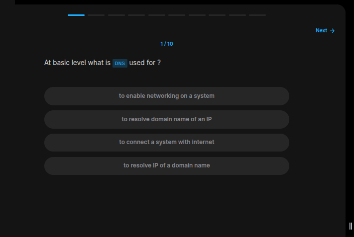
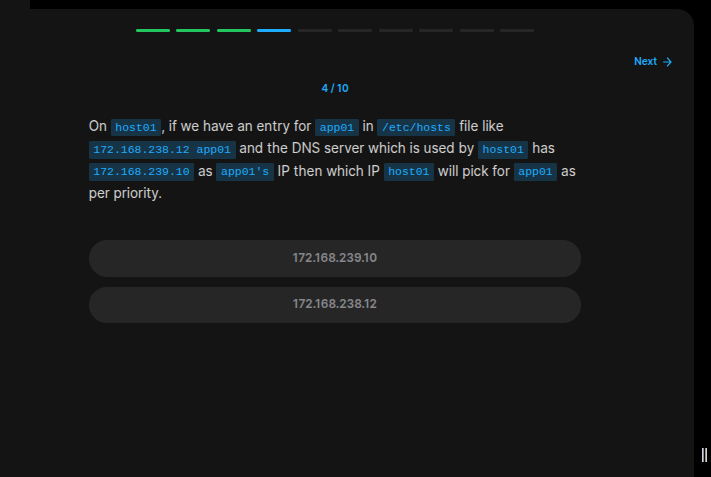
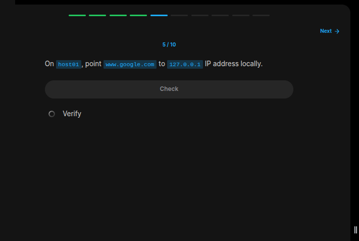
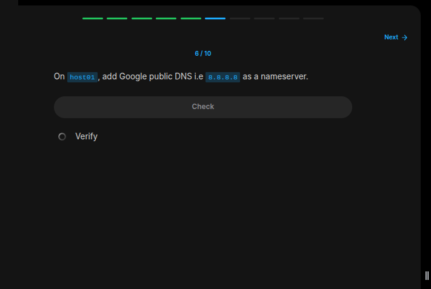
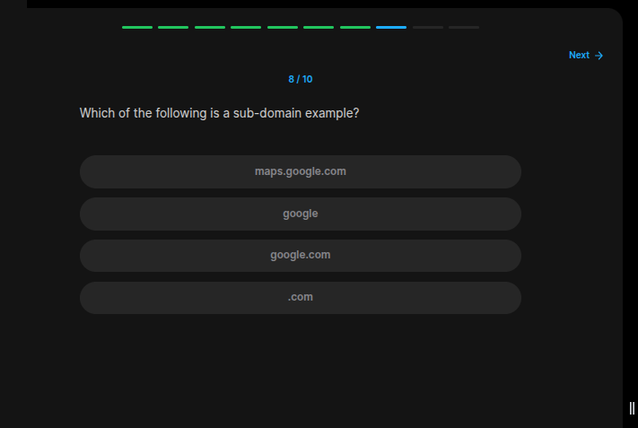
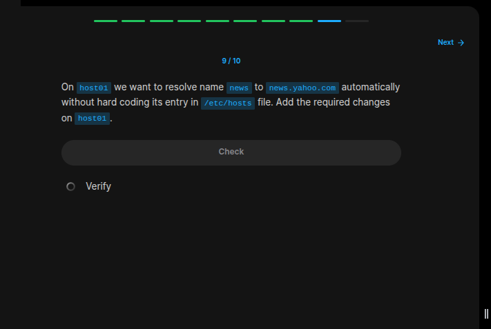

## Table of Contents

- [Introduction](#introduction)
- [Exercise 1/10](#exercise-110)
- [Exercise 2/10](#exercise-210)
- [Exercise 3/10](#exercise-310)
- [Exercise 4/10](#exercise-410)
- [Exercise 5/10](#exercise-510)
- [Exercise 6/10](#exercise-610)
- [Exercise 7/10](#exercise-710)
- [Exercise 8/10](#exercise-810)
- [Exercise 9/10](#exercise-910)
- [Exercise 10/10](#exercise-1010)


##  Introduction

Understanding Dns.

### Exercise 1/10

```bash
# to resolve IP of a domain name
```
### Exercise 2/10

```bash
/etc/hosts
```
### Exercise 3/10

```bash
# turns out it was this:
# /etc/resolv.conf
```
### Exercise 4/10

```bash
# The answer is 172.168.238.12 

# Why you may ask:
# Its because before running the dns service, linux first checks the /etc/hosts file and then turns back to the dns service. If there was a specified entry in `hosts` file, that ip will be used.
```
### Exercise 5/10

```bash
# To achieve this, we have to configre the contents of the /etc/hosts file like this:
sudo nano /etc/hosts

# and then add this line:
127.0.0.1 www.google.com

```
### Exercise 6/10

```bash
nameserver 8.8.8.8
# According to gpt, we have to write this information into the /etc/resolv.conf file:
sudo nano /etc/resolv.conf

```
### Exercise 7/10

```bash
# Turns out domains are readed from right to left. So this means that `.com` is the "Top Level Domain"
```
### Exercise 8/10

```bash
# maps.google.com
```
### Exercise 9/10

```bash
# We can use DNS Search Suffix like this:
sudo nano /etc/resolv.conf

# then add this line:
search yahoo.com
```
### Exercise 10/10

```bash
nslookup

# I looked it up and turns out nslookup returns the domain's ip. Therefor the answer.
```
