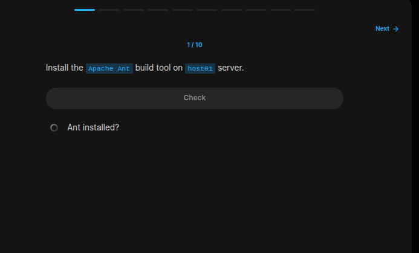
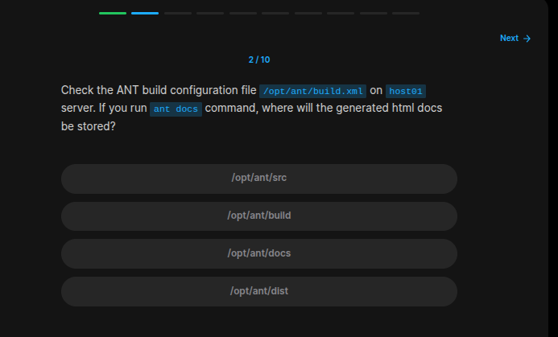
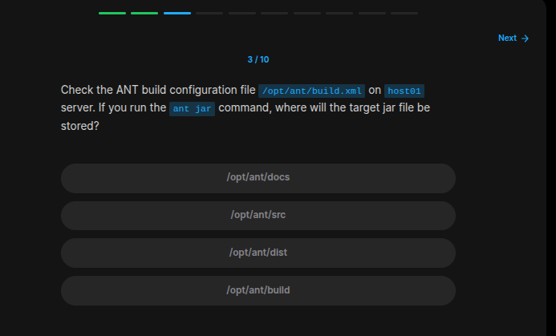
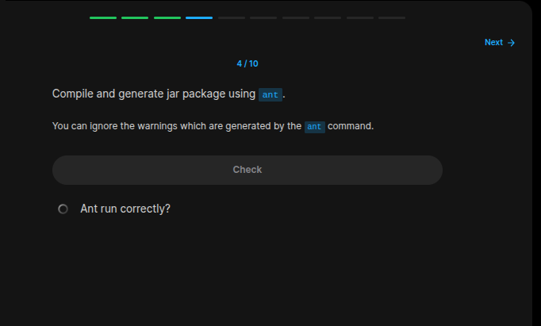
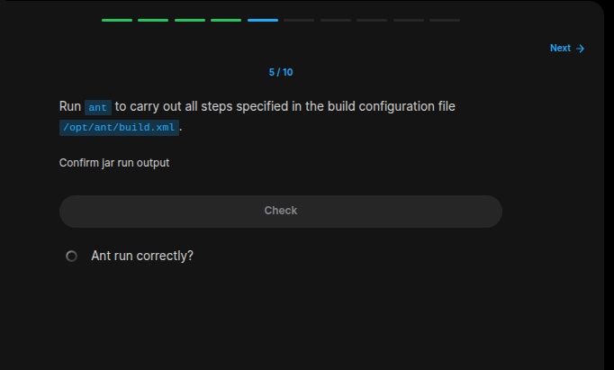
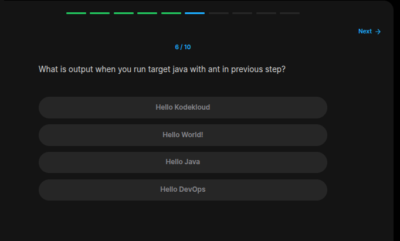
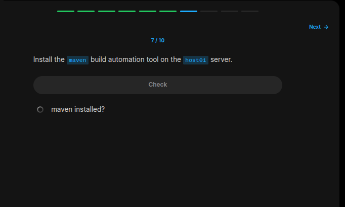
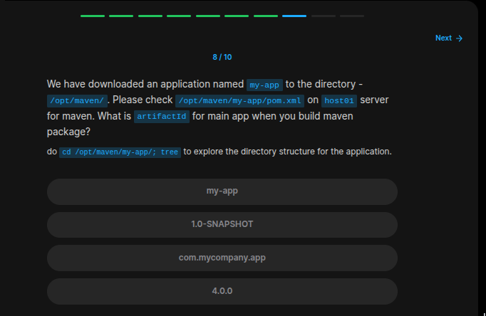
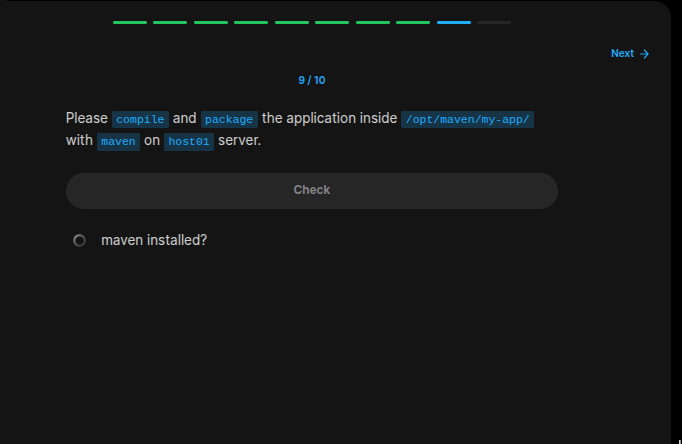
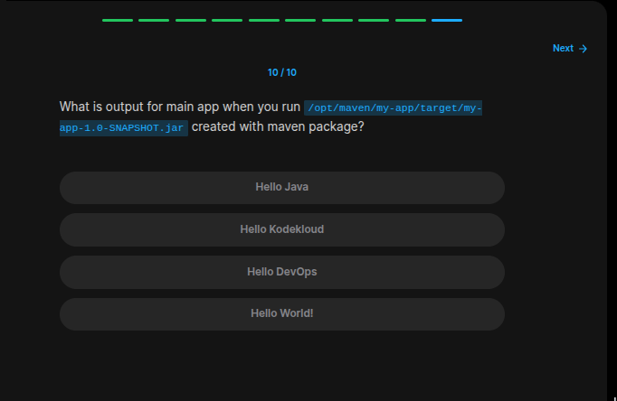

## Table of Contents

- [Introduction](#introduction)
- [Exercise 1/10](#exercise-110)
- [Exercise 2/10](#exercise-210)
- [Exercise 3/10](#exercise-310)
- [Exercise 4/10](#exercise-410)
- [Exercise 5/10](#exercise-510)
- [Exercise 6/10](#exercise-610)
- [Exercise 7/10](#exercise-710)
- [Exercise 8/10](#exercise-810)
- [Exercise 9/10](#exercise-910)
- [Exercise 10/10](#exercise-1010)


##  Introduction

Understanding Java Build and Packages.

### Exercise 1/10

```bash
sudo yum install -y ant
```
### Exercise 2/10

```bash
cat /opt/ant/build.xml | grep docs
```
### Exercise 3/10

```bash
cat /opt/ant/build.xml | grep jar
```
### Exercise 4/10

```bash
cd /opt/ant/

# and the run the build command:
ant
```
### Exercise 5/10

```bash
# If we look into the /dist/ directory, we can see that there is a .jar file. Lets run this code:
java -jar dist/MyClass.jar
```
### Exercise 6/10

```bash
Hello KodeKloud
```
### Exercise 7/10

```bash
sudo yum install maven -y
```
### Exercise 8/10

```bash
cd /opt/maven/my-app/

cat pom.xml
```
### Exercise 9/10

```bash
sudo mvn clean package
```
### Exercise 10/10

```bash
java -cp /opt/maven/my-app/target/my-app-1.0-SNAPSHOT.jar com.mycompany.app.App
```