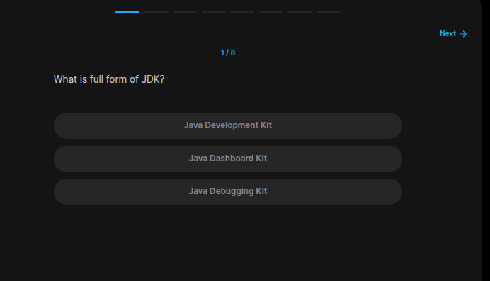
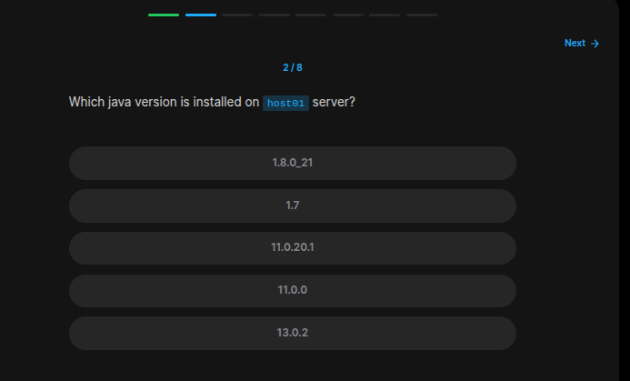
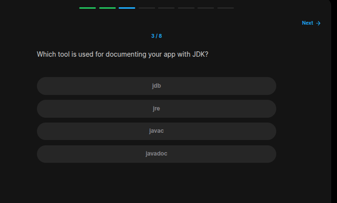
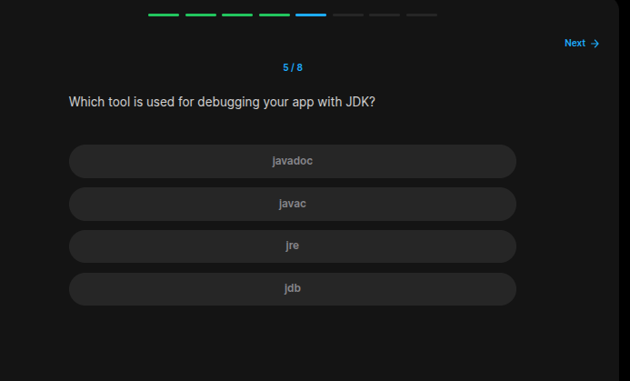
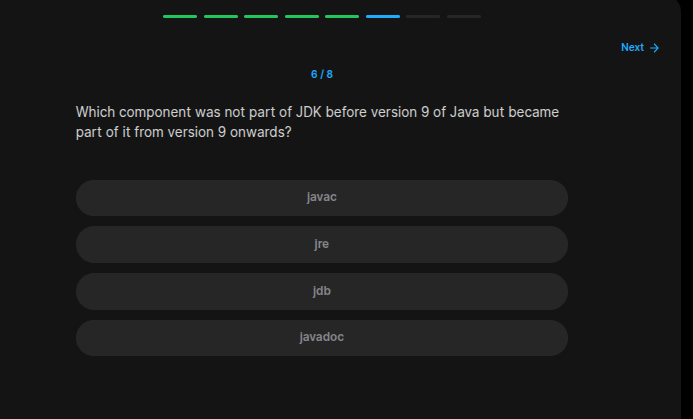
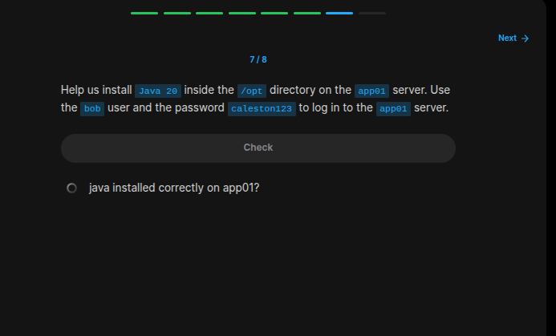

## Table of Contents

- [Introduction](#introduction)
- [Exercise 1/8](#exercise-18)
- [Exercise 2/8](#exercise-28)
- [Exercise 3/8](#exercise-38)
- [Exercise 4/8](#exercise-48)
- [Exercise 5/8](#exercise-58)
- [Exercise 6/8](#exercise-68)
- [Exercise 7/8](#exercise-78)
- [Exercise 8/8](#exercise-88)


##  Introduction

Understanding Java on linux.

### Exercise 1/8

```bash
Java Development Kit
```
### Exercise 2/8

```bash
# We can see this with
java --version
```
### Exercise 3/8

```bash
javadoc
```
### Exercise 4/8

```bash
javac
```
### Exercise 5/8

```bash
jdb
```
### Exercise 6/8

```bash
jre
```
### Exercise 7/8

```bash
# To figure out what to do, we need to see how are we gonna connect to the app01 server. For more information, lets look inside the /etc/hosts file:
sudo cat /etc/hosts

# After seeing our dns is configured, we can connect to the app01 server:
ssh bob@app01

# We are in!
# [bob@app01 ~]$ 

# And then we will continue with downloading the java version:
sudo curl https://download.java.net/java/GA/jdk20/bdc68b4b9cbc4ebcb30745c85038d91d/36/GPL/openjdk-20_linux-x64_bin.tar.gz --output /opt/openjdk-20_linux-x64_bin.tar.gz

# Uncompress:
sudo tar -xf /opt/openjdk-20_linux-x64_bin.tar.gz -C /opt/

# To verify:
/opt/jdk-20/bin/java -version
```
### Exercise 8/8

```bash
# We need to add a path variable, open this file:
vi ~/.bashrc

# And then paste thsi information:
export JAVA_HOME=/opt/jdk-20
export PATH=$JAVA_HOME/bin:$PATH

# After saving, reload it like this:
source ~/.bashrc

# Verify `java` usage:
java --version
```