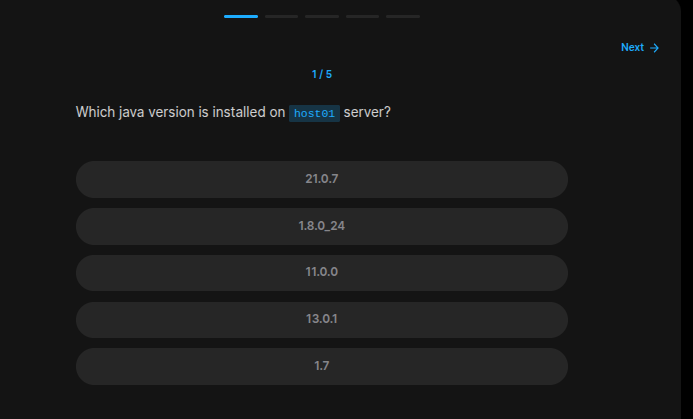
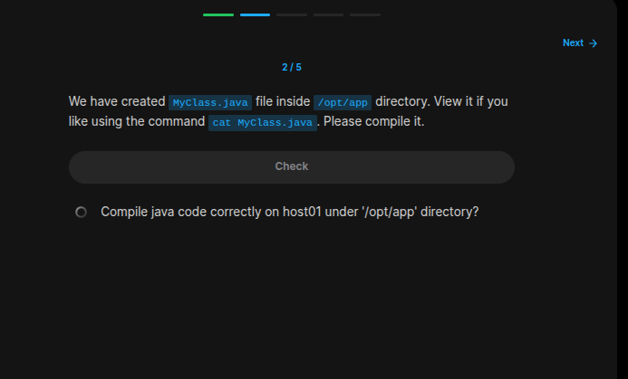
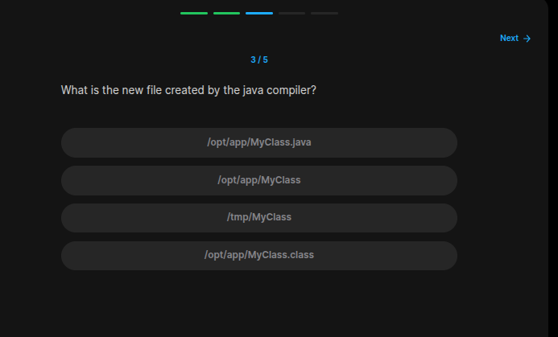
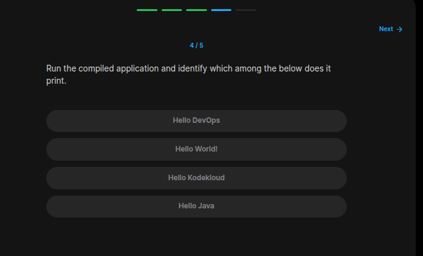
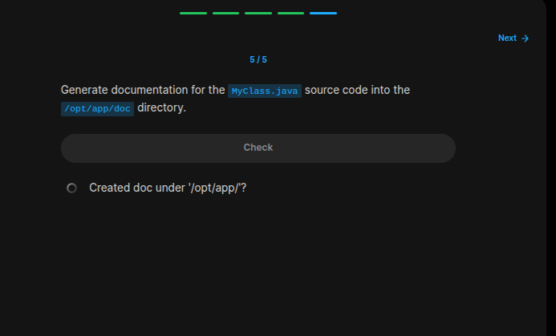

## Table of Contents

- [Introduction](#introduction)
- [Exercise 1/5](#exercise-15)
- [Exercise 2/5](#exercise-25)
- [Exercise 3/5](#exercise-35)
- [Exercise 4/5](#exercise-45)
- [Exercise 5/5](#exercise-55)

##  Introduction

Understanding Java JARS.

### Exercise 1/5

```bash
# Lets check it
java --version
```
### Exercise 2/5

```bash
# To compile, first we need to check if our compiler is available:
javac -version

# Then compile it:
javac /opt/app/MyClass.java
```
### Exercise 3/5

```bash
MyClass.class
```
### Exercise 4/5

```bash
java MyClass

# This returns: 
# Hello KodeKloud
```
### Exercise 5/5

```bash
mkdir doc/
cd doc/
javadoc MyClass.java
```