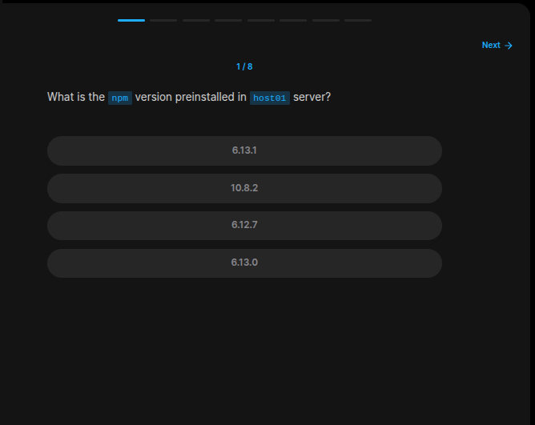
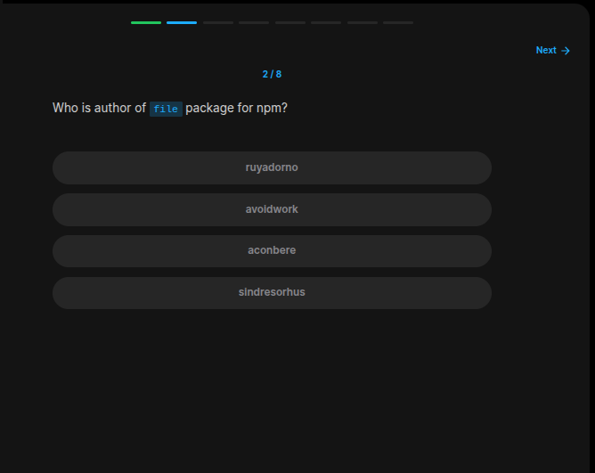
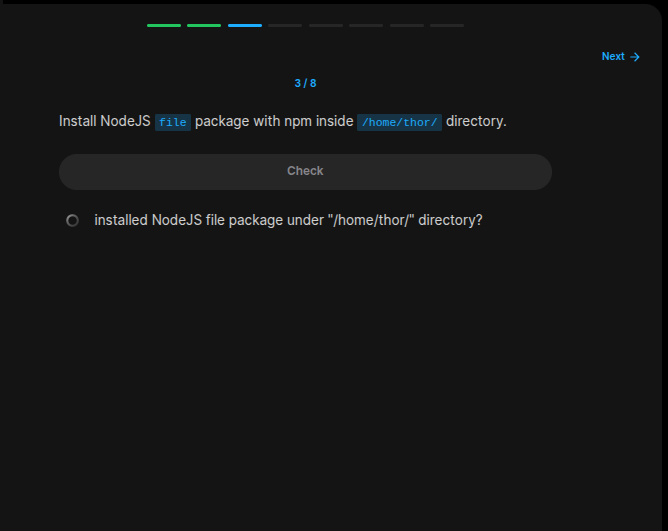
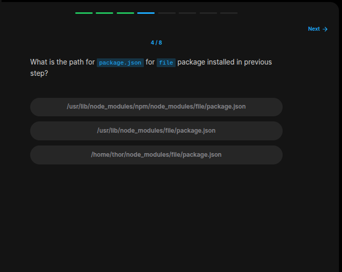
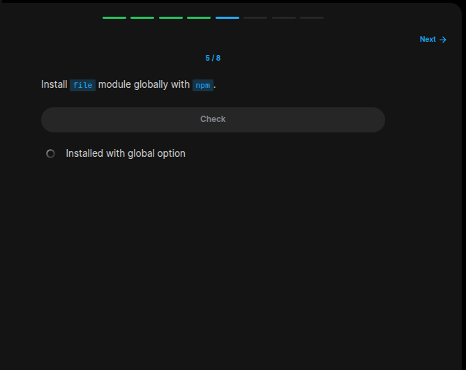
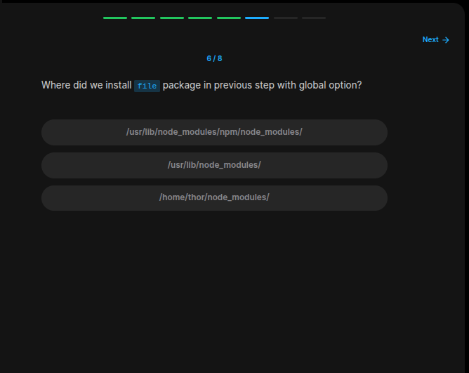
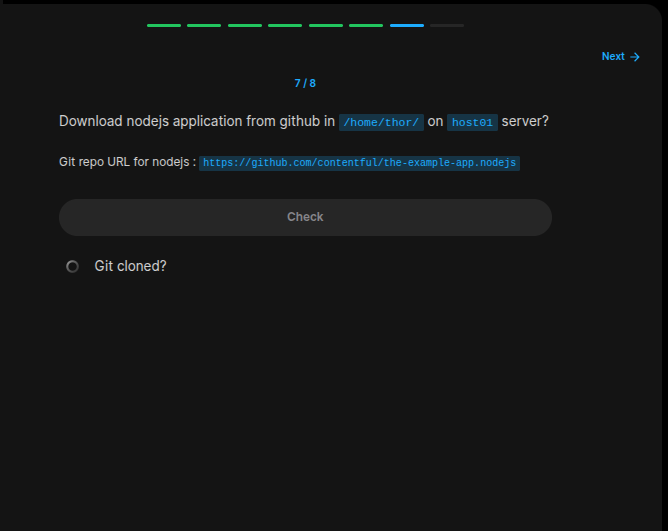
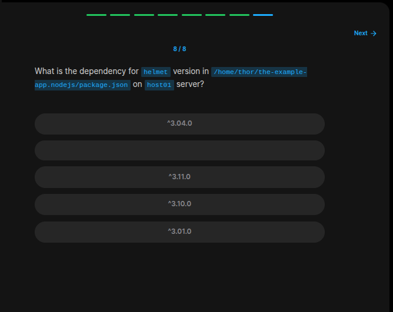

## Table of Contents

- [Introduction](#introduction)
- [Exercise 1/8](#exercise-18)
- [Exercise 2/8](#exercise-28)
- [Exercise 3/8](#exercise-38)
- [Exercise 4/8](#exercise-48)
- [Exercise 5/8](#exercise-58)
- [Exercise 6/8](#exercise-68)
- [Exercise 7/8](#exercise-78)
- [Exercise 8/8](#exercise-88)


##  Introduction

Understanding linux services.

### Exercise 1/8

```bash
npm --version
```
### Exercise 2/8

```bash
npm search file 
```
### Exercise 3/8

```bash
npm install file /home/thor/
```
### Exercise 4/8

```bash
/home/thor/node_modules/file/package.json
```
### Exercise 5/8

```bash
sudo npm install file -g
```
### Exercise 6/8

```bash
/usr/lib/mode_nodules/
```
### Exercise 7/8

```bash

```
### Exercise 8/8

```bash
# inside the `/home/thor/the-example-app.nodejs`
cat package.json | grep helmet
```