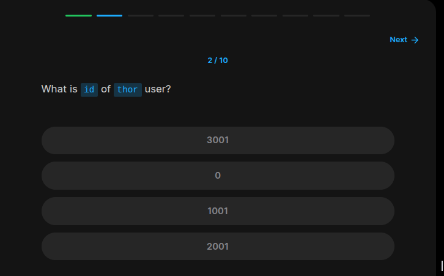
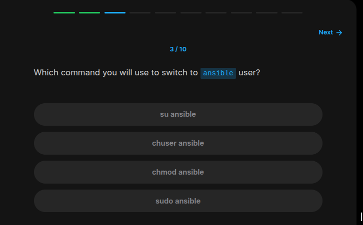
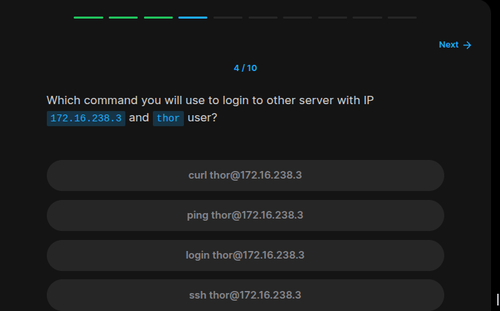
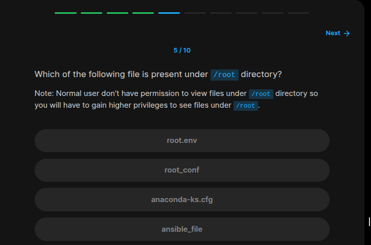
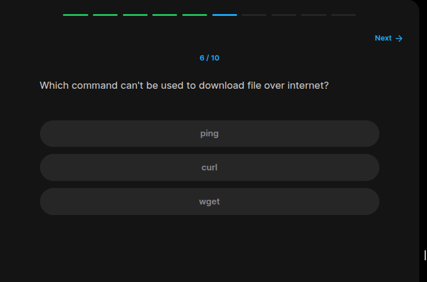
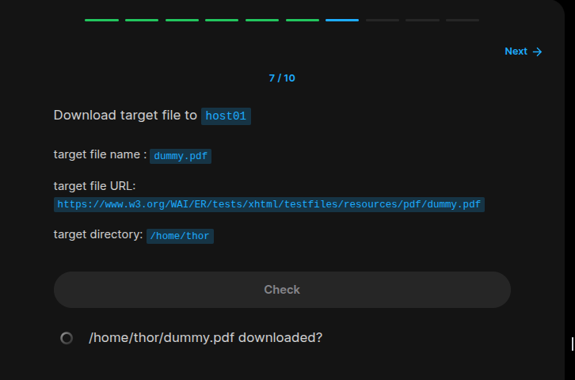
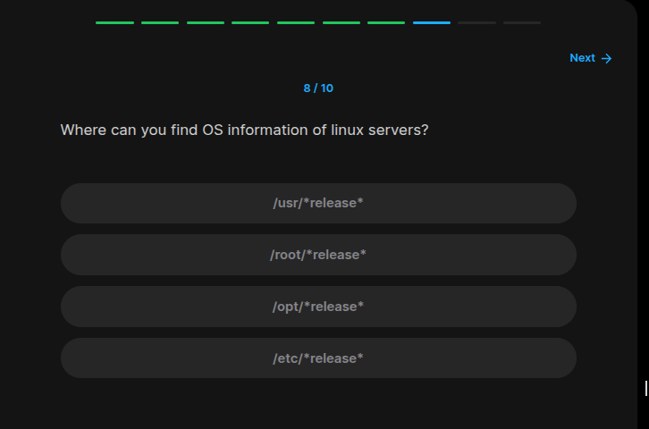
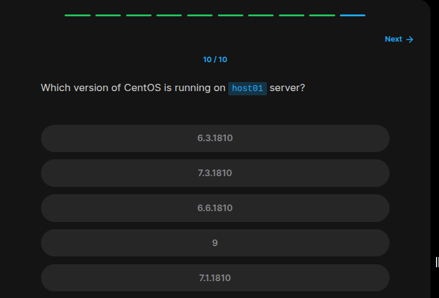

## Table of Contents

- [Introduction](#introduction)
- [Exercise 1/10](#exercise-110)
- [Exercise 2/10](#exercise-210)
- [Exercise 3/10](#exercise-310)
- [Exercise 4/10](#exercise-410)
- [Exercise 5/10](#exercise-510)
- [Exercise 6/10](#exercise-610)
- [Exercise 7/10](#exercise-710)
- [Exercise 8/10](#exercise-810)
- [Exercise 9/10](#exercise-910)
- [Exercise 10/10](#exercise-1010)


##  Introduction

Understanding linux commands.

### Exercise 1/10


```bash
# after running 
whoami
# we can see the user who is using the host01 server
```

### Exercise 2/10



```bash
# if we use 
id
# we can see the id of the user
```

### Exercise 3/10



```bash
su ansible
```

### Exercise 4/10



```bash
# of course with ssh
ssh
```

### Exercise 5/10



```bash
# if we can use this command:
sudo ls /root/

# we can see `anaconda-ks.cfg`
```

### Exercise 6/10



```bash
ping
```

### Exercise 7/10



```bash
cd /home/thor
wget https://www.w3.org/WAI/ER/tests/xhtml/testfiles/resources/pdf/dummy.pdf
```

### Exercise 8/10



```bash
ls /etc | grep release

# after this command, we can see which type of file wee need to read

cat /etc/os-release
```

### Exercise 9/10

```bash
CentOS
```


### Exercise 10/10



```bash
9
````