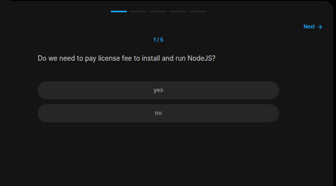
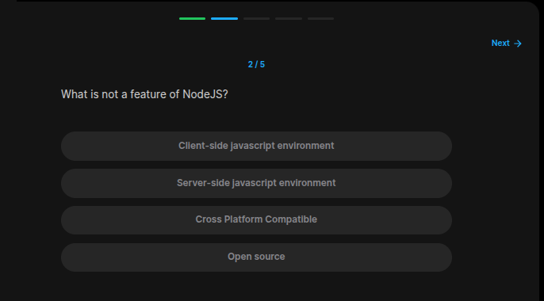
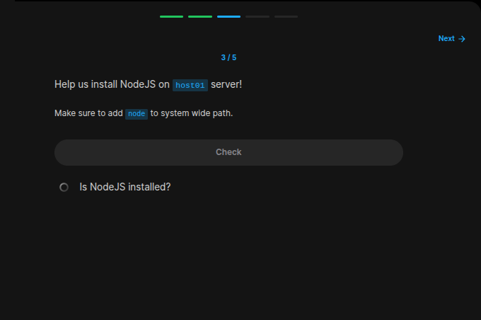
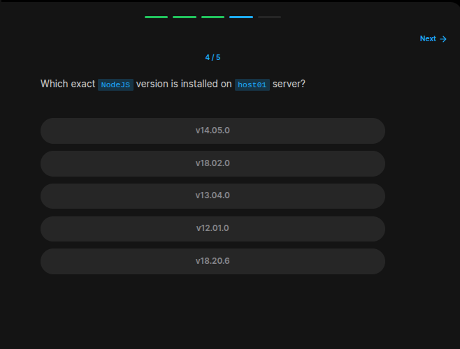
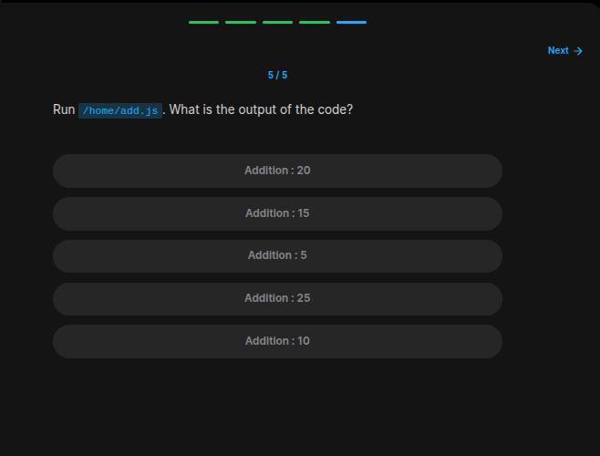

## Table of Contents

- [Introduction](#introduction)
- [Exercise 1/5](#exercise-15)
- [Exercise 2/5](#exercise-25)
- [Exercise 3/5](#exercise-35)
- [Exercise 4/5](#exercise-45)
- [Exercise 5/5](#exercise-55)


##  Introduction

Understanding linux services.

### Exercise 1/5



```bash
no
```
### Exercise 2/5

```bash
Client-side javascript environment
```
### Exercise 3/5

```bash
# Insstall nodejs like this:
sudo dnf module install nodejs:18/common
```
### Exercise 4/5

```bash
v18.20.6
```
### Exercise 5/5

```bash
# run the code like this:
node /home/add.js
```