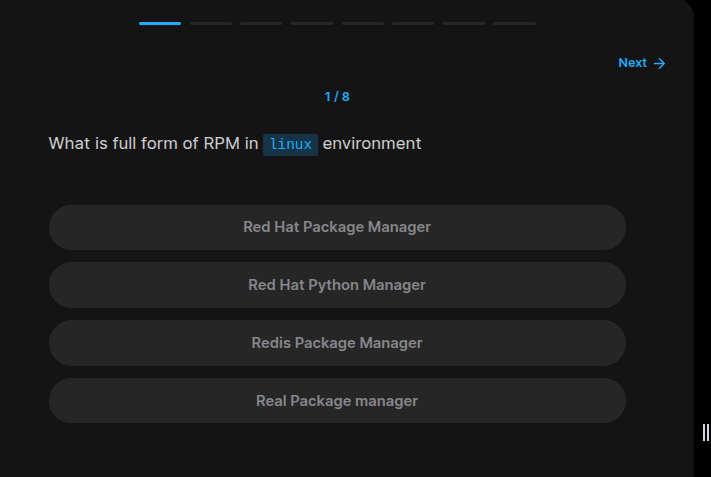
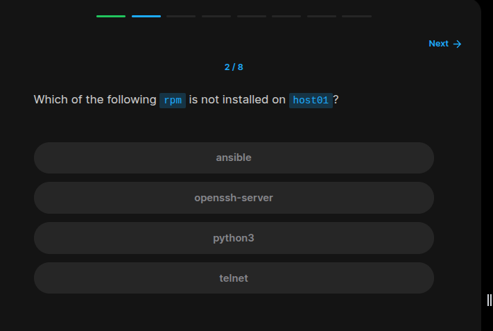
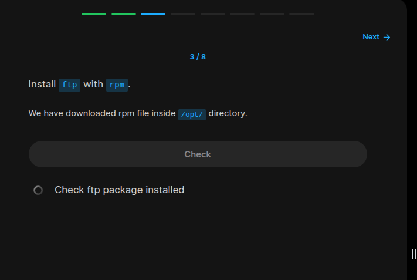
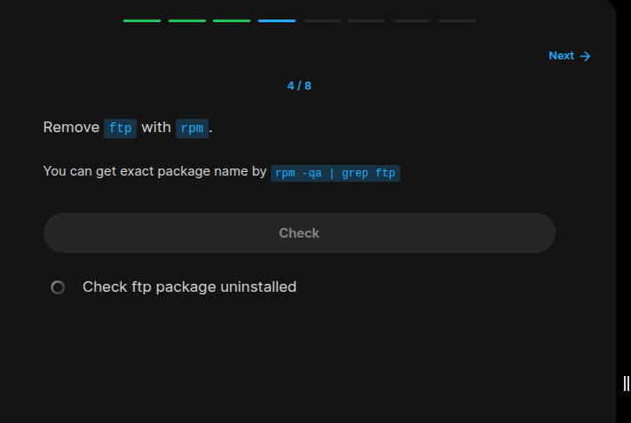
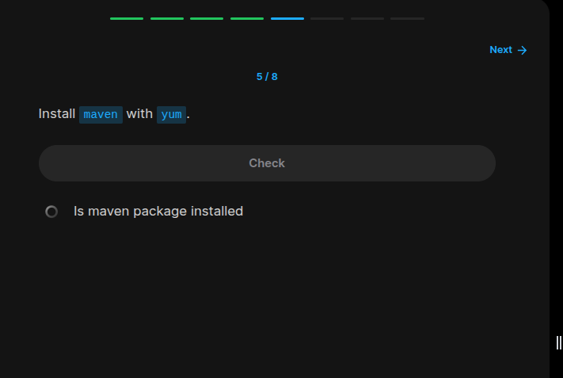
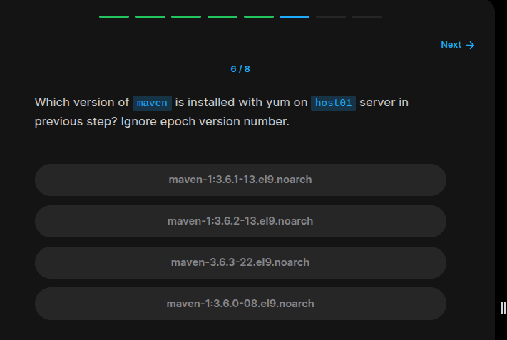
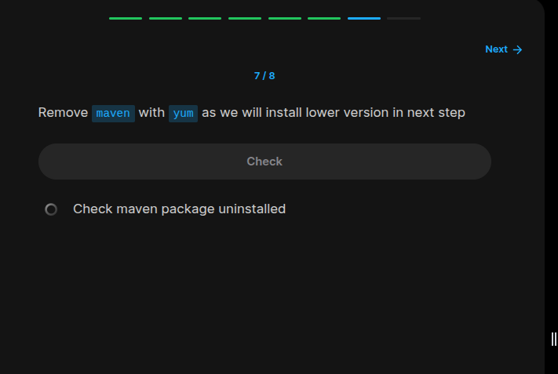
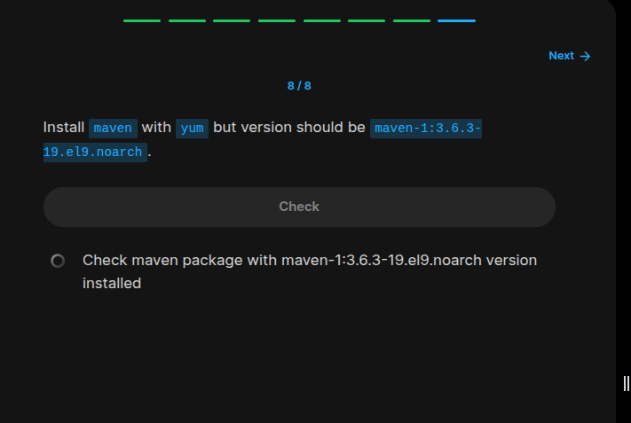

## Table of Contents

- [Introduction](#introduction)
- [Exercise 1/8](#exercise-18)
- [Exercise 2/8](#exercise-28)
- [Exercise 3/8](#exercise-38)
- [Exercise 4/8](#exercise-48)
- [Exercise 5/8](#exercise-58)
- [Exercise 6/8](#exercise-68)
- [Exercise 7/8](#exercise-78)
- [Exercise 8/8](#exercise-88)

## Introduction

In this lab, we are focused on package managers that are used in linux.

### Exercise 1/8



```bash
Red Hat Package Manager
```
### Exercise 2/8



```bash
# If we run these codes, we can see which packages is installed
rpm -qa | grep ansible
rpm -qa | grep openssh-server
rpm -qa | grep python3 
rpm -qa | grep telnet
```
### Exercise 3/8



```bash
# First lets see the contents of the /opt/ file path
ls -la /opt/ 

# After getting the file name, we can install this package like this:
sudo rpm --install /opt/ftp-0.17-89.el9.x86_64.rpm 
```

### Exercise 4/8



```bash
# We can see package name like this:
rpm -qa | grep ftp

# Then take the name and run this:
sudo rpm -e ftp-0.17-89.el9.x86_64
```

### Exercise 5/8



```bash
sudo yum install maven
```

### Exercise 6/8



```bash
# To know the version, we can use this command:
yum list | grep maven

# and see that the version is `1:3.6.3-22.e`
```

### Exercise 7/8



```bash
sudo yum remove maven -y
```

### Exercise 8/8



```bash
# To install the maven with a specific version, we only need to enter version like this:

sudo yum install maven-1:3.6.3-19.el9.noarch -y
```
