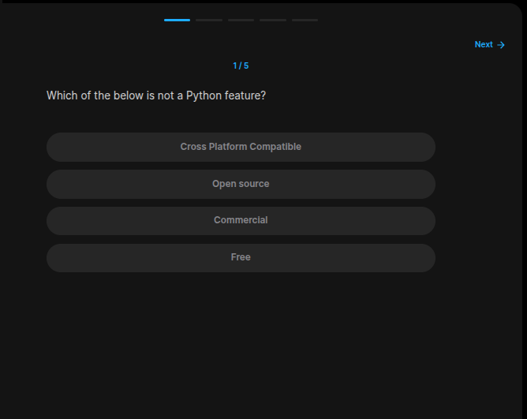
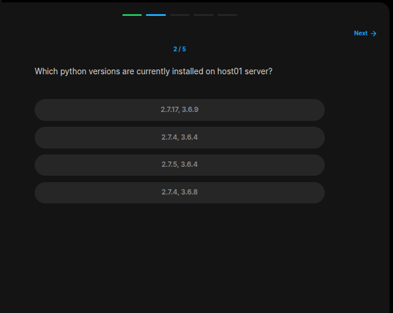
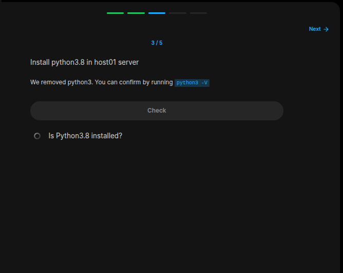
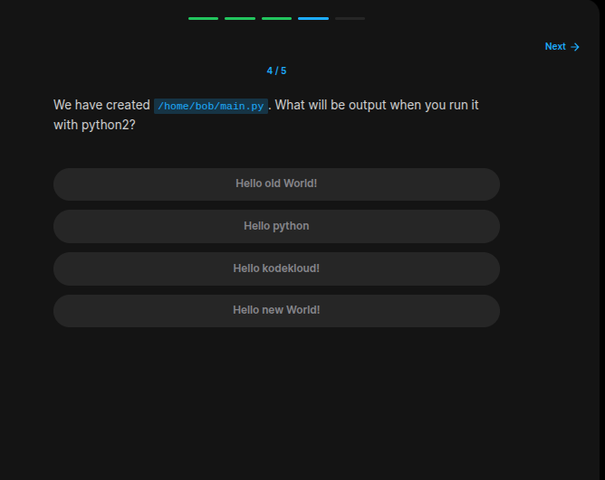
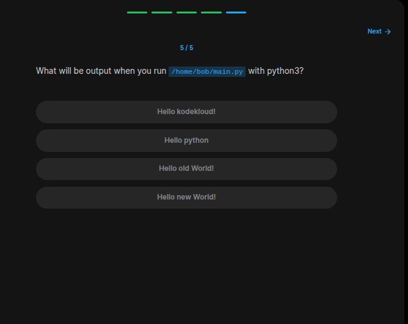

## Table of Contents

- [Introduction](#introduction)
- [Exercise 1/5](#exercise-15)
- [Exercise 2/5](#exercise-25)
- [Exercise 3/5](#exercise-35)
- [Exercise 4/5](#exercise-45)
- [Exercise 5/5](#exercise-55)


##  Introduction

Understanding linux services.

### Exercise 1/5

```bash
Comercial
```
### Exercise 2/5

```bash
python3 --version
python --version
```
### Exercise 3/5

```bash
sudo apt-get install python3.8
```
### Exercise 4/5

```bash
python2 main.py
```
### Exercise 5/5

```bash
python3 main.py
```