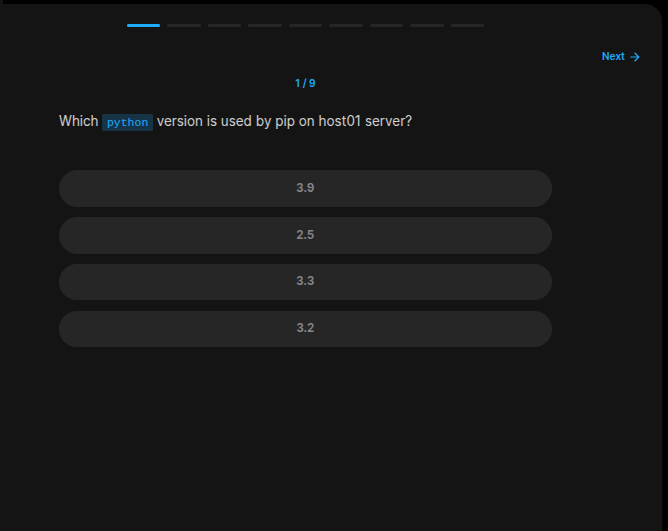
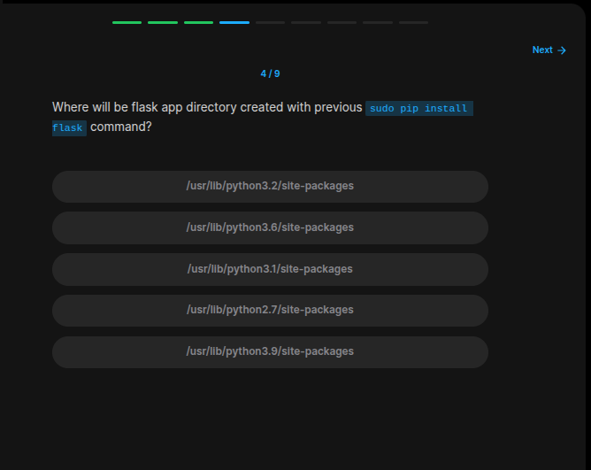
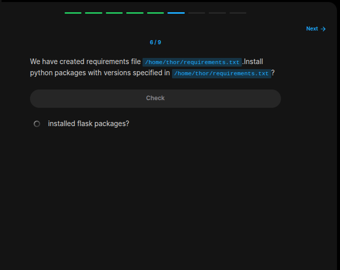
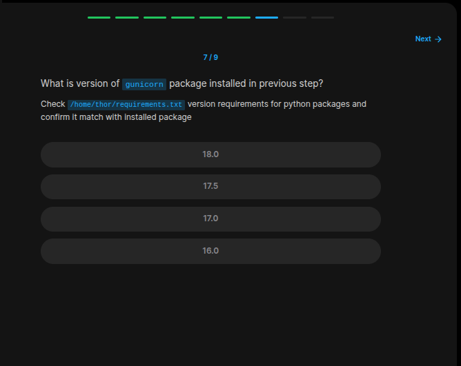
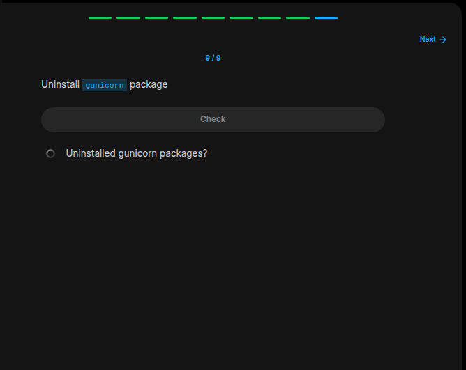

## Table of Contents

- [Introduction](#introduction)
- [Exercise 1/9](#exercise-19)
- [Exercise 2/9](#exercise-29)
- [Exercise 3/9](#exercise-39)
- [Exercise 4/9](#exercise-49)
- [Exercise 5/9](#exercise-59)
- [Exercise 6/9](#exercise-69)
- [Exercise 7/9](#exercise-79)
- [Exercise 8/9](#exercise-89)
- [Exercise 9/9](#exercise-99)


##  Introduction

Understanding linux services.

### Exercise 1/9

```bash
python3 --version
```
### Exercise 2/9

```bash
pip --version
```
### Exercise 3/9

```bash
sudo pip install flask
```
### Exercise 4/9

```bash
/usr/lib/python3.9/site-packages
```
### Exercise 5/9

```bash
pip freeze
```
### Exercise 6/9

```bash
pip install -r requirement.txt
```
### Exercise 7/9

```bash
pip freeze | grep gunicorn
```
### Exercise 8/9

```bash
pip install gunicorn -U
```
### Exercise 9/9

```bash
pip uninstall gunicorn -y
```