## Table of Contents

- [Introduction](#introduction)
- [Exercise 1/12](#exercise-112)
- [Exercise 2/12](#exercise-212)
- [Exercise 3/12](#exercise-312)
- [Exercise 4/12](#exercise-412)
- [Exercise 5/12](#exercise-512)
- [Exercise 6/12](#exercise-612)
- [Exercise 7/12](#exercise-712)
- [Exercise 8/12](#exercise-812)
- [Exercise 9/12](#exercise-912)
- [Exercise 10/12](#exercise-1012)
- [Exercise 11/12](#exercise-1112)
- [Exercise 12/12](#exercise-1212)


##  Introduction

Understanding linux services.

### Exercise 1/12

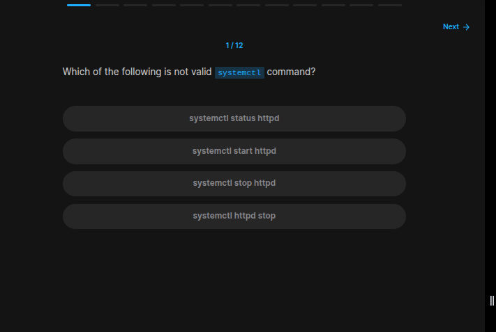

```bash
systemctl http stop
# Of course this is not a proper usage of this service
```
### Exercise 2/12

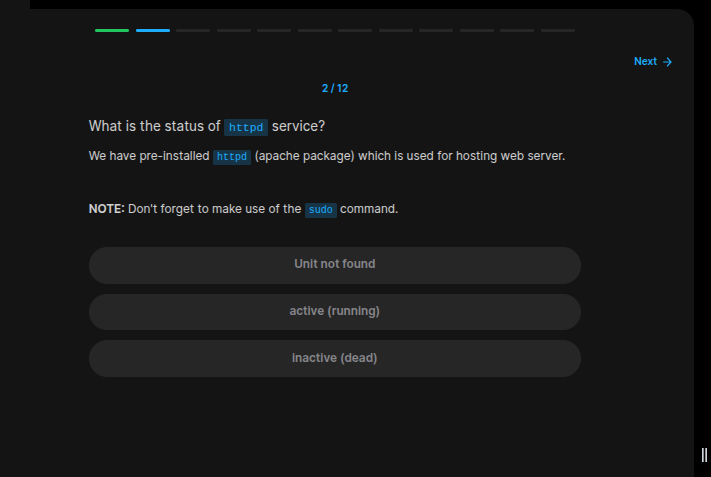

```bash
systemctl status httpd
```
### Exercise 3/12
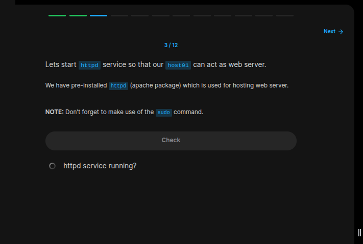

```bash
sudo systemctl start httpd
```
### Exercise 4/12
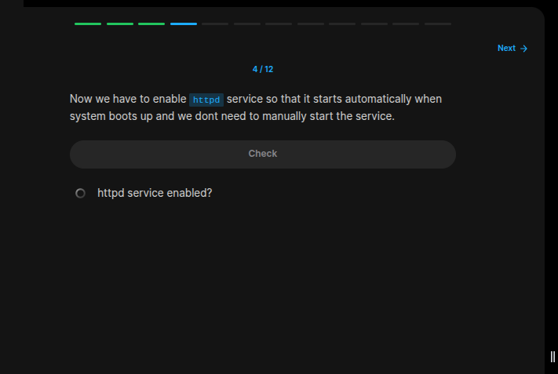
```bash
sudo systemctl enable httpd 
```
### Exercise 5/12
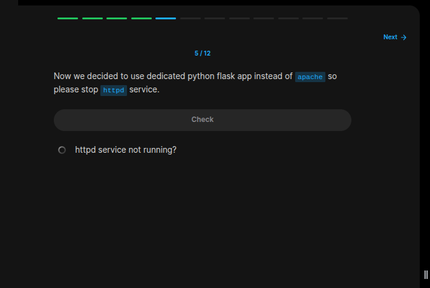
```bash
sudo systemctl stop httpd
```
### Exercise 6/12
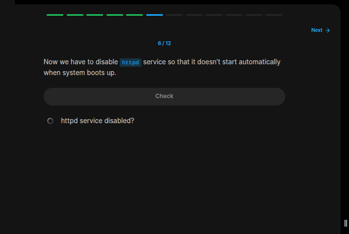
```bash
sudo systemctl disable httpd
```
### Exercise 7/12
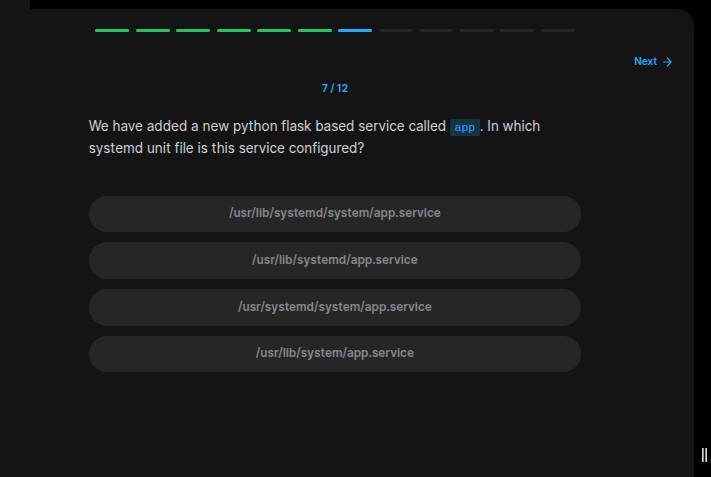
```bash
# If we look at this file path, we can see the app service:
ls -la /usr/lib/systemd/system/ | grep app
```
### Exercise 8/12
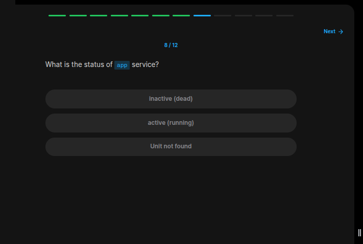
```bash
systemctl status app
```
### Exercise 9/12
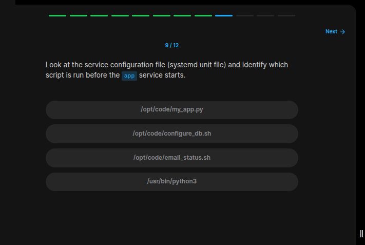
```bash
cd /opt/code/ 

# After getting into the directory, we can use this to see the contents of each file:
cat configure_db.sh
cat email_status.sh
cat my_app.py

# And then we can see that its `configure_db.sh` script.
```
### Exercise 10/12
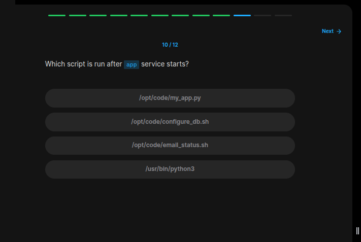
```bash
# We also know that its `email_status.sh`.
```
### Exercise 11/12
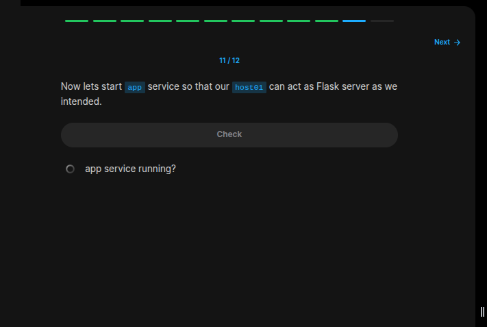
```bash
sudo systemctl start app 
```
### Exercise 12/12
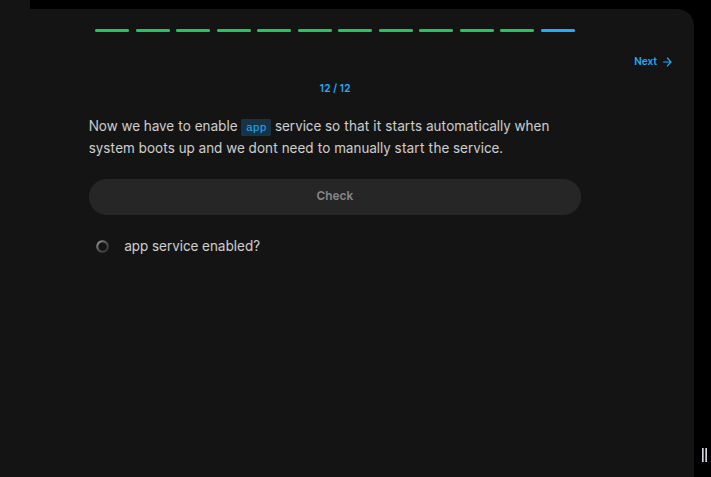
```bash
sudo systemctl enable app
```