## Table of Contents

- [Introduction](#introduction)
- [Exercise 1/10](#exercise-110)
- [Exercise 2/10](#exercise-210)
- [Exercise 3/10](#exercise-310)
- [Exercise 4/10](#exercise-410)
- [Exercise 5/10](#exercise-510)
- [Exercise 6/10](#exercise-610)
- [Exercise 7/10](#exercise-710)
- [Exercise 8/10](#exercise-810)
- [Exercise 9/10](#exercise-910)
- [Exercise 10/10](#exercise-1010)

## Introduction

In this lab, our main aim is to understand using linux. Lets get started.

### Exercise 1/10

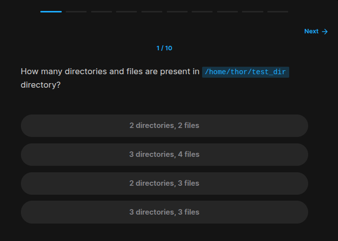

If we look at the given terminal, we can easily see that:
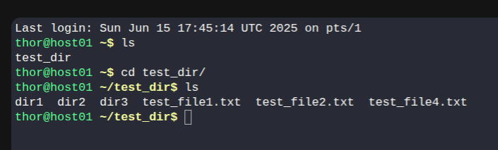

### Exercise 2/10

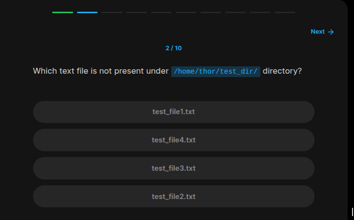

We can also see that there is no `test_file3.txt` in the `test_dir` directory. 

### Exercise 3/10

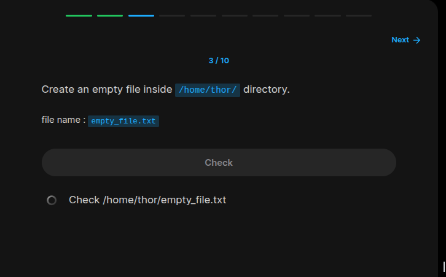

Lets create:

```bash
cd /home/thor
sudo nano empty_file.txt
# and save!
```

### Exercise 4/10

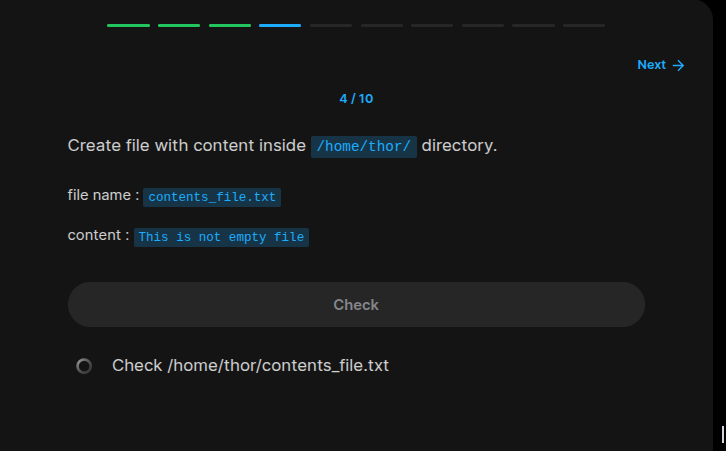

We can write this script without more work with echo:
```bash
cd /home/thor/
echo "This is not empty file" > contents_file.txt
```

### Exercise 5/10

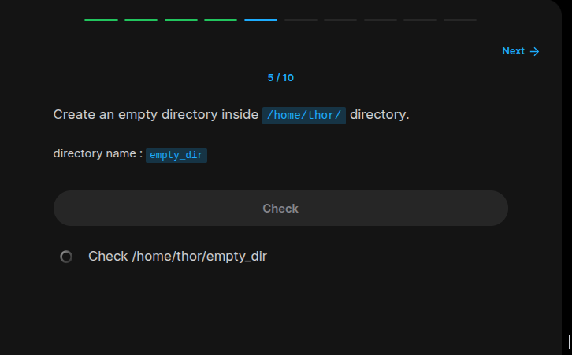

```bash 
mkdir /home/thor/empty_dir
```

### Exercide 6/10

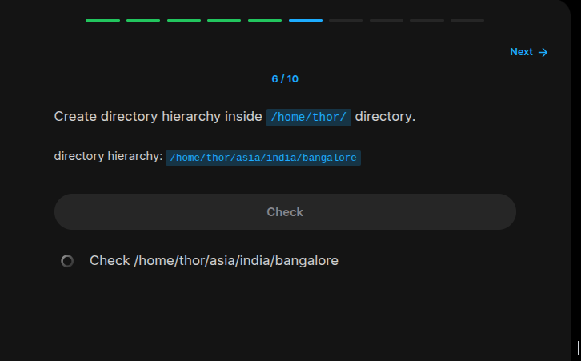

```bash
mkdir -p /home/thor/asia/india/bangalore
```

### Exercise 7/10

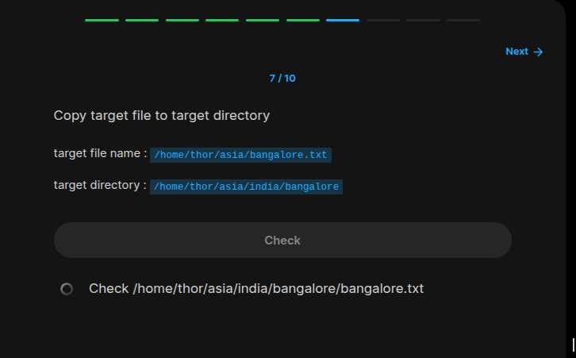

```bash
# Create some file
echo "Some info" > /home/thor/asia/bangalore.txt
cp -v /home/thor/asia/bangalore.txt /home/thor/asia/india/bangalore
# -v for better understanding about what is going on!
```

### Exercise 8/10

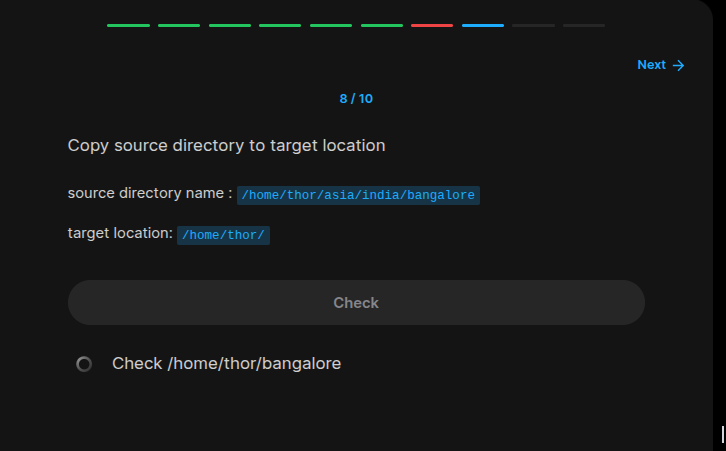

```bash
cp -vr /home/thor/asia/india/bangalore /home/thor
```

### Exercise 9/10

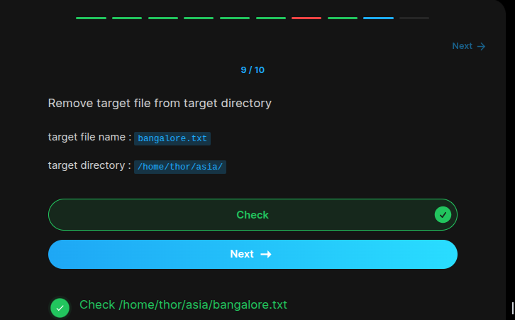

```bash
rm -v /home/thor/asia/bangalore.txt
```

### Exercise 10/10

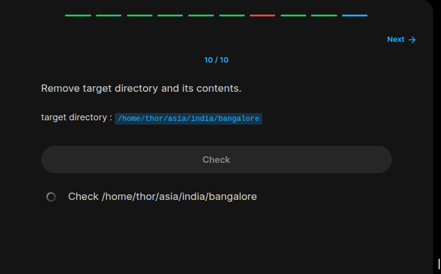

```bash 
rm -vr /home/thor/asia/india/bangalore
```