## Table of Contents

- [Introduction](#introduction)
- [Exercise 1/17](#exercise-117)
- [Exercise 2/17](#exercise-217)
- [Exercise 3/17](#exercise-317)
- [Exercise 4/17](#exercise-417)
- [Exercise 5/17](#exercise-517)
- [Exercise 6/17](#exercise-617)
- [Exercise 7/17](#exercise-717)
- [Exercise 8/17](#exercise-817)
- [Exercise 9/17](#exercise-917)
- [Exercise 10/17](#exercise-1017)
- [Exercise 11/17](#exercise-1117)
- [Exercise 12/17](#exercise-1217)
- [Exercise 13/17](#exercise-1317)
- [Exercise 14/17](#exercise-1417)
- [Exercise 15/17](#exercise-1517)
- [Exercise 16/17](#exercise-1617)
- [Exercise 17/17](#exercise-1717)


##  Introduction

Understanding Docker.

### Exercise 1/17
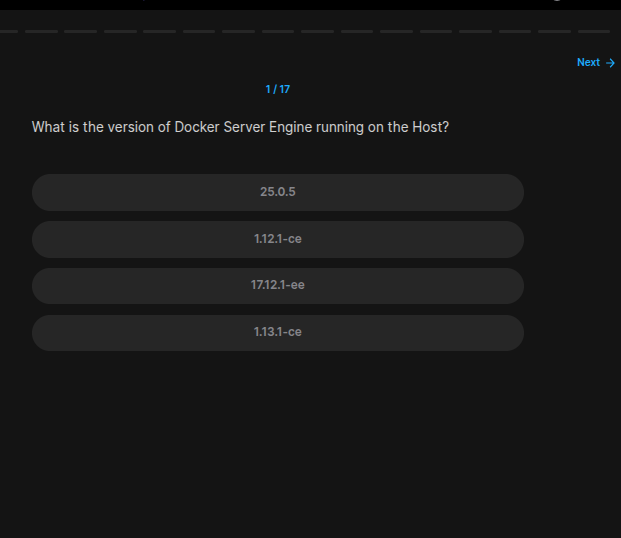
```bash
docker --version
```
### Exercise 2/17
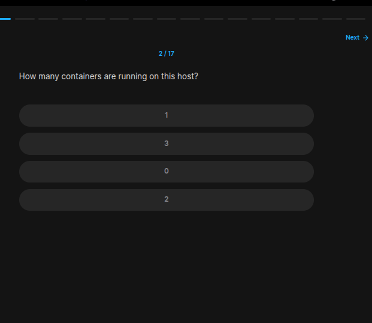
```bash
docker ps
```
### Exercise 3/17
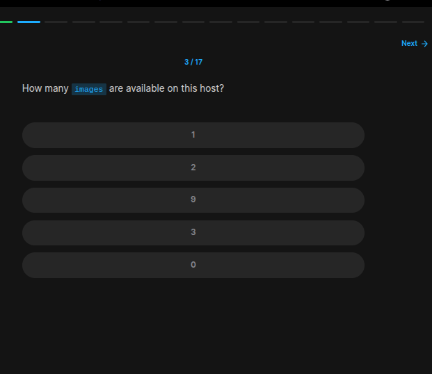
```bash
docker images
```
### Exercise 4/17
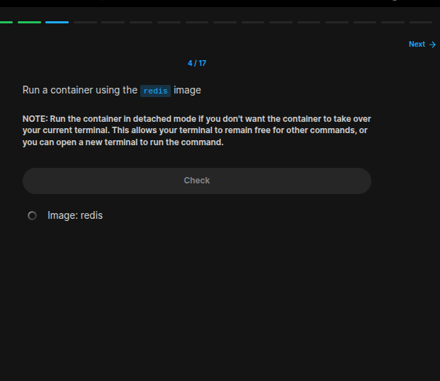
```bash
docker run -d redis
```
### Exercise 5/17
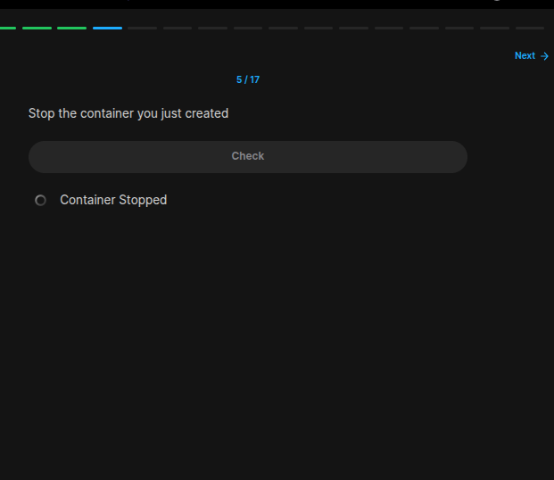
```bash
docker ps # get the container name or id

# then
docker stop [container_name or container_ID]
```
### Exercise 6/17
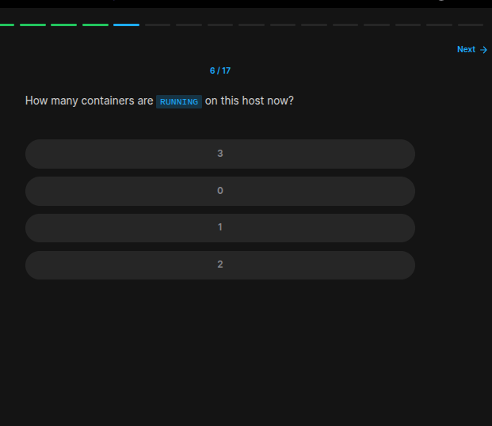
```bash
docker ps # 0
```
### Exercise 7/17
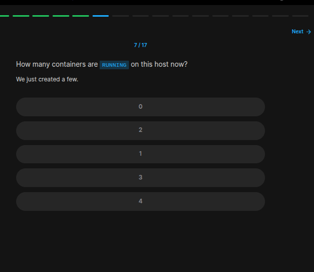
```bash
docker ps # 4
```
### Exercise 8/17
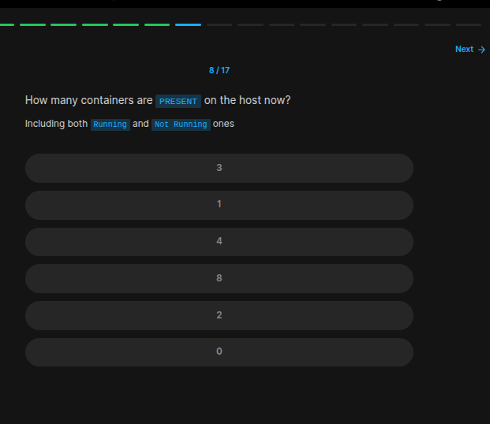
```bash
docker ps -a # it was 8 for me
```
### Exercise 9/17
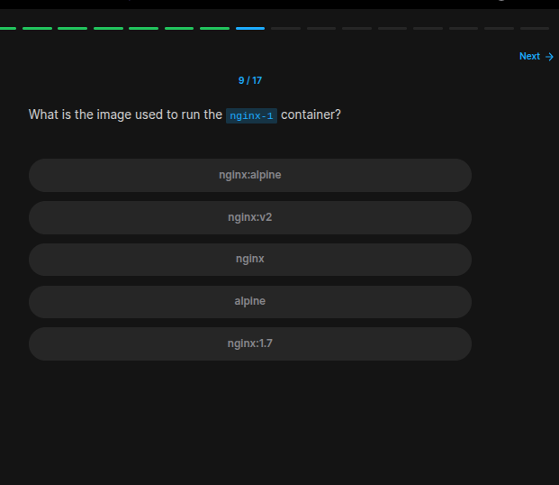
```bash
docker ps -a # we can see that its "nginx:alpine"
```
### Exercise 10/17
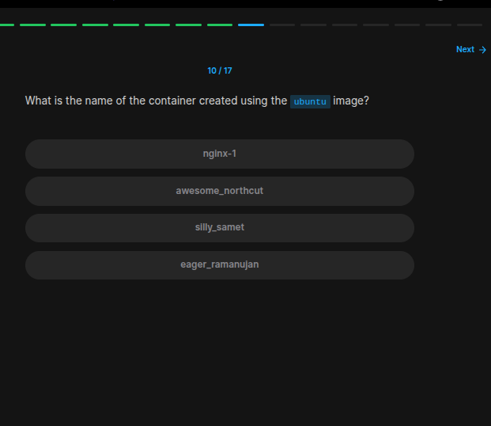
```bash
docker ps -a # "awesome_northcut"
```
### Exercise 11/17
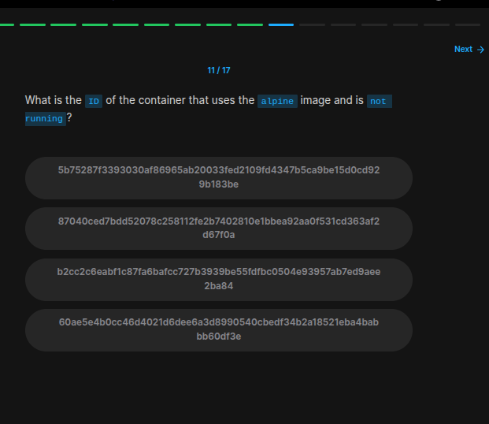
```bash
docker ps -a # We can see it easily with this
```
### Exercise 12/17
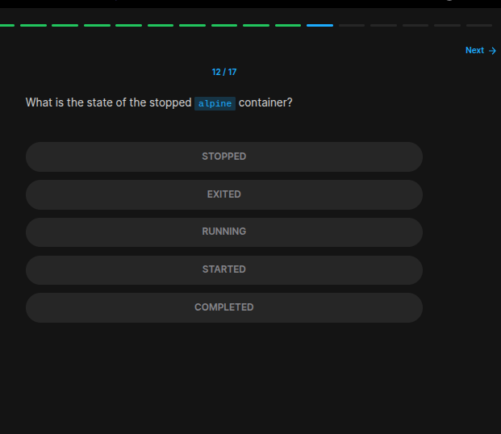
```bash
docker ps -a # Exited
```
### Exercise 13/17
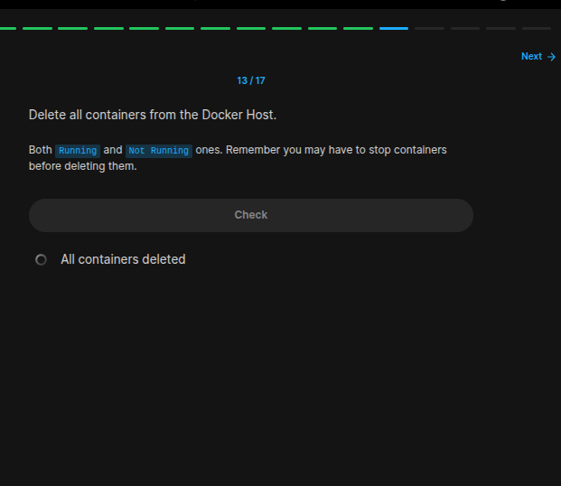
```bash
# use these commands for each continaer:
docker stop [container_name or container_id]
docker rm [container_name or container_id]
```
### Exercise 14/17
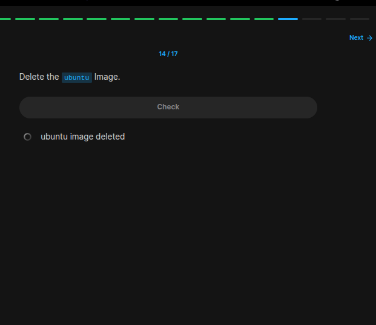
```bash
docker rmi ubuntu
```
### Exercise 15/17
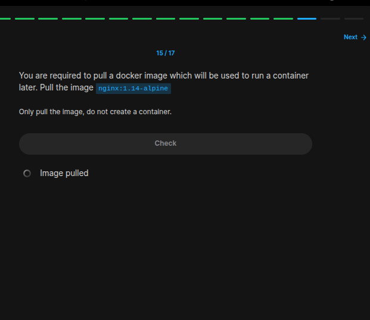
```bash
docker pull nginx:1.14-alpine
```
### Exercise 16/17
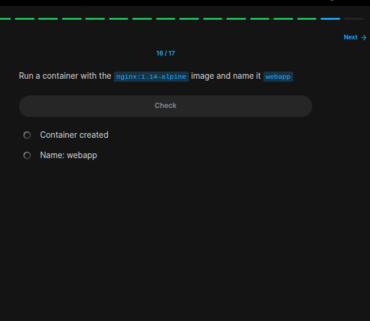
```bash
docker run --name  webapp -d nginx:1.14-alpine
```
### Exercise 17/17
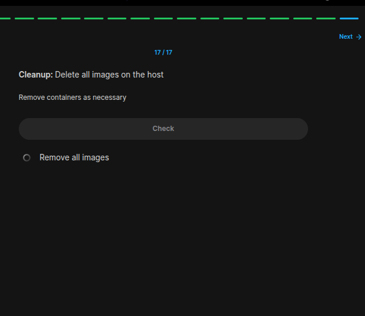
```bash
# https://stackoverflow.com/questions/44785585/how-can-i-delete-all-local-docker-images

docker rm -vf $(docker ps -aq)
docker rmi -f $(docker images -aq)
```
