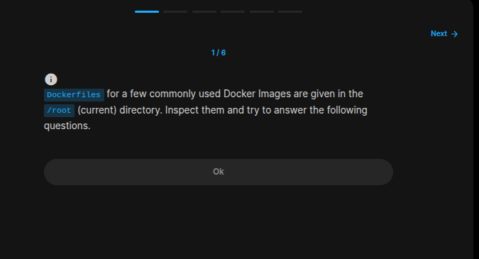
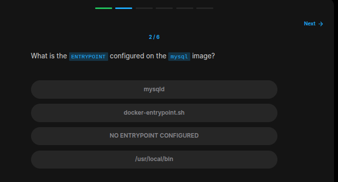
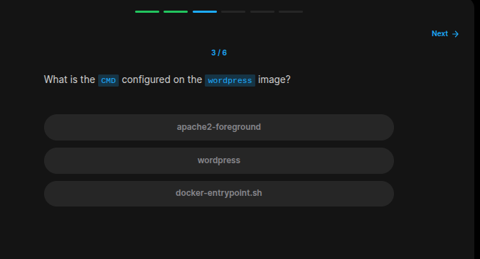
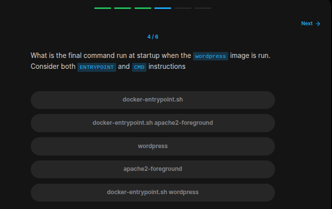
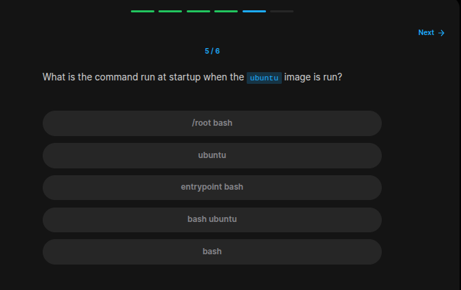
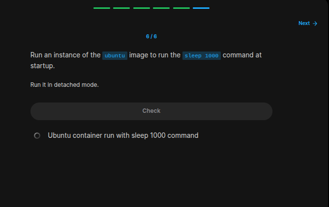

## Table of Contents

- [Introduction](#introduction)
- [Exercise 1/6](#exercise-16)
- [Exercise 2/6](#exercise-26)
- [Exercise 3/6](#exercise-36)
- [Exercise 4/6](#exercise-46)
- [Exercise 5/6](#exercise-56)
- [Exercise 6/6](#exercise-66)


##  Introduction

Understanding Docker.

### Exercise 1/6

```
OK
```
### Exercise 2/6

```bash
cat Dockerfile-mysql | grep ENTRYPOINT
```
### Exercise 3/6

```bash
cat Dockerfile-wordpress | grep CMD
# CMD ["apache2-foreground"]
```
### Exercise 4/6

```
docker-entrypoint.sh -> apache2-foreground
```
### Exercise 5/6

```bash
cat Dockerfile-ubuntu # its "bash"
```
### Exercise 6/6

```bash
docker run -d ubuntu sleep 1000 
```