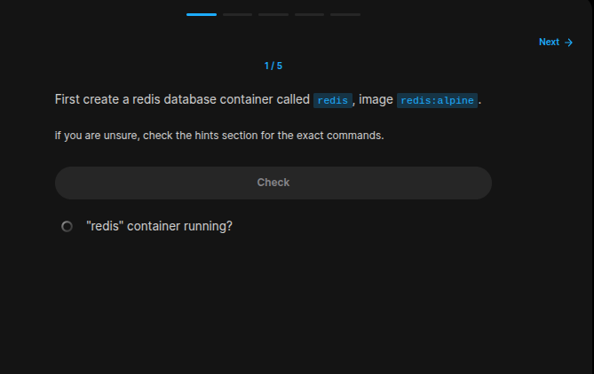
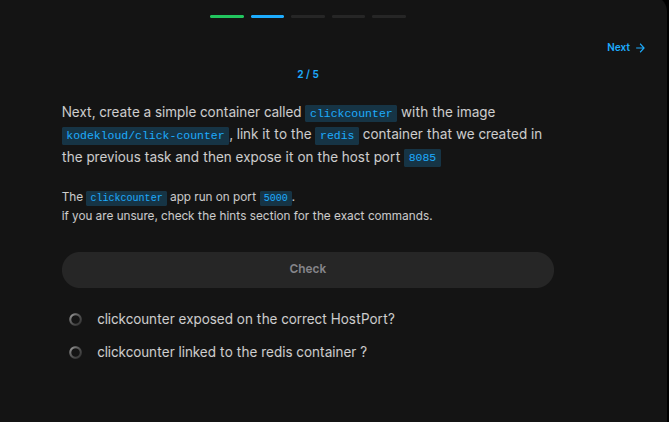
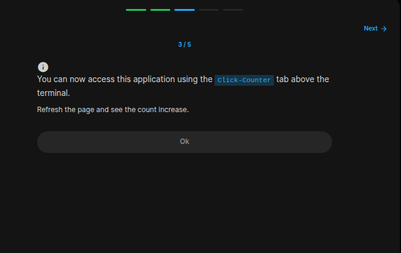
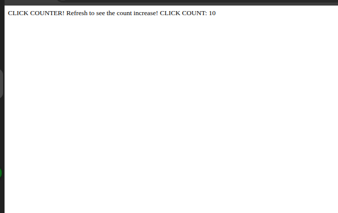
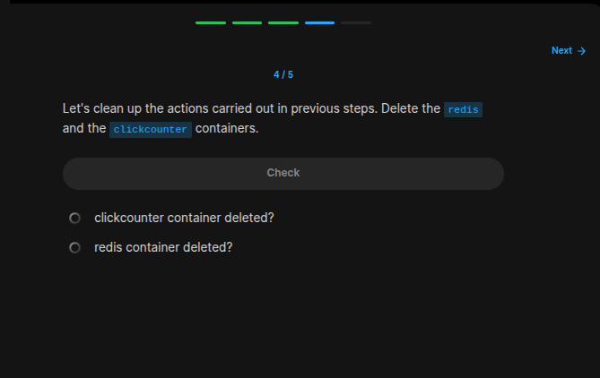
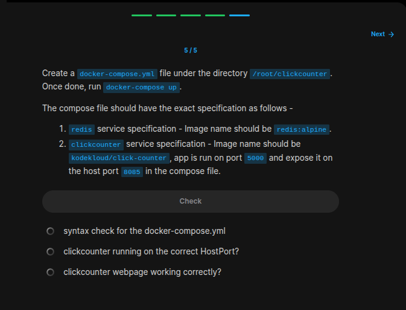

## Table of Contents

- [Introduction](#introduction)
- [Exercise 1/5](#exercise-15)
- [Exercise 2/5](#exercise-25)
- [Exercise 3/5](#exercise-35)
- [Exercise 4/5](#exercise-45)
- [Exercise 5/5](#exercise-55)

##  Introduction

Understanding Docker.

### Exercise 1/5

```bash
docker run -d --name redis redis:alpine 
```
### Exercise 2/5

```bash
# https://stackoverflow.com/questions/41768157/how-to-link-containers-in-docker

ocker run -d --name=clickcounter --link redis:redis -p 8085:5000 kodekloud/click-counter
```
### Exercise 3/5


```
Yes! Its working.
```
### Exercise 4/5

```bash
docker rm -vf $(docker ps -aq)
```
### Exercise 5/5

```bash
nano docker-compose.yml

# and enter this lines:
# services:
#   redis:
    # image: redis:alpine
#   clickcounter:
    # image: kodekloud/click-counter
    # ports:
    # - 8085:5000
# version: '3.0'

# After that we can run our services with:
docker compose up -d
```
