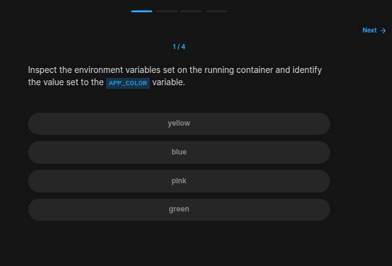
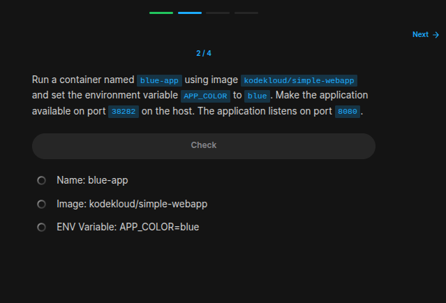
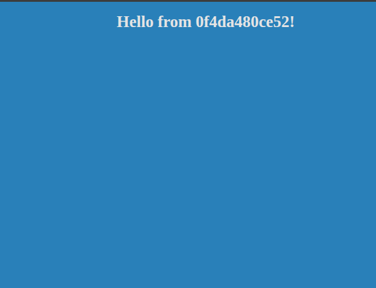
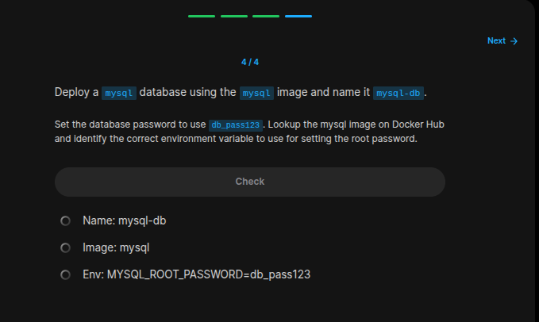

## Table of Contents

- [Introduction](#introduction)
- [Exercise 1/4](#exercise-14)
- [Exercise 2/4](#exercise-24)
- [Exercise 3/4](#exercise-34)
- [Exercise 4/4](#exercise-44)


##  Introduction

Understanding Docker.

### Exercise 1/4

```bash
docker exec [container_name or container_id] env # this shows "pink"
```
### Exercise 2/4

```bash
docker run --name blue-app -p 38282:8080 -e APP_COLOR=blue kodekloud/simple-webapp  
```
### Exercise 3/4


```
Its blue!
```
### Exercise 4/4

```bash
# https://hub.docker.com/_/mysql

docker run --name mysql-db -e MYSQL_ROOT_PASSWORD=db_pass123 mysql
```