## Table of Contents

- [Introduction](#introduction)
- [Exercise 1/15](#exercise-115)
- [Exercise 2/15](#exercise-215)
- [Exercise 3/15](#exercise-315)
- [Exercise 4/15](#exercise-415)
- [Exercise 5/15](#exercise-515)
- [Exercise 6/15](#exercise-615)
- [Exercise 7/15](#exercise-715)
- [Exercise 8/15](#exercise-815)
- [Exercise 9/15](#exercise-915)
- [Exercise 10/15](#exercise-1015)
- [Exercise 11/15](#exercise-1115)
- [Exercise 12/15](#exercise-1215)
- [Exercise 13/15](#exercise-1315)
- [Exercise 14/15](#exercise-1415)
- [Exercise 15/15](#exercise-1515)


##  Introduction

Understanding Docker.

### Exercise 1/15
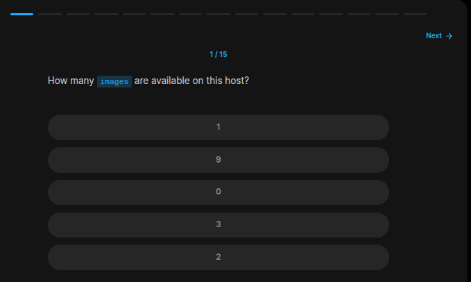
```bash
docker images # 9
```
### Exercise 2/15
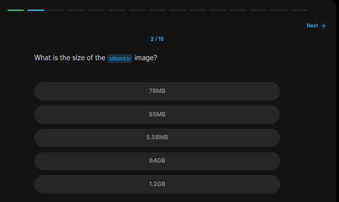
```bash
docker images # 78 MB
```
### Exercise 3/15
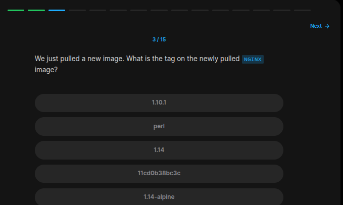
```bash
docker images # 1.14:alpine
```
### Exercise 4/15
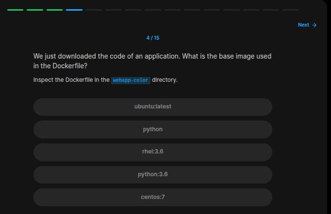
```bash
cat webapp-color/Dockerfile

# base is python
```
### Exercise 5/15
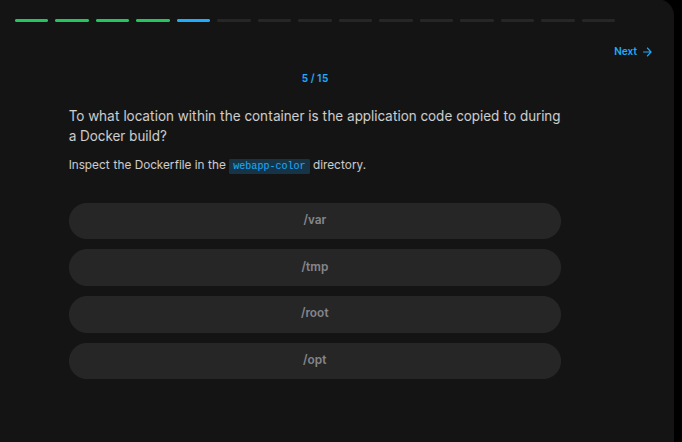
```bash
cat webapp-color/Dockerfile

# its "/opt/"
```
### Exercise 6/15
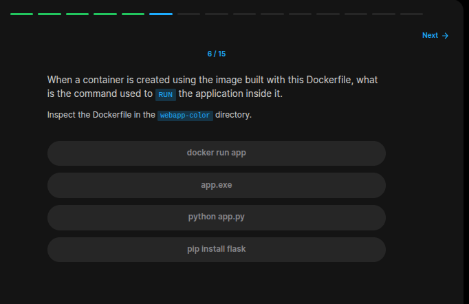
```bash
cat webapp-color/Dockerfile

# python app.py
```
### Exercise 7/15
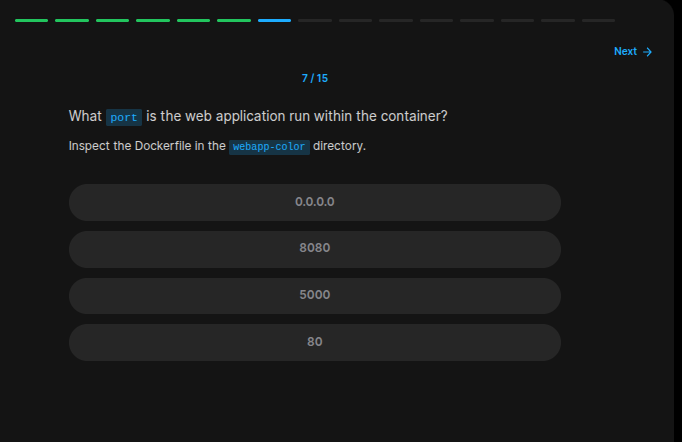
```bash
cat webapp-color/Dockerfile

# port 8080
```
### Exercise 8/15

```bash
docker build -t webapp-color webapp-color/ 
```
### Exercise 9/15
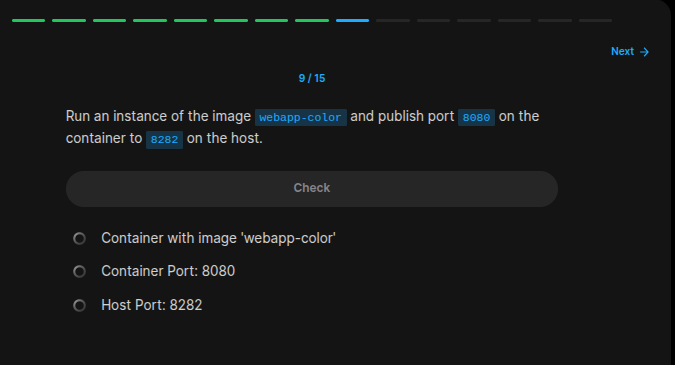
```bash
docker run -p 8282:8080 webapp-color
```
### Exercise 10/15
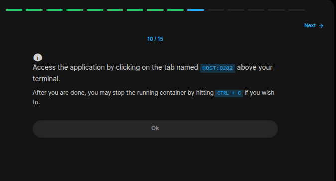
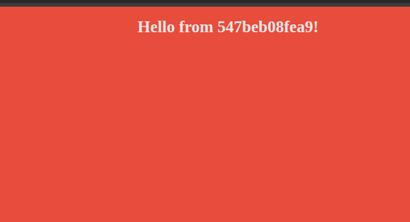
```
Its working!
```
### Exercise 11/15
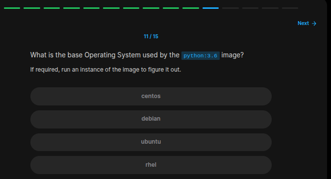
```
debian
```
### Exercise 12/15
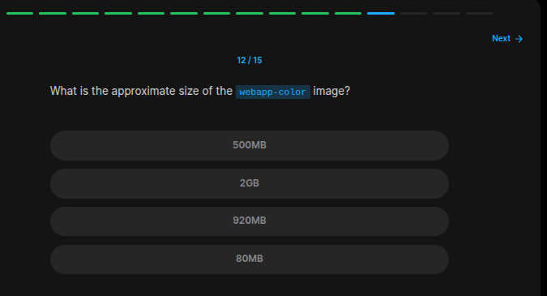
```bash
docker images | grep webapp-color
```
### Exercise 13/15
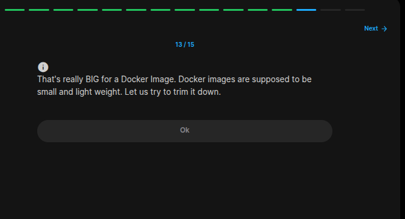
```
YES! They need to be in small sizes.
```
### Exercise 14/15
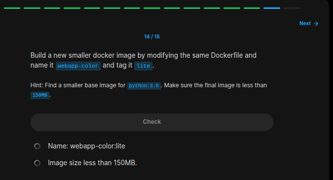
```bash
# First update our base image from "python:3.6" to "python:3.6-alpine"
nano webapp-color/Dockerfile 

docker build -t webapp-color:lite webapp-color 
```
### Exercise 15/15
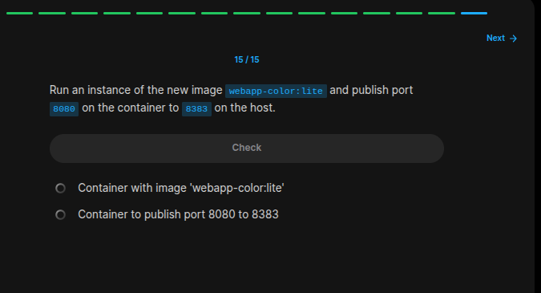
```bash
docker run  -p 8383:8080 webapp-color:lite
```