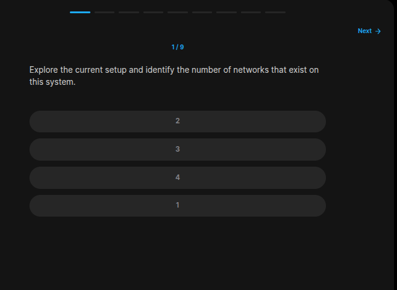
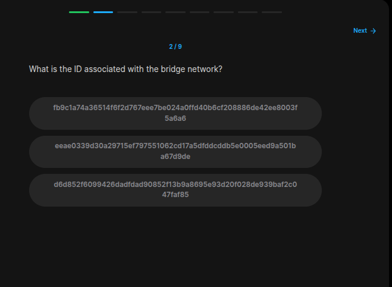
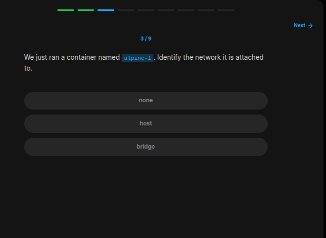
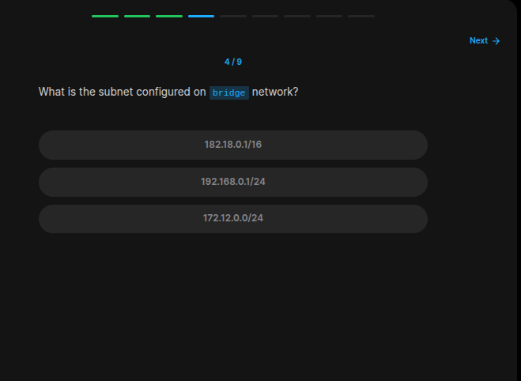
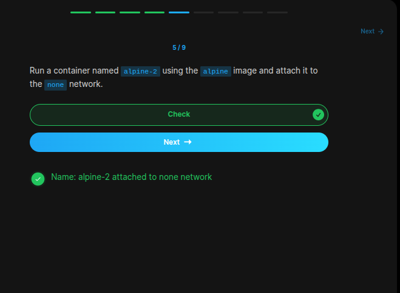
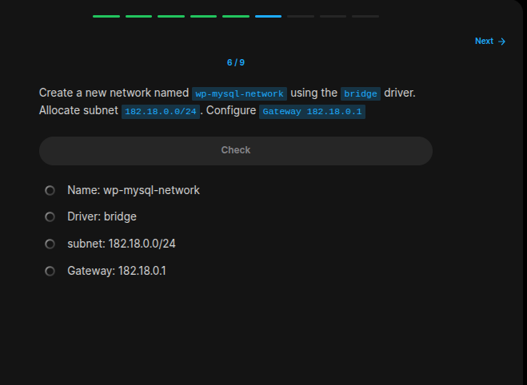
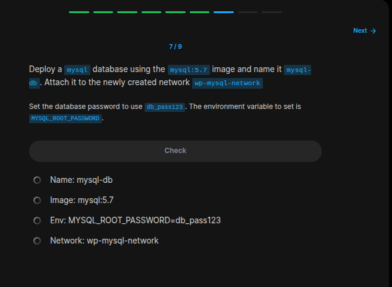
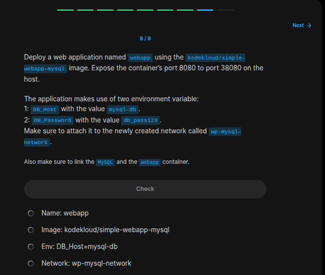
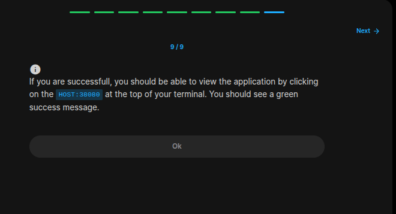
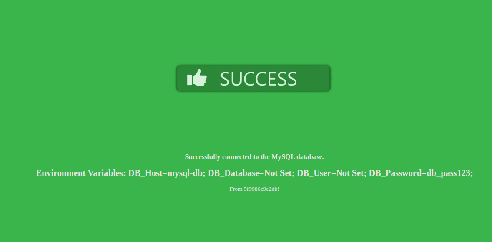

## Table of Contents

- [Introduction](#introduction)
- [Exercise 1/9](#exercise-19)
- [Exercise 2/9](#exercise-29)
- [Exercise 3/9](#exercise-39)
- [Exercise 4/9](#exercise-49)
- [Exercise 5/9](#exercise-59)
- [Exercise 6/9](#exercise-69)
- [Exercise 7/9](#exercise-79)
- [Exercise 8/9](#exercise-89)
- [Exercise 9/9](#exercise-99)

##  Introduction

Understanding Docker.

### Exercise 1/9

```bash
docker network list
```
### Exercise 2/9

```bash
docker network list # some hash ....
```
### Exercise 3/9

```bash
docker network list 

# https://stackoverflow.com/questions/43904562/docker-how-to-find-the-network-my-container-is-in

# With this script, we can see which network our container is using.
docker inspect alpine-1 -f "{{json .NetworkSettings.Networks }}"
```
### Exercise 4/9

```bash
# https://docker-community-leaders.github.io/dockercommunity/docs/communityleaders/eventhandbooks/docker101/networking/#:~:text=The%20docker%20network%20inspect%20command,networks%20on%20your%20Docker%20host.

docker network inspect bridge
```
### Exercise 5/9

```bash
docker run --name alpine-2 -d --network none alpine 
```
### Exercise 6/9

```bash
# https://docs.docker.com/reference/cli/docker/network/create/

docker network create -d bridge --subnet 182.18.0.0/24 --gateway 182.18.0.1 wp-mysql-network 
```
### Exercise 7/9

```bash
docker run -e MYSQL_ROOT_PASSWORD=db_pass123 --name mysql-db --network wp-mysql-network mysql:5.7     
```
### Exercise 8/9

```bash
docker run -d --name webapp -p 38080:8080 -e DB_Host=mysql-db -e DB_Password=db_pass123 --network wp-mysql-network --link mysql-db kodekloud/simple-webapp-mysql 
```
### Exercise 9/9


```
We made it!
```