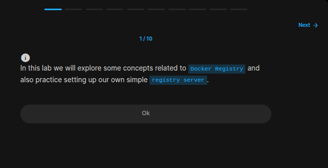
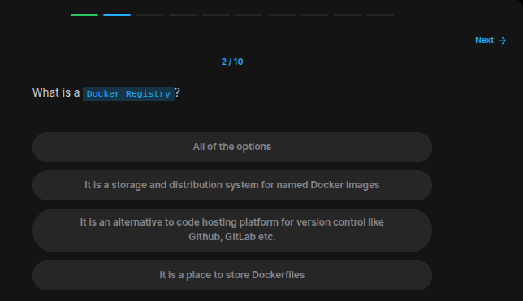
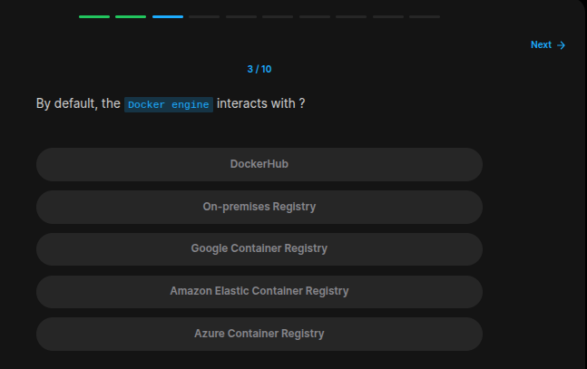
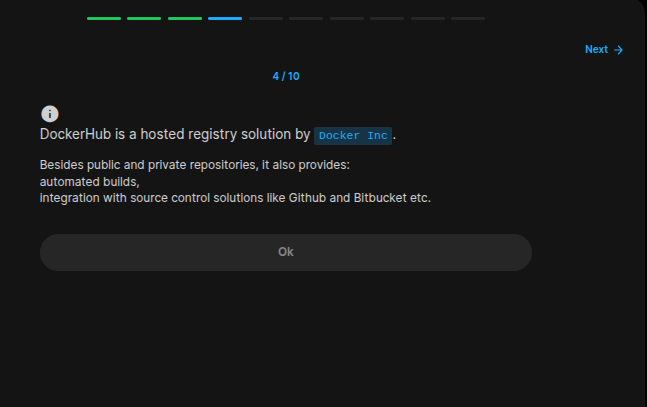
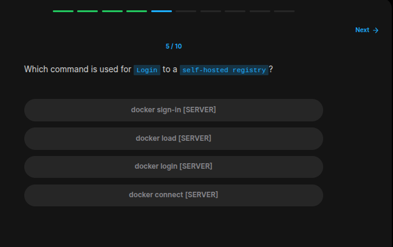
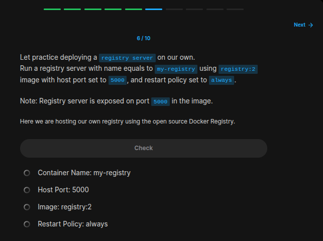
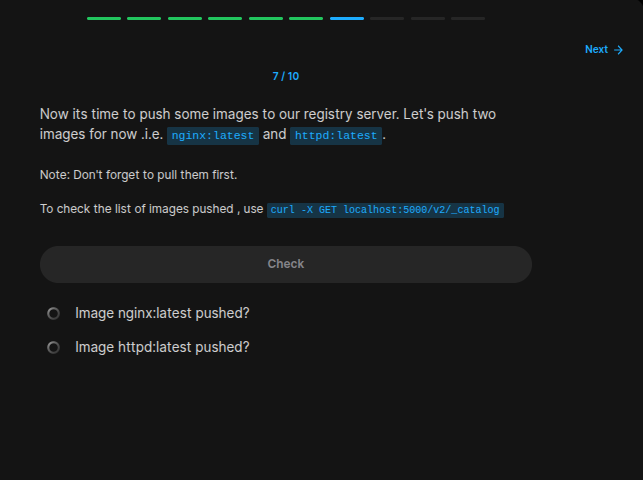
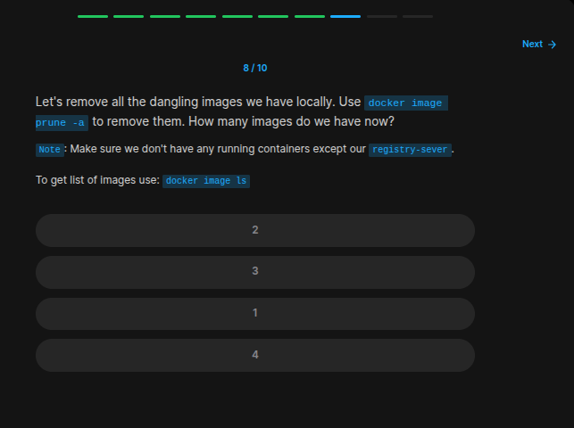
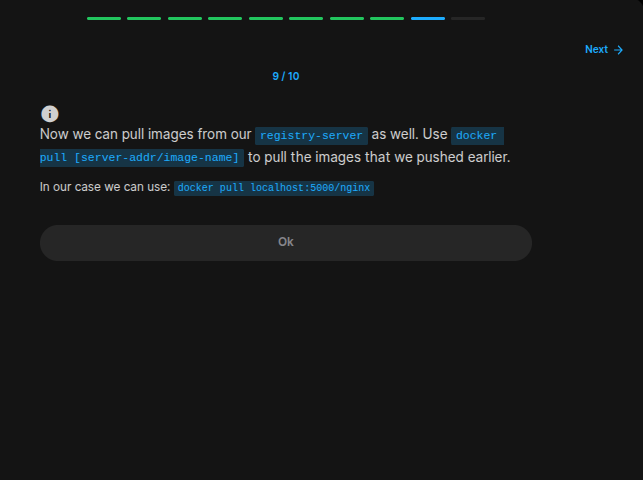
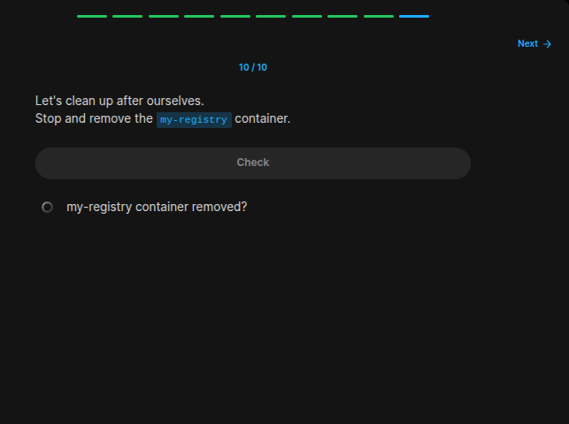

## Table of Contents

- [Introduction](#introduction)
- [Exercise 1/10](#exercise-110)
- [Exercise 2/10](#exercise-210)
- [Exercise 3/10](#exercise-310)
- [Exercise 4/10](#exercise-410)
- [Exercise 5/10](#exercise-510)
- [Exercise 6/10](#exercise-610)
- [Exercise 7/10](#exercise-710)
- [Exercise 8/10](#exercise-810)
- [Exercise 9/10](#exercise-910)
- [Exercise 10/10](#exercise-1010)


##  Introduction

Understanding Docker.

### Exercise 1/10

```
OK
```
### Exercise 2/10

```
It is a storage and distribution system for named Docker images
```
### Exercise 3/10

```
DockerHub
```
### Exercise 4/10

```
OK
```
### Exercise 5/10

```bash
# https://docs.docker.com/reference/cli/docker/login/

docker login 
```
### Exercise 6/10

```bash
docker run --name my-registry -p 5000:5000 --restart always registry:2 
```
### Exercise 7/10

```bash
# https://hub.docker.com/_/registry

# in this link we can see how to push images to our registry!
docker pull nginx
docker tag nginx localhost:5000/nginx
docker push localhost:5000/nginx

docker pull httpd
docker tag httpd localhost:5000/httpd
docker push localhost:5000/httpd
```
### Exercise 8/10

```bash
docker image prune -a

# after this command we have only 1 image remaining and that is registry:2
```
### Exercise 9/10

```
OK
```
### Exercise 10/10

```bash
docker stop my-registry
docker rm my-registry
```