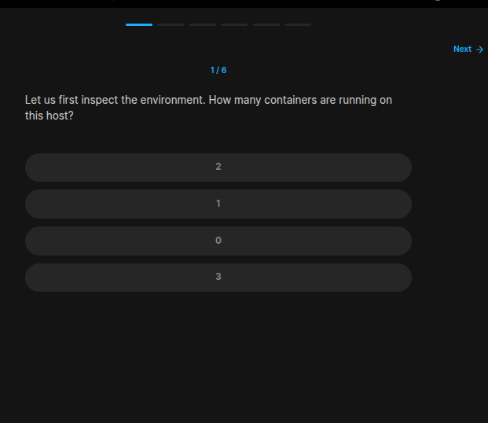
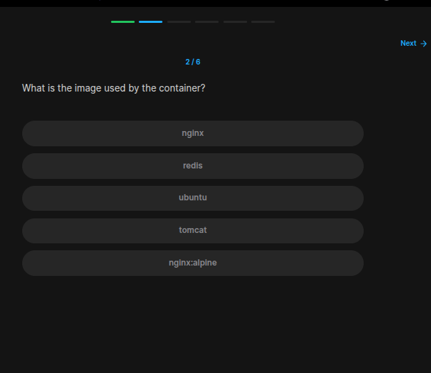
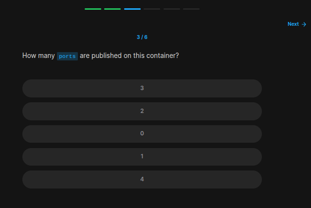
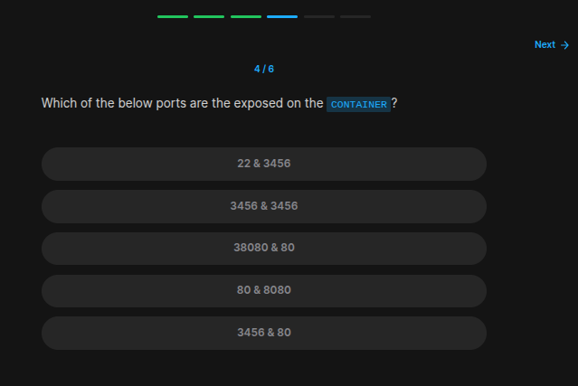
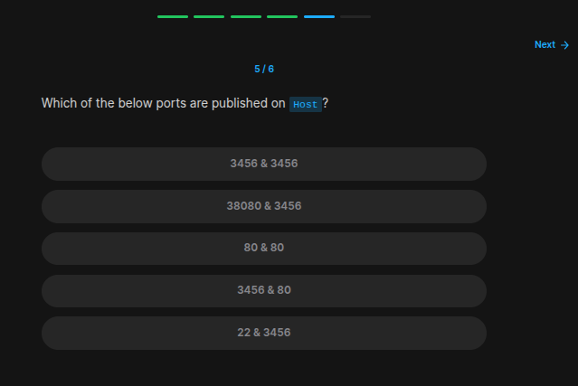
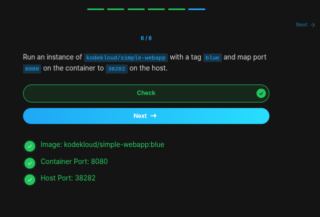

## Table of Contents

- [Introduction](#introduction)
- [Exercise 1/6](#exercise-16)
- [Exercise 2/6](#exercise-26)
- [Exercise 3/6](#exercise-36)
- [Exercise 4/6](#exercise-46)
- [Exercise 5/6](#exercise-56)
- [Exercise 6/6](#exercise-66)


##  Introduction

Understanding linux services.

### Exercise 1/6

```bash
docker ps # 1
```
### Exercise 2/6

```bash
docker ps # nginx:alpine
```
### Exercise 3/6

```bash
docker ps # 2
```
### Exercise 4/6

```
3456 & 80
```
### Exercise 5/6

```bash
38080 & 3456
```
### Exercise 6/6

```bash
docker run -p 38282:8080 kodekloud/simple-webapp:blue
```