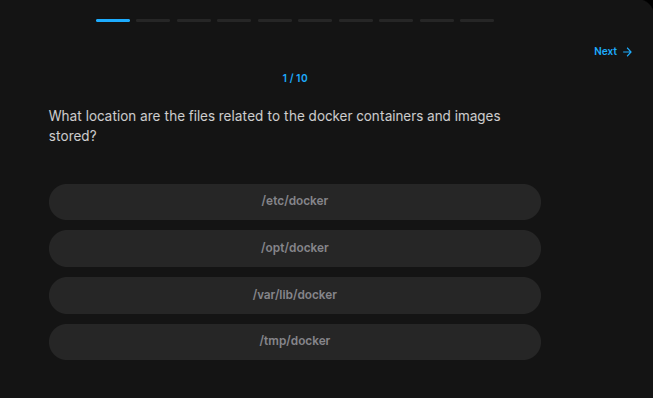
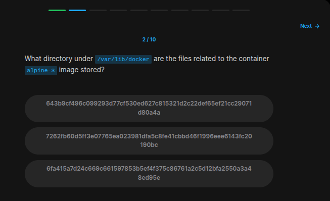
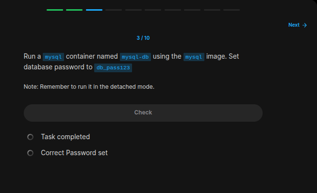
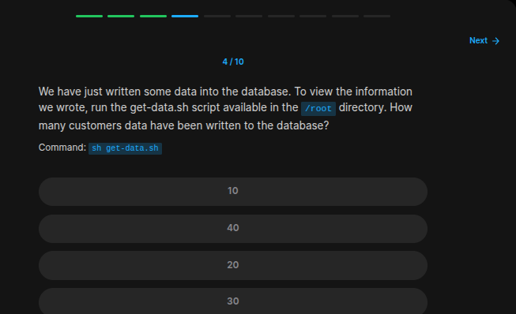
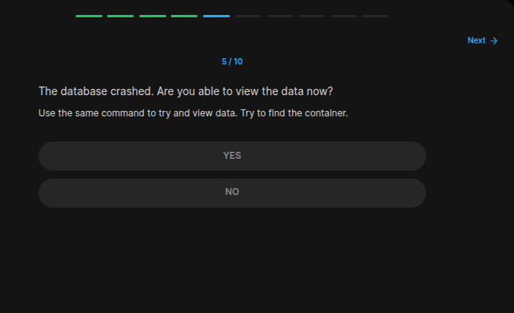
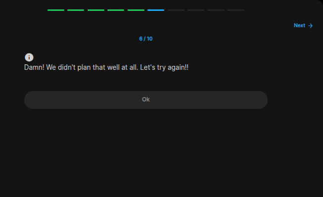
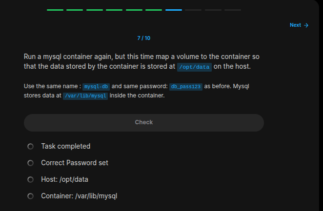
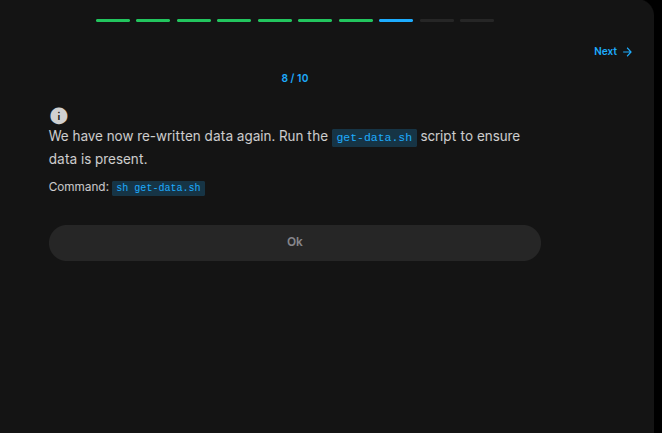
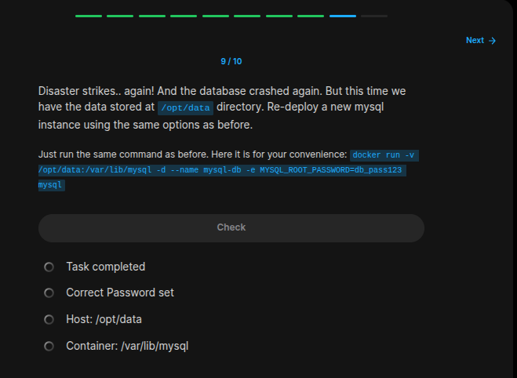
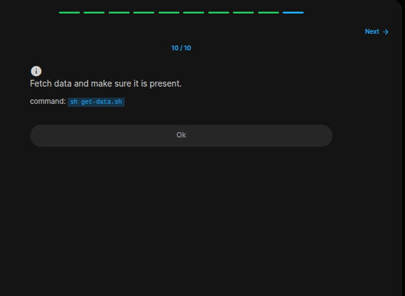

## Table of Contents

- [Introduction](#introduction)
- [Exercise 1/10](#exercise-110)
- [Exercise 2/10](#exercise-210)
- [Exercise 3/10](#exercise-310)
- [Exercise 4/10](#exercise-410)
- [Exercise 5/10](#exercise-510)
- [Exercise 6/10](#exercise-610)
- [Exercise 7/10](#exercise-710)
- [Exercise 8/10](#exercise-810)
- [Exercise 9/10](#exercise-910)
- [Exercise 10/10](#exercise-1010)
- [Exercise 11/10](#exercise-1110)
- [Exercise 10/10](#exercise-10)


##  Introduction

Understanding Docker.

### Exercise 1/10

```bash
# https://kodekloud.com/blog/where-docker-images-are-stored/#:~:text=This%20means%20that%20Docker%20directly,known%20as%20the%20root%20directory.

/var/lib/docker
```
### Exercise 2/10

```bash
# we have to check running or exited containers:
docker ps -a

# There we can see alpine-3 container that exited.
```
### Exercise 3/10

```bash
# https://hub.docker.com/_/mysql

docker run --name mysql-db -e MYSQL_ROOT_PASSWORD=db_pass123 -d mysql
```
### Exercise 4/10

```bash
cd /root

./get-data.sh | wc -l
```
### Exercise 5/10

```bash
./get-data.sh | wc -l

# this command doesnt work now!
```
### Exercise 6/10

```
OK
```
### Exercise 7/10

```bash
docker run --name mysql-db -e MYSQL_ROOT_PASSWORD=db_pass123 -d -v "/opt/data:/var/lib/mysql" mysql
```
### Exercise 8/10

```bash
cd /root
./get-data.sh

# Now we can see datas again!
```
### Exercise 9/10

```bash
docker run -v /opt/data:/var/lib/mysql -d --name mysql-db -e MYSQL_ROOT_PASSWORD=db_pass123 mysql
```
### Exercise 10/10

```bash
cd /root

./get-data.sh

# Its working!!!
```