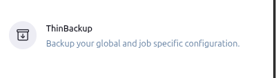
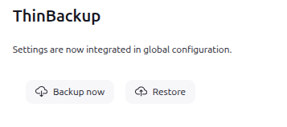
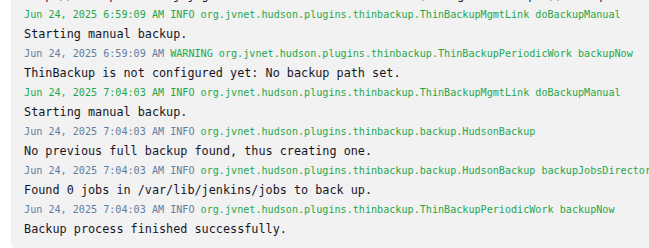
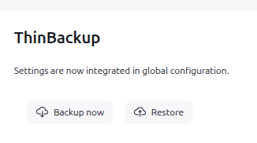
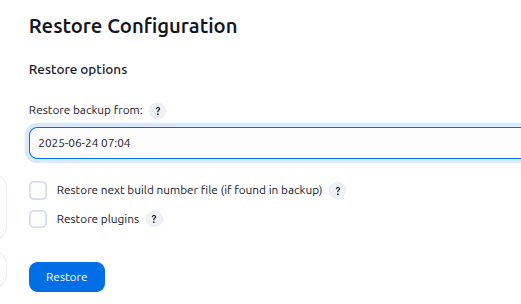
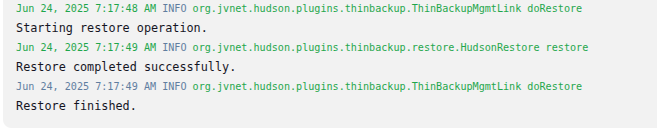

## Table of Contents

- [Introduction](#introduction)
- [Exercise 1/7](#exercise-17)
- [Exercise 2/7](#exercise-27)
- [Exercise 3/7](#exercise-37)
- [Exercise 4/7](#exercise-47)
- [Exercise 5/7](#exercise-57)
- [Exercise 6/7](#exercise-67)
- [Exercise 7/7](#exercise-77)
- [Exercise 8/7](#exercise-87)
- [Exercise 9/7](#exercise-97)
- [Exercise 10/7](#exercise-107)
- [Exercise 11/7](#exercise-117)
- [Exercise 7/7](#exercise-7)


##  Introduction

Understanding Jenkins.

### Exercise 1/7
Jenkins server is already installed and it's running on port 8085. You can access the same using Jenkins button on the top bar. Login into the Jenkins server using below given credentials:

Username: admin  
Password: Adm!n321  
Notes:
1. You might need to restart Jenkins service after installing some plugins or after making some configuration changes etc. In such case, please make sure Jenkins service is back up before you submit your solution.

2. Please make a note of Jenkins credentials given above.
```
OK
```
### Exercise 2/7
Where does the data stored in jenkins?
```
https://www.jenkins.io/doc/developer/persistence/#:~:text=Jenkins%20uses%20the%20file%20system,stored%20in%20Java%20property%20files.

In $JENKINS_HOME 
```
### Exercise 3/7
Which of the following is the main configuration file of Jenkins?
```
https://www.jenkins.io/doc/book/managing/system-configuration/

config.xml
```
### Exercise 4/7
While backing up Jenkins server, which of the following directories is the most crucial to backup?
```
https://timi.eu/docs/anatella/4_8_7_backing_up_jenkins.html#:~:text=Jenkins%20stores%20everything%20under%20the,on%20the%20build%20agent%20side.

Jenkins Home directory
```
### Exercise 5/7
Install the ThinBackup Jenkins plugin.
```
Lets install it from "Plugins" section
```
### Exercise 6/7
Backup Jenkins (including plugins) under /var/lib/jenkins/jenkins_backup directory using thinBackup plugin.



```
after some reasearch i see that i have to configure ThinBackup on "Global Configure" section
```

```
Entered this section, after clicking "Backup Now", we can see that our backup finished in the logs:
```

### Exercise 7/7
Using ThinBackup plugin, restore the Jenkins backup (including plugins) you just took in the previous question.

Make sure to restart the Jenkins service after restoring the backup.

```
service jenkins restart
```



```
Let's Restore
``` 


```bash
DONE!
```