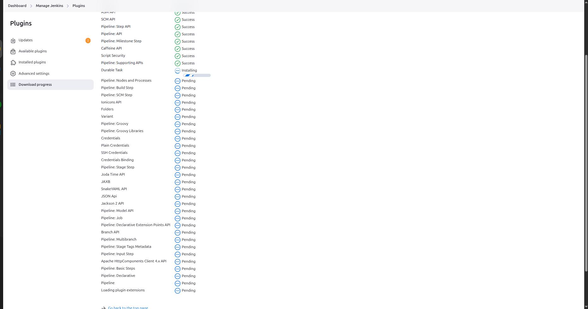
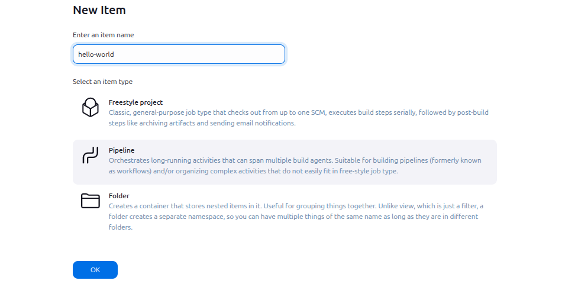
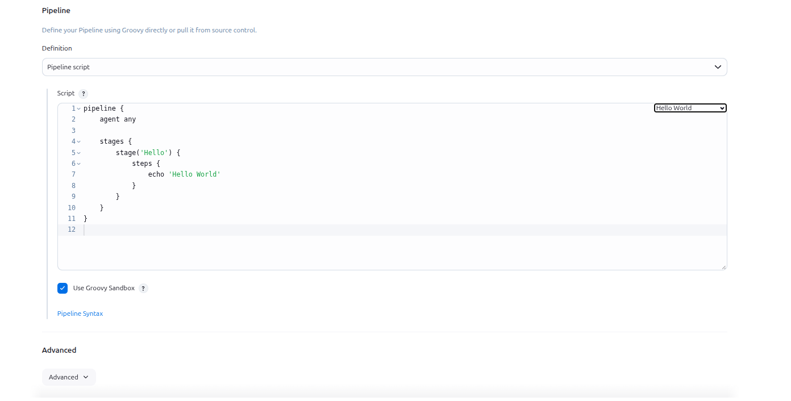

## Table of Contents

- [Introduction](#introduction)
- [Exercise 1/10](#exercise-110)
- [Exercise 2/10](#exercise-210)
- [Exercise 3/10](#exercise-310)
- [Exercise 4/10](#exercise-410)
- [Exercise 5/10](#exercise-510)
- [Exercise 6/10](#exercise-610)
- [Exercise 7/10](#exercise-710)
- [Exercise 8/10](#exercise-810)
- [Exercise 9/10](#exercise-910)
- [Exercise 10/10](#exercise-1010)

##  Introduction

Understanding Jenkins.

### Exercise 1/10
Jenkins server is already installed and it's running on port 8085. You can access the same using Jenkins button on the top bar. Login into the Jenkins server using below given credentials:

Username: admin  
Password: Adm!n321

Notes:
1. You might need to restart Jenkins service after installing some plugins or after making some configuration changes etc. In such case please make sure Jenkins service is back up before you submit your solution.
2. Please make a note of Jenkins credentials given above.
```
OK
```
### Exercise 2/10
What is a Jenkinsfile?
```
Jenkinsfile is a text file that contains the definition of a Jenkins Pipeline.
```
### Exercise 3/10
Which of the following components is not a part of Jenkinsfile (Jenkins pipeline) ?
```
needs
```
### Exercise 4/10
Does Jenkins support multi-stage pipeline?
```
Yes
```
### Exercise 5/10
Install Pipeline Jenkins plugin?

Note: Just in case Jenkins page gets stuck after restart please try to refresh it.

```
Installing...
```
### Exercise 6/10
Create a pipeline job named hello-world, it should just echo the Hello World string.

You can name the stage as per your choice.


```
and then 
```


```
Then build and we are done!
```
### Exercise 7/10
We have a pipeline job named go-test but its incomplete.

Complete the same by adding the required stages/steps as per details mentioned below:  
1. Clone a git repository.  
```
git 'https://github.com/kodekloudhub/go-webapp-sample.git'
```
2. Run a shell command go test ./...

```
sh 'go test ./...'
```
Note: You can name the stages as per your choice.
```
Edit the pipeline like this:
```
```
pipeline {
    agent {
        label {
            label 'master'
            customWorkspace "${JENKINS_HOME}/${BUILD_NUMBER}/"
        }
    }
    environment {
        Go111MODULE='on'
    }
    stages {
        stage('Test') {
            steps {
                git 'https://github.com/kodekloudhub/go-webapp-sample.git'
                sh 'go test ./...'
            }
        }
    }
}

```
### Exercise 8/10

Now modify the go-test pipeline job as per details mentioned below:


1. Remove the sh 'go test ./...' step.

2. Add an another stage (name it as per your choice) to build a docker image from the cloned code. The required Jenkins plugins have already been installed i.e Docker and Docker pipeline. The image should be tagged as adminturneddevops/go-webapp-sample
```
Edit the pipeline file like this:
```
```
pipeline {
    agent {
        label {
            label 'master'
            customWorkspace "${JENKINS_HOME}/${BUILD_NUMBER}/"
        }
    }
    environment {
        Go111MODULE='on'
    }
    stages {
        stage('Test') {
            steps {
                git 'https://github.com/kodekloudhub/go-webapp-sample.git'
            }
        }
        stage('build') {
            steps {
                script{
                    image = docker.build("adminturneddevops/go-webapp-sample")
                }
            }
        }
    }
}
```
### Exercise 9/10
Now that you have built the docker image so let's modify the go-test pipeline job to deploy an app using this docker image. Find below more details:  
1. Add an another step to run a docker container using the docker image you are building in this pipeline itself. Make sure to map container port 8000 with docker host port 8090. This is the step you can add:
```
sh "docker run -p 8090:8000 -d adminturneddevops/go-webapp-sample"
```
```
Lets edit the pipeline like this:
```
```
pipeline {
    agent {
        label {
            label 'master'
            customWorkspace "${JENKINS_HOME}/${BUILD_NUMBER}/"
        }
    }
    environment {
        Go111MODULE='on'
    }
    stages {
        stage('Test') {
            steps {
                git 'https://github.com/kodekloudhub/go-webapp-sample.git'
            }
        }
        stage('build') {
            steps {
                script{
                    image = docker.build("adminturneddevops/go-webapp-sample")
                    sh "docker run -p 8090:8000 -d adminturneddevops/go-webapp-sample"
                }
            }
        }
    }
}
```
### Exercise 10/10
You can access the deployed app using Sample-App button on the top bar.

You can login with the following username and password:  
username: test  
password: test
```bash
DONE!
```
