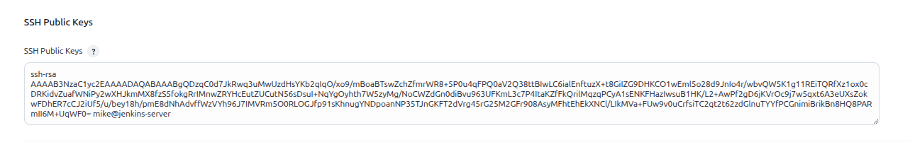

## Table of Contents

- [Introduction](#introduction)
- [Exercise 1/13](#exercise-113)
- [Exercise 2/13](#exercise-213)
- [Exercise 3/13](#exercise-313)
- [Exercise 4/13](#exercise-413)
- [Exercise 5/13](#exercise-513)
- [Exercise 6/13](#exercise-613)
- [Exercise 7/13](#exercise-713)
- [Exercise 8/13](#exercise-813)
- [Exercise 9/13](#exercise-913)
- [Exercise 10/13](#exercise-1013)
- [Exercise 11/13](#exercise-1113)
- [Exercise 12/13](#exercise-1213)
- [Exercise 13/13](#exercise-1313   )


##  Introduction

Understanding Jenkins.

### Exercise 1/13
From this lab onwards, Jenkins would be pre-deployed on the machine called jenkins-server. You can access the UI by clicking on the Jenkins button on top of the terminal. Login into the UI using the below credentials:

Username: admin  

Password: Adm!n321  

Notes:
1. You might need to restart Jenkins service after installing some plugins or after making some configuration changes. In such cases, please make sure that the Jenkins service is back to a running state before you submit your solution.

2. Re-use the Jenkins credentials given above.
```
OK
```
### Exercise 2/13
How many users are there?
```
Only 1, "Admin"
```
### Exercise 3/13
We just updated the configuration and restarted the Jenkins service. Login to the UI again and find out the number of users that have been created.

UserName: admin  
Password: Adm!n321  
```
We got 2 now.
```
### Exercise 4/13
What is the User ID of the new user that was added?
```
mike
```
### Exercise 5/13
What is the Full Name of this user?
```
Mike Wazowski
```
### Exercise 6/13
For the rest of the lab, let us make use of mike to navigate through the Jenkins UI.

Logout of the Jenkins UI as the admin user and log back in with the following credentials:

UserName: mike  
Password: M!k3@123  
```
OK, logged in.
```
### Exercise 7/13
Is there a Public SSH Key configured for the user called mike?
```
If we go to the "Dashboard > Mike Wazowski > Security
We can see that there is no key available.
```
### Exercise 8/13
The user called mike has also been created in the jenkins-server.

```
root@jenkins-server:~# id mike
uid=1001(mike) gid=1002(mike) groups=1002(mike),27(sudo)
root@jenkins-server:~#
```
Switch to this user by running the below command:

```
root@jenkins-server:~# su - mike 
mike@jenkins-server:~$
```
```
DONE
```
### Exercise 9/13
There is a SSH key-pair created under /home/mike/.ssh.

What is name of the public key?
```bash
ls /home/mike/.ssh # we can see both "jenkins_key" and "jenkins_key.rsa"
```
### Exercise 10/13
Now add this public key (/home/mike/.ssh/jenkins_key.pub) in Jenkins for the user called mike. This will allow us to interact with Jenkins using the CLI.
```bash
cat /home/mike/.ssh/jenkins_key.rsa # copy the contents and create a key in jenkins UI.
```

```
then save.
```
### Exercise 11/13
We have configured the SSH service in Jenkins to listen on a fixed port. To find out the port in use, run the command below:

```
curl -Lv http://localhost:8085/login 2>&1 | grep -i 'x-ssh-endpoint'
```
Which port does the Jenkins SSH service use?
```
Its working on port 8022
```
### Exercise 12/13
Now that we have the port used by the Jenkins SSH server, let us begin interacting with Jenkins over ssh with the user mike.

As mike, try running the following commands:

```
mike@jenkins-server:~$ ssh -i /home/mike/.ssh/jenkins_key -l mike -p 8022 jenkins-server help
```

Keep a note of the options used with the SSH command:

-i flag is used to point to mike's private SSH key. Remember, we have already added the public key in the Jenkins configuration.
-l is the login user which in our example is mike
-p is the port which we found out in the previous step to be 8022
```
We can connect easily! 
```
### Exercise 13/13
Using the help command, find out the built-in command to safely restart Jenkins from the CLI.
```
We can do this with "safe-restart" command
```