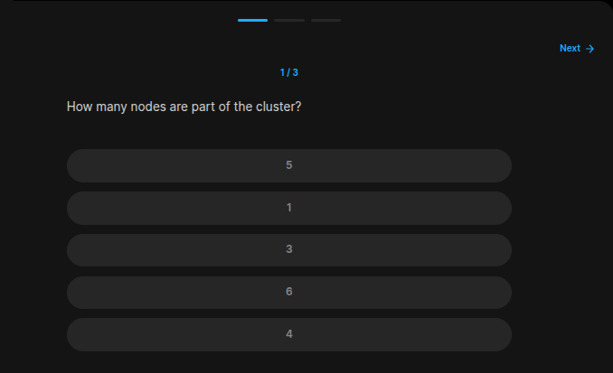
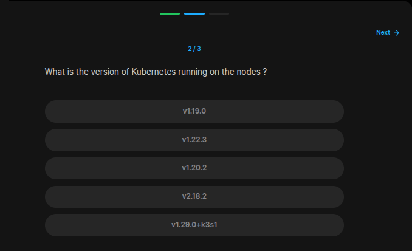
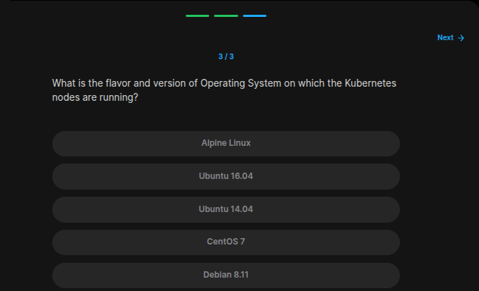

## Table of Contents

- [Introduction](#introduction)
- [Exercise 1/3](#exercise-13)
- [Exercise 2/3](#exercise-23)
- [Exercise 3/3](#exercise-33)

##  Introduction

Understanding Kubernetes.

### Exercise 1/3

```bash
kubectl get nodes # 1
```
### Exercise 2/3

```bash
kkubectl version # v1.29.0+k3s1
```
### Exercise 3/3

```bash
cat /etc/os-release

# We can see that its running on alpine linux.
```