## Table of Contents

- [Introduction](#introduction)
- [Exercise 1/13](#exercise-113)
- [Exercise 2/13](#exercise-213)
- [Exercise 3/13](#exercise-313)
- [Exercise 4/13](#exercise-413)
- [Exercise 5/13](#exercise-513)
- [Exercise 6/13](#exercise-613)
- [Exercise 7/13](#exercise-713)
- [Exercise 8/13](#exercise-813)
- [Exercise 9/13](#exercise-913)
- [Exercise 10/13](#exercise-1013)
- [Exercise 11/13](#exercise-1113)
- [Exercise 12/13](#exercise-1213)
- [Exercise 13/13](#exercise-1313)


##  Introduction

Understanding Kubernetes.

### Exercise 1/13
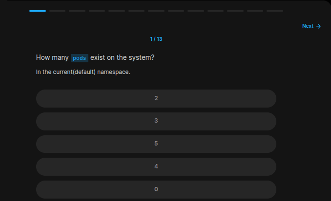
```bash
kubectl get pods
# return none
```
### Exercise 2/13
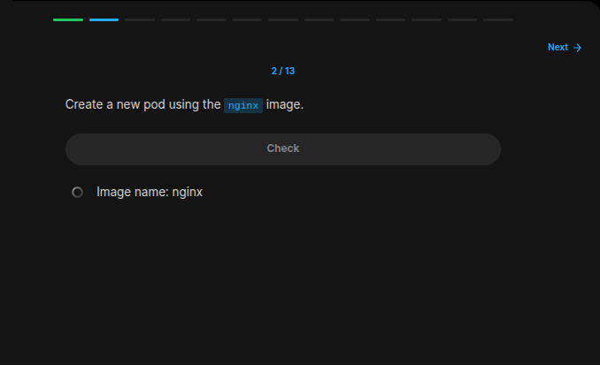
```bash
# In this link, we are giving this command:
# https://kubernetes.io/docs/concepts/workloads/pods/

kubectl apply -f https://k8s.io/examples/pods/simple-pod.yaml

# This command creates a new pod using kubernetes example .yaml file!

# But something was wrong in that .yaml, instead i used this in sample.yaml:

# apiVersion: v1
# kind: Pod
# metadata:
#   name: nginx
# spec:
#   containers:
#   - name: nginx
#     image: nginx
#     ports:
#     - containerPort: 80

# THEN
kubectl apply -f sample.yaml
```
### Exercise 3/13
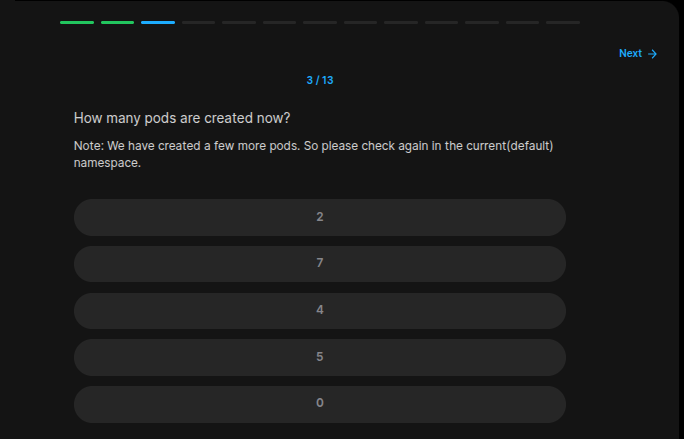
```bash
kubectl get pods # its 4
```
### Exercise 4/13
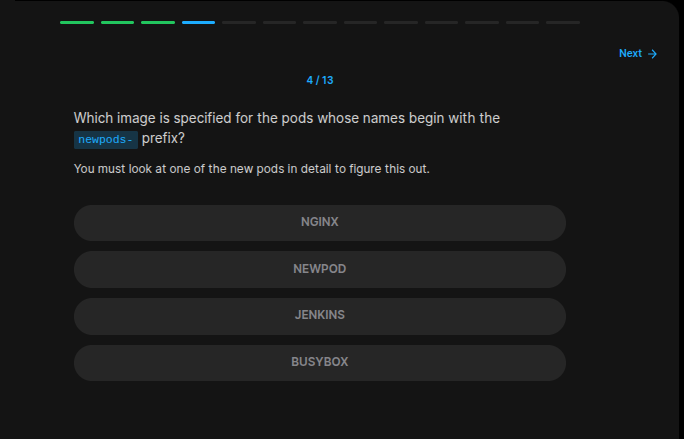
```bash
# With this command, we can see which image are these pods using;
kubectl describe pod | grep image

# which is 'busybox'
```
### Exercise 5/13
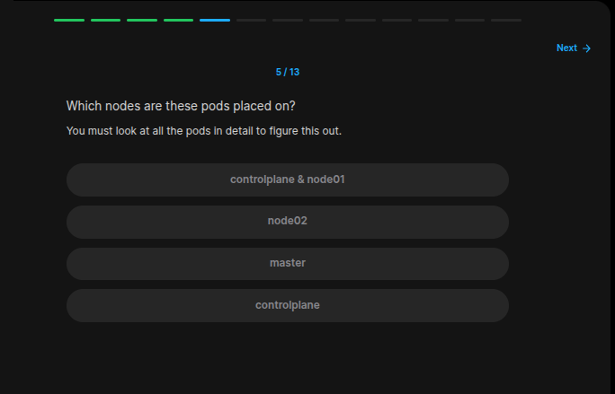
```bash
kubectl get pods -o wide # This command shows with more information, therefor "controlplane"
```
### Exercise 6/13
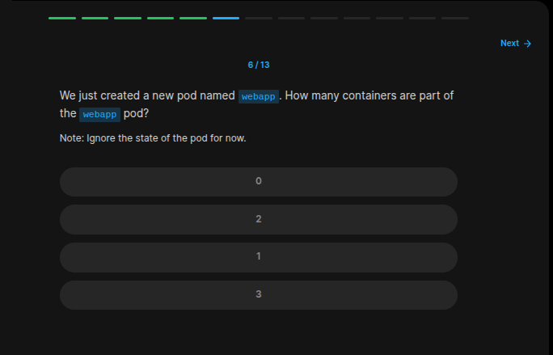
```bash
kubectl describe pod # 2

# With this command, we can see that this service creates 2 different contaiiner called "nginx" and "agentx"
```
### Exercise 7/13

```bash
kubectl describe pod # "nginx & agentx" images
```
### Exercise 8/13
What is the status of the agentx container in the pod?
```bash
kubectl describe pod
# In the logs, we can see that it couldnt take the image therefor in a error or waiting stage.
```
### Exercise 9/13
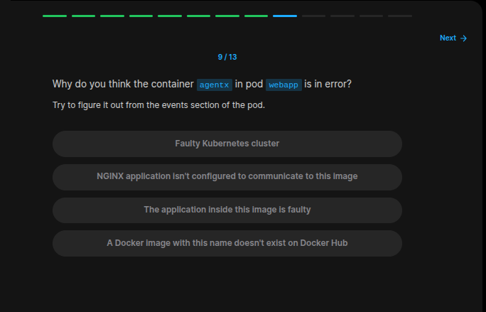
```
Image doesnt exist
```
### Exercise 10/13
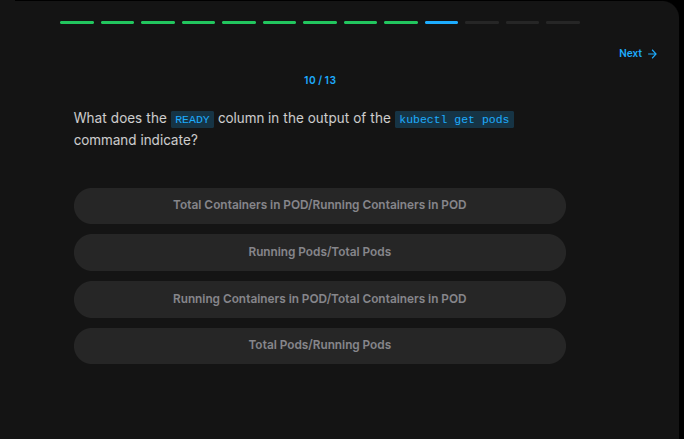
```
Running Container in POD/ Total Container in POD
```
### Exercise 11/13
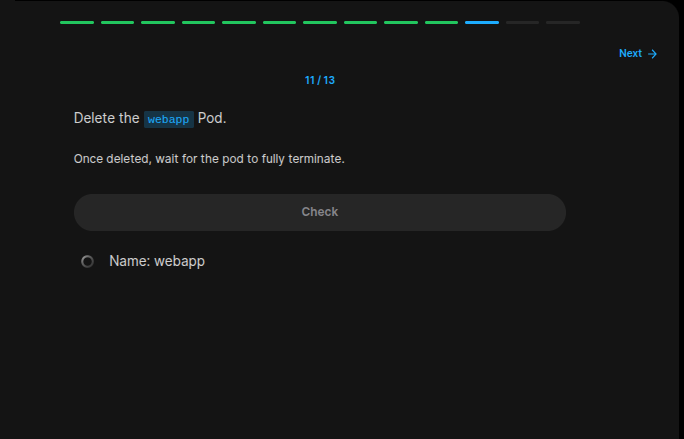
```bash
kubectl delete pod webapp 
```
### Exercise 12/13
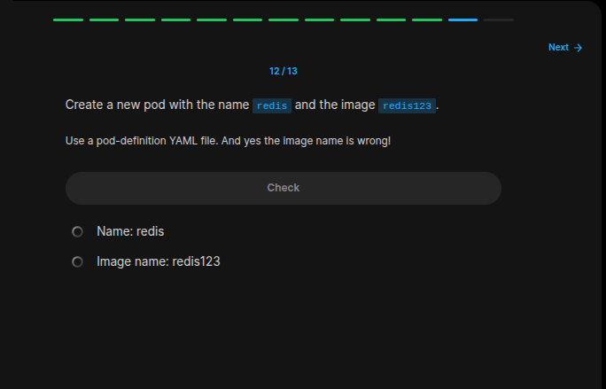
```bash
# I created a new service .yml file with this content:

# apiVersion: v1
# kind: Pod
# metadata:
#   name: redis
# spec:
#   containers:
#   - name: redis
#     image: redis123
#     ports:
#     - containerPort: 80


# After saving this file, we have to run this command:
kubectl apply -f redis.yaml
```
### Exercise 13/13
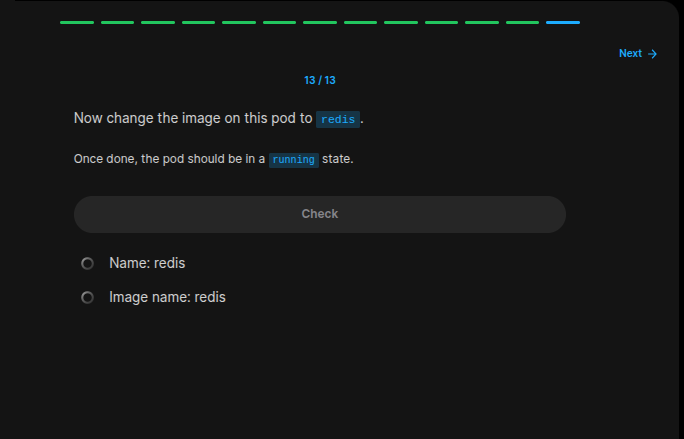
```bash
# after editing the file content, all we left to do is this;
kubectl apply -f redis.yaml

# and our service works just fine!
```