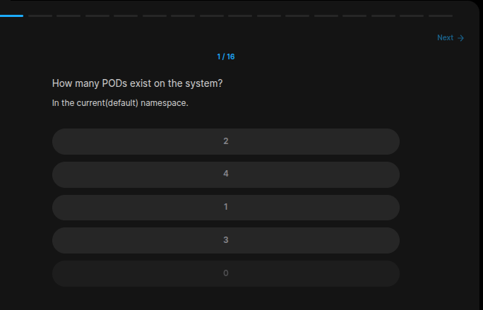

## Table of Contents

- [Introduction](#introduction)
- [Exercise 1/16](#exercise-116)
- [Exercise 2/16](#exercise-216)
- [Exercise 3/16](#exercise-316)
- [Exercise 4/16](#exercise-416)
- [Exercise 5/16](#exercise-516)
- [Exercise 6/16](#exercise-616)
- [Exercise 7/16](#exercise-716)
- [Exercise 8/16](#exercise-816)
- [Exercise 9/16](#exercise-916)
- [Exercise 10/16](#exercise-1016)
- [Exercise 11/16](#exercise-1116)
- [Exercise 12/16](#exercise-1216)
- [Exercise 13/16](#exercise-1316)
- [Exercise 14/16](#exercise-1416)
- [Exercise 15/16](#exercise-1516)
- [Exercise 16/16](#exercise-1616)


##  Introduction

Understanding Kubernetes.

### Exercise 1/16

```bash
kubectl get pods # NONE
```
### Exercise 2/16
How many ReplicaSets exist on the system?
```bash
kubectl get rs # NONE
```
### Exercise 3/16
How about now? How many ReplicaSets do you see?  
We just made a few changes!
```bash
kubectl get rs # Now its "1"
```
### Exercise 4/16
How many PODs are DESIRED in the new-replica-set?
```bash
# NAME              DESIRED   CURRENT   READY   AGE
# new-replica-set   4         4         0       2m2s

# 4
```
### Exercise 5/16
What is the image used to create the pods in the new-replica-set?
```bash
kubectl describe pods # Its busybox777
```
### Exercise 6/16
How many PODs are READY in the new-replica-set?
```bash
kubectl get rs # None of them is ready.
```
### Exercise 7/16
Why do you think the PODs are not ready?
```bash
kubectl describe pod # This shows that there is no image called "busybox777".
```
### Exercise 8/16
Delete any one of the 4 PODs.
```bash
kubectl delete pod [pod_name]
```
### Exercise 9/16
How many PODs exist now?
```bash
# Still 4
```
### Exercise 10/16
Why are there still 4 PODs, even after you deleted one?
```bash
# with this command:
kubectl describe rs

# We can see that these pods configured for 4 replicas. 
```
### Exercise 11/16
Create a ReplicaSet using the replicaset-definition-1.yaml file located at /root/.

There is an issue with the file, so try to fix it.
```bash
# We are told that there is a error and we have to fix it. Lets fix it.

# ERROR
# controlplane ~ ➜  kubectl apply -f replicaset-definition-1.yaml 

# error: resource mapping not found for name: "replicaset-1" namespace: "" from "replicaset-definition-1.yaml": no matches for kind "ReplicaSet" in version "v1"
# ensure CRDs are installed first

# Turns out we have to change this section:
# apiVersion: v1 -> apiVersion: apps/v1
```
### Exercise 12/16
Fix the issue in the replicaset-definition-2.yaml file and create a ReplicaSet using it.

This file is located at /root/.
```bash
# We have to change tier: nginx to tier: frontend
```
### Exercise 13/16
Delete the two newly created ReplicaSets - replicaset-1 and replicaset-2
```bash
kubectl delete rs replicaset-1
kubectl delete rs replicaset-2
```
### Exercise 14/16
Update the replica set information.
```
I forgot how i solved this :')
```
### Exercise 15/16
Scale the ReplicaSet to 5 PODs.
```bash
kubectl edit replicaset new-replica-set
# Set "replicas" to 5
```
### Exercise 16/16
Now scale the ReplicaSet down to 2 PODs.

Use the kubectl scale command or edit the replicaset using kubectl edit replicaset.
```bash
kubectl edit replicaset new-replica-set
# Set "replicas" to 2
```