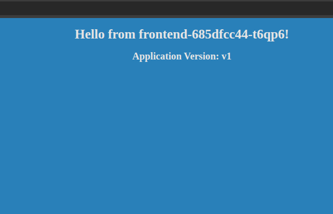

## Table of Contents

- [Introduction](#introduction)
- [Exercise 1/13](#exercise-113)
- [Exercise 2/13](#exercise-213)
- [Exercise 3/13](#exercise-313)
- [Exercise 4/13](#exercise-413)
- [Exercise 5/13](#exercise-513)
- [Exercise 6/13](#exercise-613)
- [Exercise 7/13](#exercise-713)
- [Exercise 8/13](#exercise-813)
- [Exercise 9/13](#exercise-913)
- [Exercise 10/13](#exercise-1013)
- [Exercise 11/13](#exercise-1113)
- [Exercise 12/13](#exercise-1213)
- [Exercise 13/13](#exercise-1313)


##  Introduction

Understanding Kubernetes.

### Exercise 1/13
We have deployed a simple web application. Inspect the PODs and the Services

Wait for the application to fully deploy and view the application using the link called Webapp Portal above your terminal.
```bash
OK
```
### Exercise 2/13
What is the current color of the web application?

Access the Webapp Portal.


```
It's currently blue!
```
### Exercise 3/13
Run the script named curl-test.sh to send multiple requests to test the web application. Take a note of the output.

Execute the script at /root/curl-test.sh.
```bash
./curl-test.sh # i did it.
```
### Exercise 4/13
Inspect the deployment and identify the number of PODs deployed by it
```bash
kubectl get pods # "4"
```
### Exercise 5/13
What container image is used to deploy the applications?
```bash
kubectl describe pod | grep Image: # this returns us "kodekloud/webapp-color:v1"
```
### Exercise 6/13
Inspect the deployment and identify the current strategy
```bash
kubectl describe deployments # RollingUpdate
```
### Exercise 7/13
If you were to upgrade the application now what would happen?
```bash
PODs would be upgraded few at a time.
```
### Exercise 8/13
Let us try that. Upgrade the application by setting the image on the deployment to kodekloud/webapp-color:v2

Do not delete and re-create the deployment. Only set the new image name for the existing deployment.
```bash
kubectl edit deployment frontend # and edit the image section...
```
### Exercise 9/13
Run the script curl-test.sh again. Notice the requests now hit both the old and newer versions. However none of them fail.

Execute the script at /root/curl-test.sh.
```
The output is sometimes blue and sometimes green.
```
### Exercise 10/13
Up to how many PODs can be down for upgrade at a time

Consider the current strategy settings and number of PODs - 4
```bash
# This command:
kubectl describe deployments | grep RollingUpdateStrategy
# Returns this information
# RollingUpdateStrategy:  25% max unavailable, 25% max surge

# And we can understand that we can only have "1" unavailable POD.
```
### Exercise 11/13
Change the deployment strategy to Recreate

Delete and re-create the deployment if necessary. Only update the strategy type for the existing deployment.
```bash
kubectl edit deployments frontend

# edit file for "Recreate"
```
### Exercise 12/13
Upgrade the application by setting the image on the deployment to kodekloud/webapp-color:v3

Do not delete and re-create the deployment. Only set the new image name for the existing deployment.
```bash
kubectl edit deployments frontend # edit image name
```
### Exercise 13/13
Run the script curl-test.sh again. Notice the failures. Wait for the new application to be ready. Notice that the requests now do not hit both the versions

Execute the script at /root/curl-test.sh.
```
Its working like a charm!
```