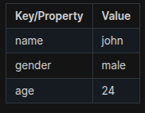
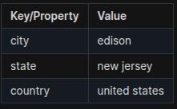
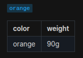
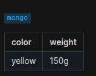
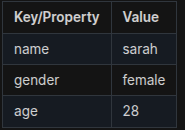
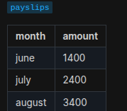

## Table of Contents

- [Introduction](#introduction)
- [Exercise 1/13](#exercise-113)
- [Exercise 2/13](#exercise-213)
- [Exercise 3/13](#exercise-313)
- [Exercise 4/13](#exercise-413)
- [Exercise 5/13](#exercise-513)
- [Exercise 6/13](#exercise-613)
- [Exercise 7/13](#exercise-713)
- [Exercise 8/13](#exercise-813)
- [Exercise 9/13](#exercise-913)
- [Exercise 10/13](#exercise-1013)
- [Exercise 11/13](#exercise-1113)
- [Exercise 12/13](#exercise-1213)
- [Exercise 13/13](#exercise-1313)


##  Introduction

Understanding 

### Exercise 1/13
Which of the following is used to separate the key and value in YAML?
```
colon
```
### Exercise 2/13
How many array keys are there in the following yaml snippet?

```yaml
Fruits:
  - Orange
  - Apple
  - Banana
Vegetables:
  - Carrot
  - CauliFlower
  - Tomato
```
```
2
```
### Exercise 3/13
Which of the following statements is true?

A. Dictionary is an unordered collection whereas list is an ordered collection.

B. Dictionary is an ordered collection whereas list is an unordered collection.

C. Dictionary and list, both are an ordered collection.

D. Dictionary and list, both are an unordered collection.
```
A. Dictionary is an unordered collection whereas list is an ordered collection.
```
### Exercise 4/13
There is a yaml file named practice.yaml under /home/bob/playbooks/ directory with a key property1 and value value1.

Add an additional key named property2 and value value2.
```bash
nano practice.yaml # then add this line "property2: value2"
```
### Exercise 5/13
We have updated the /home/bob/playbooks/practice.yaml file with the key name and value apple. Add some additional properties (given below) to the dictionary.

name= apple  
color= red  
weight= 90g  
```bash
nano practice.yaml 

# this should be the file content:

# name: apple
# color: red
# weight: 90g
```
### Exercise 6/13
We have updated the /home/bob/playbooks/practice.yaml file with a dictionary named employee. Add the remaining properties to it using information from the table below.


```bash
nano practice.yaml 

# Current file content:
```
```yaml
employee:
  name: john
  gender: male
  age: 24
```
### Exercise 7/13
Now, update the /home/bob/playbooks/practice.yaml file with a dictionary in dictionary.

Add a dictionary named address to add the address information in this file.

```bash
nano practice.yaml 

# Current file content:
```
```yaml
employee:
  name: john
  gender: male
  age: 24
  address:
    city: edison
    state: "new jersey"
    country: "united states"
```
### Exercise 8/13
We have updated the /home/bob/playbooks/practice.yaml file with an array of apples. Add a new apple to the list to make it a total of 4.
```bash
nano practice.yaml 

# Current file content:
```
```yaml
- apple
- apple
- apple
- apple
```
### Exercise 9/13
In /home/bob/playbooks/practice.yaml, add two more values apple to make it 6.
```bash
nano practice.yaml 

# Current file content:
```
```yaml
- apple
- apple
- apple
- apple
- apple
- apple
```
### Exercise 10/13
We have updated the /home/bob/playbooks/practice.yaml file with some data for apple, orange and mango. Just like apple, we would like to add additional details for each item, such as color, weight etc. Modify the remaining items to match the below data.



```bash
nano practice.yaml 

# Current file content:
```
```yaml
- name: apple
  color: red
  weight: 100g
- name: orange
  weight: 90g
  color: orange
- name: mango
  color: yellow
  weight: 150g
```
### Exercise 11/13
We have updated the /home/bob/playbooks/practice.yaml file with a dictionary named employee. We would like to record information about multiple employees. Convert the dictionary named employee to an array named employees.

```
Before
```
```yaml
employee:
  name: john
  gender: male
  age: 24
```
```
After
```
```yaml
employees:
 - employee:
     name: john
     gender: male
     age: 24
```
### Exercise 12/13
Update the /home/bob/playbooks/practice.yaml file to add an additional employee (below the existing entry) to the list using the below information.


```
Before
```

```yaml
employees:
 - employee:
     name: john
     gender: male
     age: 24
```
```
After
```
```yaml
employees:
 - employee:
     name: john
     gender: male
     age: 24
 - employee:
     name: sarah
     gender: female
     age: 28
```
### Exercise 13/13
We have updated the /home/bob/playbooks/practice.yaml file to add some more details. Now add the employee payslip information by adding an array called payslips. Remember, while address is a dictionary, payslips is an array of month and amount.


```
Before
```
```yaml
employee:
  name: john
  gender: male
  age: 24
  address:
    city: 'edison'
    state: 'new jersey'
    country: 'united states'
```
```
After
```
```yaml
employee:
  name: john
  gender: male
  age: 24
  address:
    city: 'edison'
    state: 'new jersey'
    country: 'united states'
  payslips:   
    - month: june
      amount: 1400
    - month: july
      amount: 2400
    - month: august
      amount: 3400
```