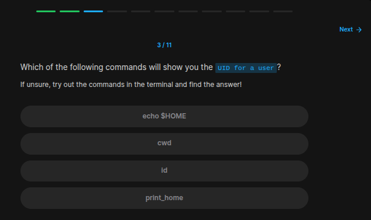
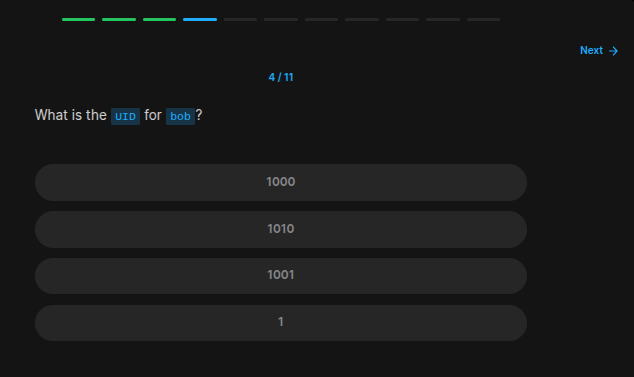
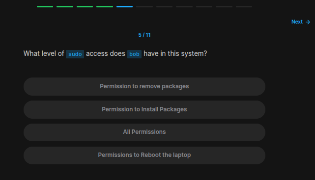
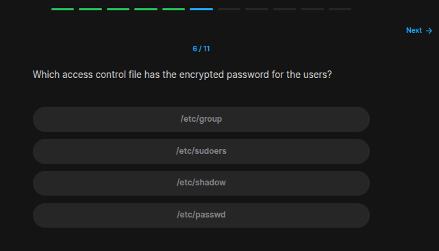
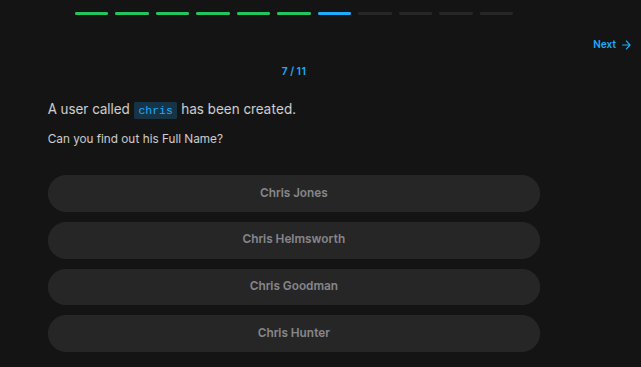
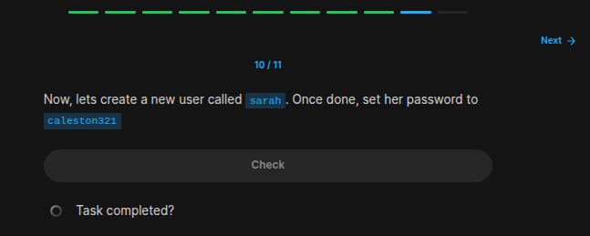
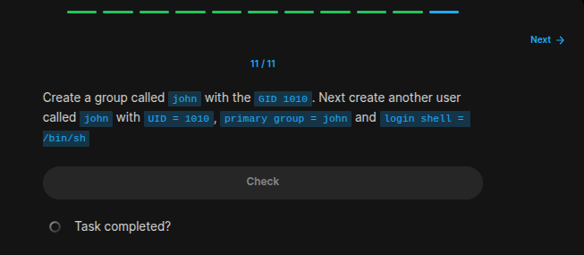

## Table of Contents

- [Introduction](#introduction)
- [Exercise 1/11](#exercise-111)
- [Exercise 2/11](#exercise-211)
- [Exercise 3/11](#exercise-311)
- [Exercise 4/11](#exercise-411)
- [Exercise 5/11](#exercise-511)
- [Exercise 6/11](#exercise-611)
- [Exercise 7/11](#exercise-711)
- [Exercise 8/11](#exercise-811)
- [Exercise 9/11](#exercise-911)
- [Exercise 10/11](#exercise-1011)
- [Exercise 11/11](#exercise-1111)

##  Introduction

Understanding linux services.

### Exercise 1/11

```
OK
```
### Exercise 2/11
Which type of user is Bob?
```bash
```
### Exercise 3/11

```bash
id
```
### Exercise 4/11

```bash
id
```
### Exercise 5/11

```
All permissions 
```
### Exercise 6/11

```bash
# google says its /etc/shadow
```
### Exercise 7/11

```bash
sudo cat /etc/passwd
```
### Exercise 8/11
```bash
# https://www.strongdm.com/blog/linux-list-all-groups#:~:text=Using%20the%20'%2Fetc%2Fgroup,of%20users%20in%20that%20group.

sudo cat /etc/group
```
### Exercise 9/11

```bash
sudo cat /etc/group
```
### Exercise 10/11

```bash
# https://snapshooter.com/learn/linux/create-and-manage-users#:~:text=You%20can%20create%20a%20new,command%20followed%20by%20the%20username.&text=The%20above%20command%20will%20do,and%20%2Fetc%2Fgshadow%20files.

sudo adduser sarah

# And then enter the password.
```
### Exercise 11/11

```bash
# https://www.redhat.com/en/blog/linux-groups

sudo groupadd -g 1010 john

sudo useradd -u 1010 -g 1010 -s /bin/sh john
```