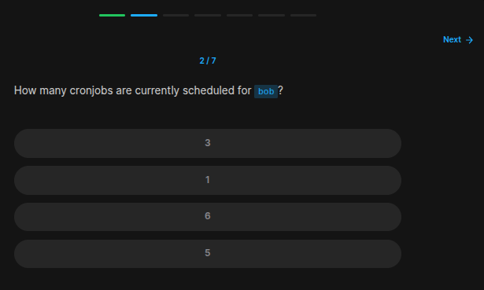
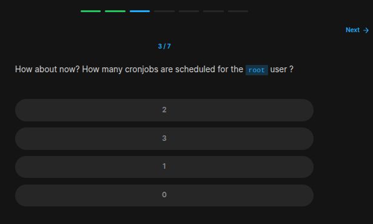
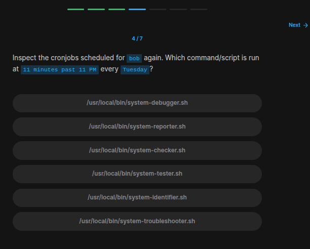
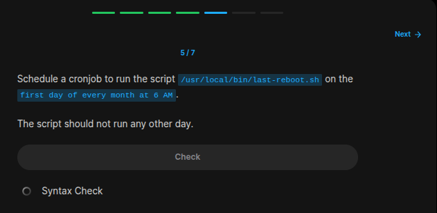
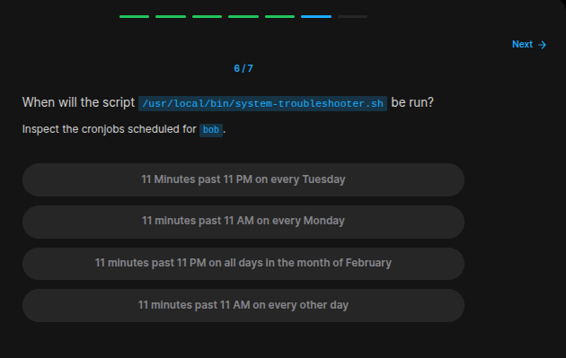
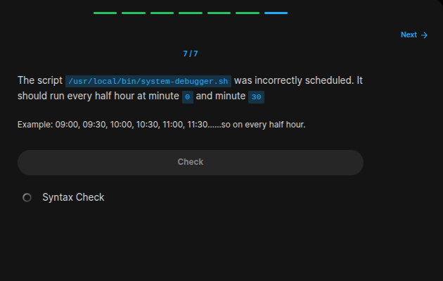

## Table of Contents

- [Introduction](#introduction)
- [Exercise 1/7](#exercise-17)
- [Exercise 2/7](#exercise-27)
- [Exercise 3/7](#exercise-37)
- [Exercise 4/7](#exercise-47)
- [Exercise 5/7](#exercise-57)
- [Exercise 6/7](#exercise-67)
- [Exercise 7/7](#exercise-77)

##  Introduction

Understanding linux services.

### Exercise 1/7

```bash
# https://phoenixnap.com/kb/how-to-list-display-view-all-cron-jobs-linux
crontab -l
```
### Exercise 2/7

```bash
crontab -l -u bob

# which is 6
```
### Exercise 3/7

```bash
sudo crontab -l
```
### Exercise 4/7

```bash
# I couldn't find a solution.
```
### Exercise 5/7

```bash
crontab -e

# inside the file, enter this:
0 6 1 * * /usr/local/bin/last-reboot.sh
```
### Exercise 6/7

```
February every day. 
```
### Exercise 7/7

```bash
crontab -e

# and edit the cronjob using some site like this:
# https://crontab.cronhub.io/
```