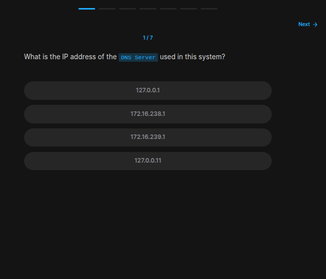
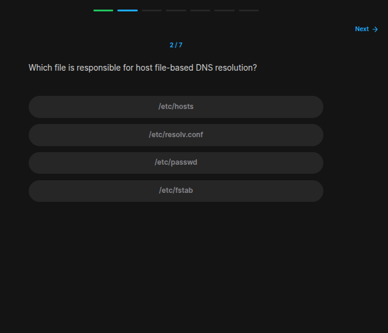
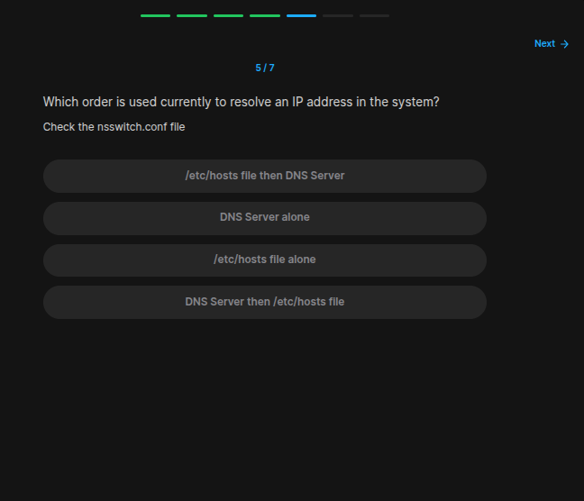
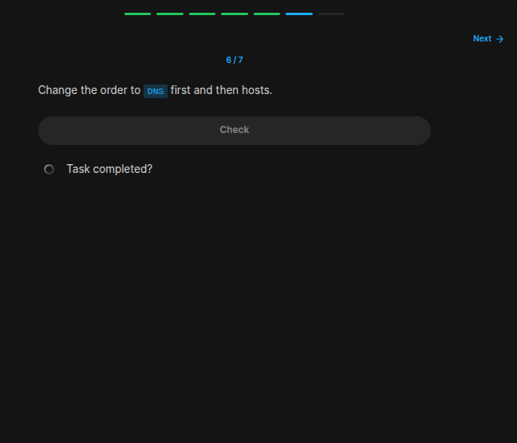
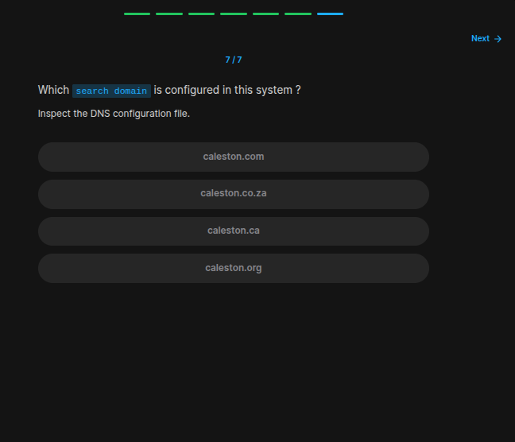

## Table of Contents

- [Introduction](#introduction)
- [Exercise 1/7](#exercise-17)
- [Exercise 2/7](#exercise-27)
- [Exercise 3/7](#exercise-37)
- [Exercise 4/7](#exercise-47)
- [Exercise 5/7](#exercise-57)
- [Exercise 6/7](#exercise-67)
- [Exercise 7/7](#exercise-77)


##  Introduction

Understanding linux services.

### Exercise 1/7

```bash
# With this link:
# https://draculaservers.com/tutorials/find-my-dns-server-ip-address-in-linux/

systemd-resolve --status
```
### Exercise 2/7

```bash
/etc/hosts
```
### Exercise 3/7
Where is the DNS configuration located?
```bash
/etc/resolv.conf
```
### Exercise 4/7

```bash
# Update the contents of the /etc/resolv.conf
sudo vi /etc/resolv.conf

# change `search` google.com
# cahnge `nameserver` to 8.8.8.8
```
### Exercise 5/7

```
/etc/hosts file then DNS Server
```
### Exercise 6/7

```bash
# https://unix.stackexchange.com/questions/738701/what-is-the-order-in-which-linux-resolves-dns

# At /etc/nsswitch.conf, edit the line hosts: files dns to hosts: dns files.
# This way linux actually looks for dns then to files.
```
### Exercise 7/7

```
caleston.ca
```