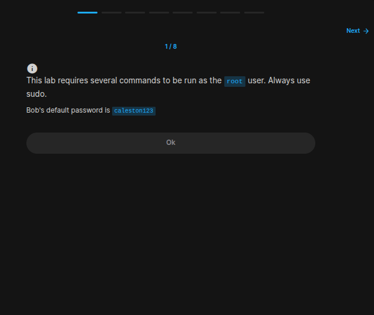
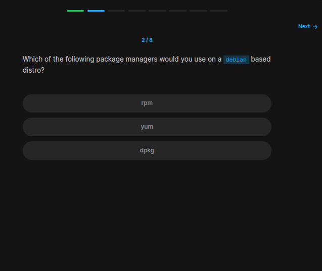
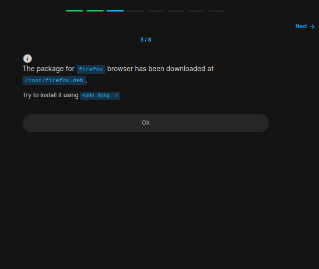
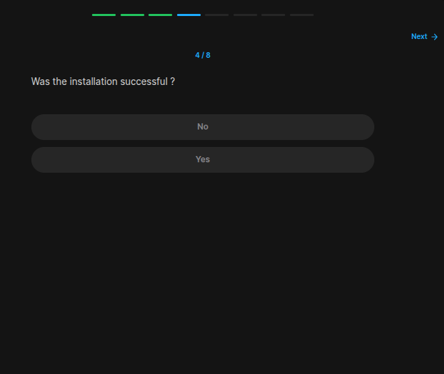
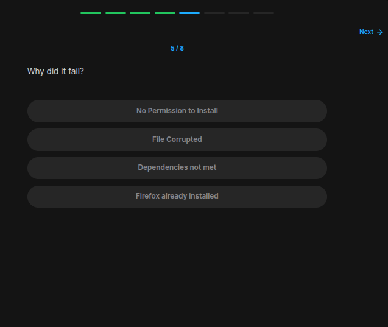
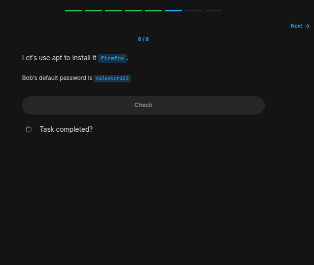
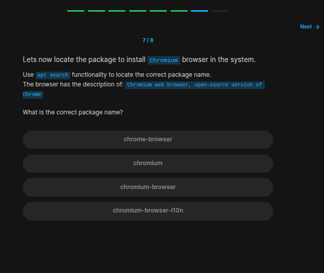
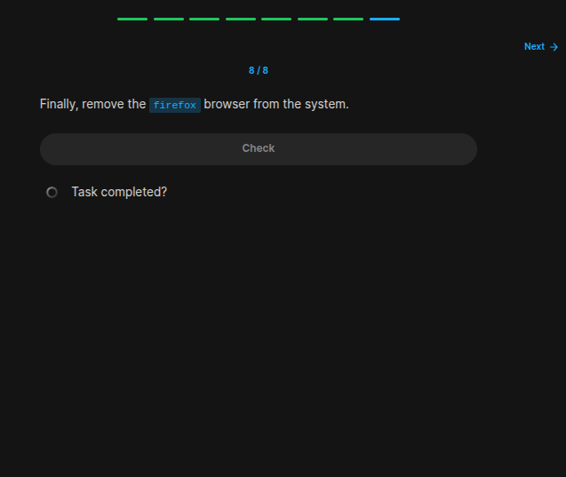

## Table of Contents

- [Introduction](#introduction)
- [Exercise 1/8](#exercise-18)
- [Exercise 2/8](#exercise-28)
- [Exercise 3/8](#exercise-38)
- [Exercise 4/8](#exercise-48)
- [Exercise 5/8](#exercise-58)
- [Exercise 6/8](#exercise-68)
- [Exercise 7/8](#exercise-78)
- [Exercise 8/8](#exercise-88)


##  Introduction

Understanding linux services.

### Exercise 1/8

```bash
OK
```
### Exercise 2/8

```bash
dpkg
```
### Exercise 3/8

```bash
OK
```
### Exercise 4/8

```bash
# I couldn't install it:

# dpkg: error processing package firefox (--install):
#  dependency problems - leaving unconfigured
# Processing triggers for mime-support (3.60ubuntu1) ...
# Processing triggers for man-db (2.8.3-2ubuntu0.1) ...
# Errors were encountered while processing:
#  firefox
```
### Exercise 5/8

```bash
Dependencies not met
```
### Exercise 6/8

```bash
sudo apt install /root/firefox.deb -y
```
### Exercise 7/8

```bash
sudo apt search Chromium
```
### Exercise 8/8

```bash
sudo apt remove chromium-browser
```