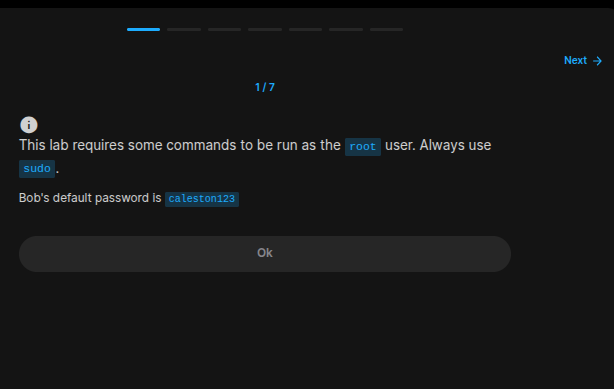
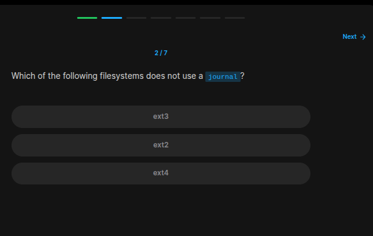
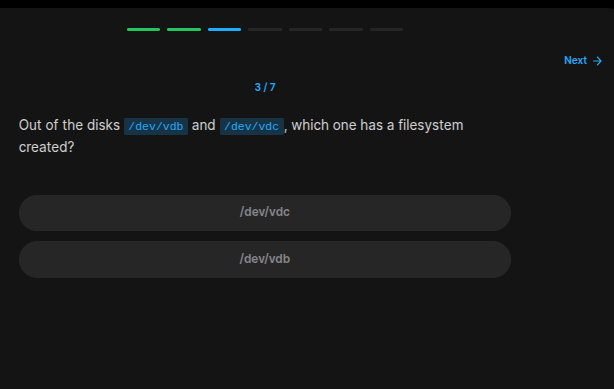
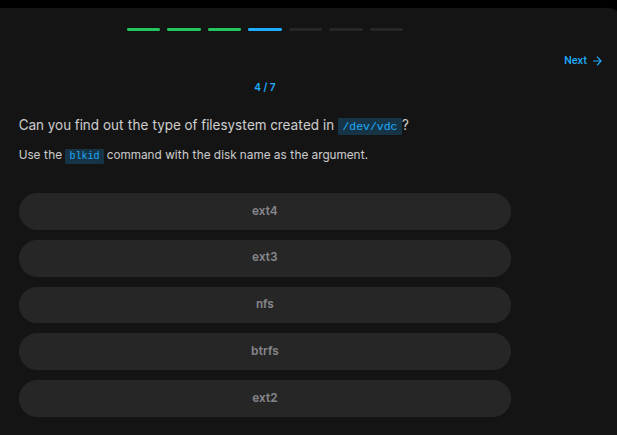
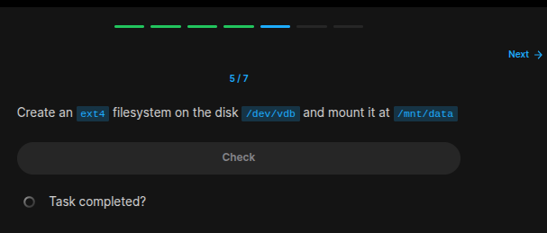
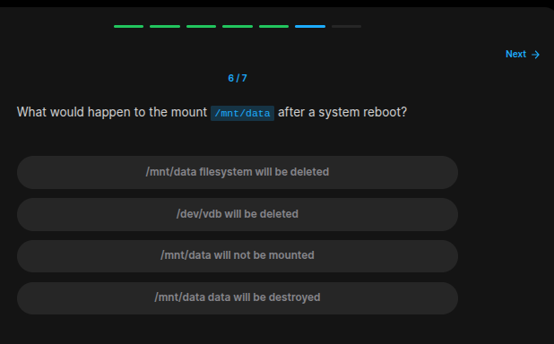
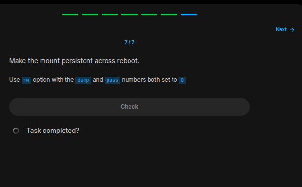

## Table of Contents

- [Introduction](#introduction)
- [Exercise 1/7](#exercise-17)
- [Exercise 2/7](#exercise-27)
- [Exercise 3/7](#exercise-37)
- [Exercise 4/7](#exercise-47)
- [Exercise 5/7](#exercise-57)
- [Exercise 6/7](#exercise-67)
- [Exercise 7/7](#exercise-77)

##  Introduction

Understanding linux services.

### Exercise 1/7

```
OK
```
### Exercise 2/7

```bash
# https://en.wikipedia.org/wiki/Journaling_file_system

# From the link we can see that ext3 and ext4 is using journal.
```
### Exercise 3/7

```bash
lshw -class disk
```
### Exercise 4/7

```bash
# Still with the same command:
lshw -class disk

# it is ext2
```
### Exercise 5/7

```bash
sudo mkfs.ext4 /dev/vdb

# then
sudo mkdir /mnt/data

# and lastly
sudo  mount /dev/vdb /mnt/data
```
### Exercise 6/7

```bash
# https://serverfault.com/questions/302122/how-can-i-mount-a-partition-on-every-reboot

# /mnt/data will not be mounted
```
### Exercise 7/7

```bash
# https://help.ubuntu.com/community/Fstab

# After reading the document, here is what we will do:
# 1 - Get into the fstab file
# 2- edit it contents

sudo nano /etc/fstab

# then if your mount information shows edit it accordingly to the link
# if not, try to find your information out of the nano with 'blkid'

# And you are done!
```