## Table of Contents

- [Introduction](#introduction)
- [Exercise 1/17](#exercise-117)
- [Exercise 2/17](#exercise-217)
- [Exercise 3/17](#exercise-317)
- [Exercise 4/17](#exercise-417)
- [Exercise 5/17](#exercise-517)
- [Exercise 6/17](#exercise-617)
- [Exercise 7/17](#exercise-717)
- [Exercise 8/17](#exercise-817)
- [Exercise 9/17](#exercise-917)
- [Exercise 10/17](#exercise-1017)
- [Exercise 11/17](#exercise-1117)
- [Exercise 12/17](#exercise-1217)
- [Exercise 13/17](#exercise-1317)
- [Exercise 14/17](#exercise-1417)
- [Exercise 15/17](#exercise-1517)
- [Exercise 16/17](#exercise-1617)
- [Exercise 17/17](#exercise-1717)


##  Introduction

Understanding linux services.

### Exercise 1/17
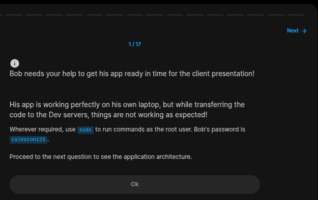
```
OK
```
### Exercise 2/17
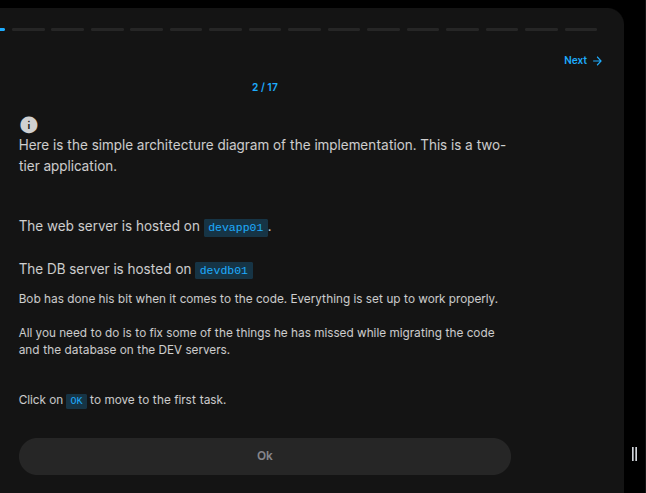
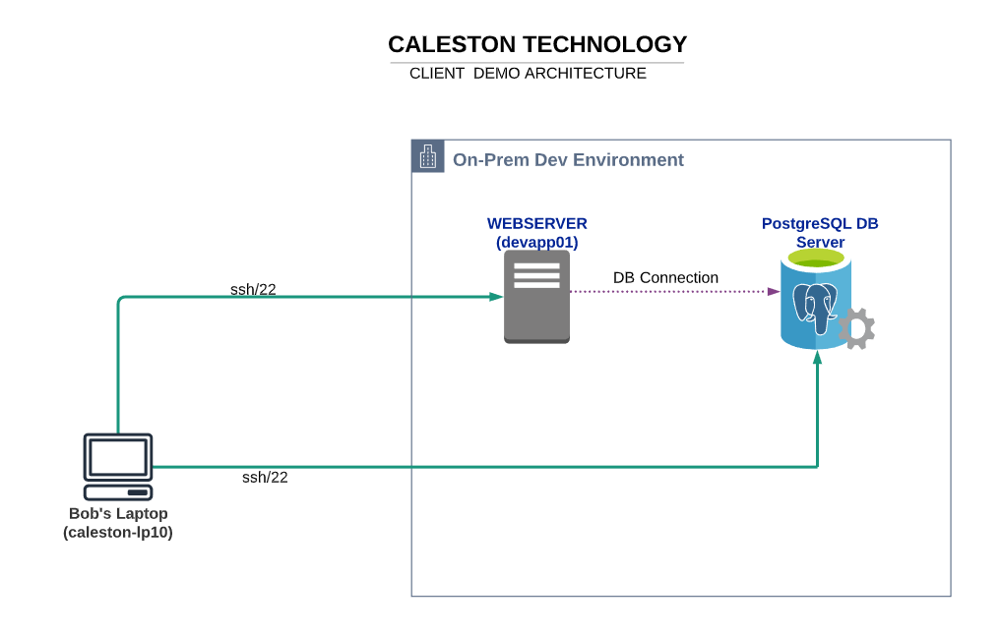
```
OK
```
### Exercise 3/17
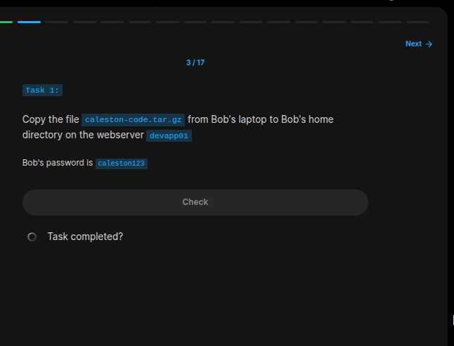
```bash
# https://linuxblog.io/linux-securely-copy-files-using-scp/

scp caleston-code.tar.gz bob@devapp01:~/
```
### Exercise 4/17
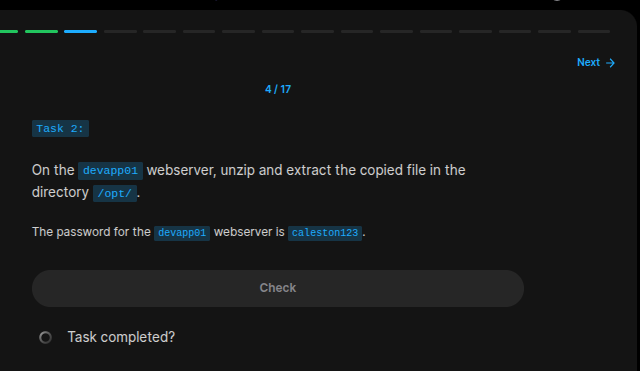
```bash
# Get inside the server
ssh bob@devapp01

# then:
# https://www.hostinger.com/tutorials/linux-tar-command-with-examples

sudo tar -C /opt/ -xvf caleston-code.tar.gz
```
### Exercise 5/17
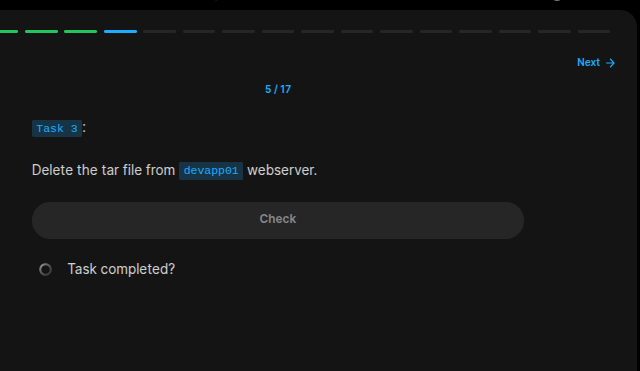
```bash
sudo rm caleston-code.tar.gz
```
### Exercise 6/17
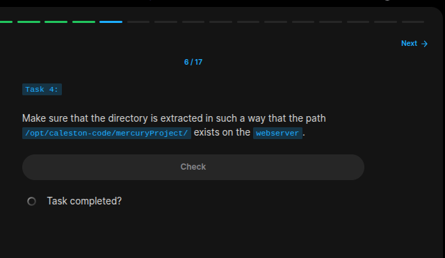
```bash
cd /opt/caleston-code/mercuryProject/
# this command is working so we got no problem.
```
### Exercise 7/17

```bash
ssh bob@devdb01

# After logging in, run this caommnd to see the status of the service.
systemctl status postgresql.service 
```
### Exercise 8/17
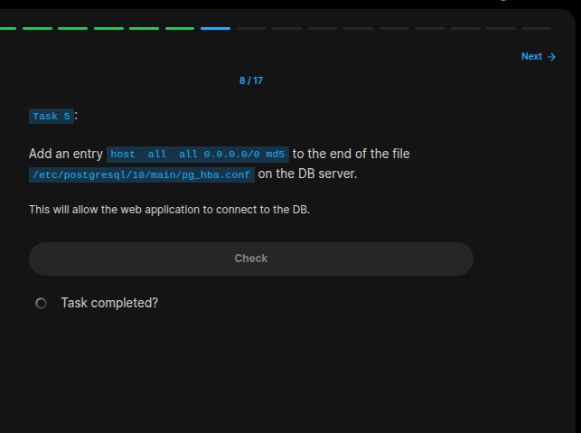
```bash
# Edit the file contents:
sudo vi /etc/postgresql/10/main/pg_hba.conf

# Edit this line without "#"
# host  all  all 0.0.0.0/0 md5
```
### Exercise 9/17
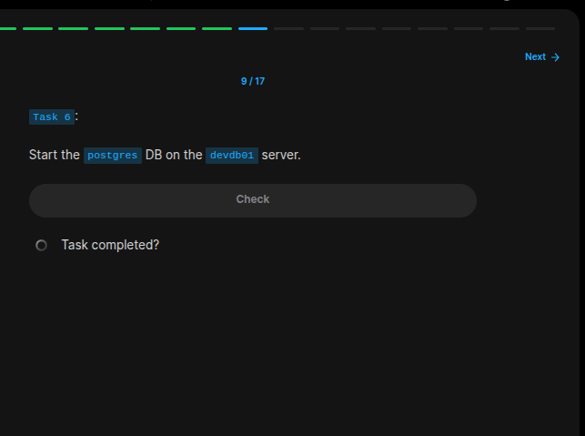
```bash
sudo systemctl start postgresql.service
```
### Exercise 10/17
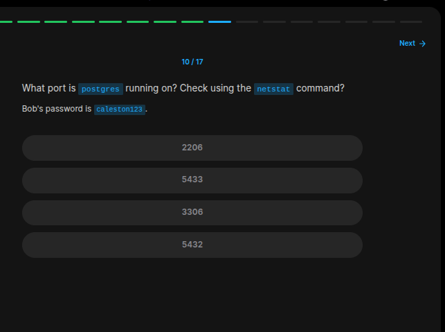
```bash
# https://stackoverflow.com/questions/5598517/find-the-host-name-and-port-using-psql-commands

sudo netstat -plunt |grep postgres
```
### Exercise 11/17

```bash
cd /opt/caleston-code/mercuryProject

python3 manage.py runserver 0.0.0.0:8000

# The service did not started!
```
### Exercise 12/17
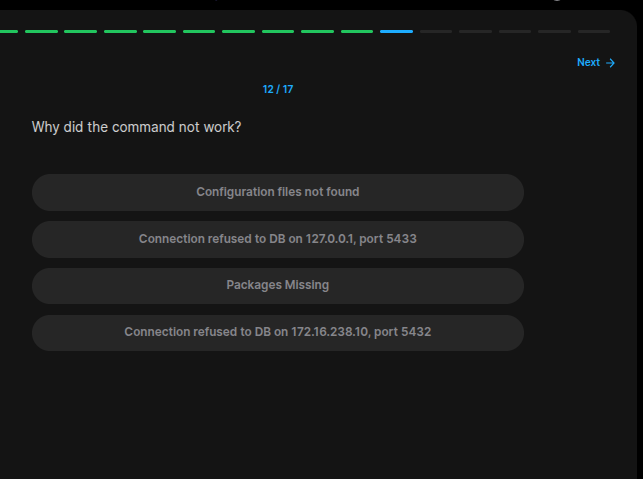
```
Connection refused to DB on 127.0.0.1, port 5433
```
### Exercise 13/17
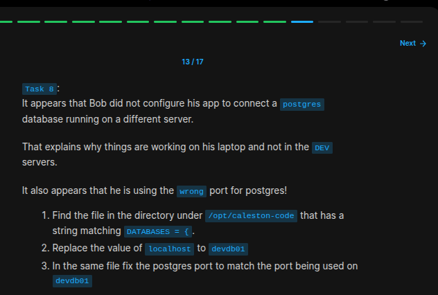
```bash
# https://stackoverflow.com/questions/16956810/find-all-files-containing-a-specific-text-string-on-linux
grep -rnw '/path/to/somewhere/' -e 'pattern'

# we have to change this command to something like this:
sudo grep -rnw . -e "DATABASES = {"

# and this is the ouptut we get:
# ./mercuryProject/mercury/settings.py:78:DATABASES = {

vi mercuryProject/mercury/settings.py

# edit 'HOST' and 'PORT' section in db credentials
```
### Exercise 14/17
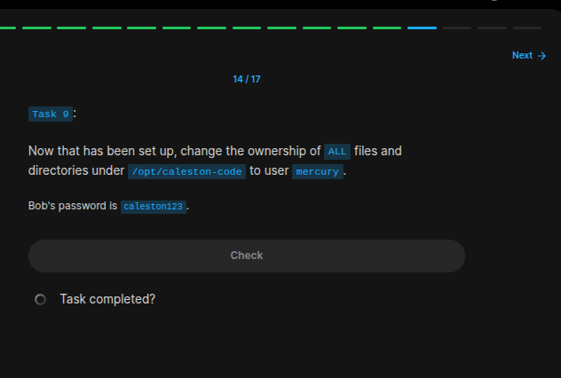
```bash
cd /opt/caleston-code
sudo chown -R mercury .
```
### Exercise 15/17

```
Did what told me...
```
### Exercise 16/17
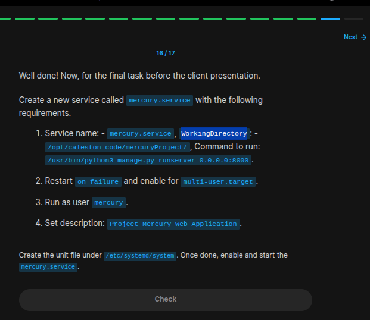
```bash
# service file contents:

# [Unit]
# Description=Project Mercury Web Application

# [Service]
# ExecStart=/usr/bin/python3 manage.py runserver 0.0.0.0:8000
# Restart=on-failure
# WorkingDirectory=/opt/caleston-code/mercuryProject
# User=mercury

# [Install]
# WantedBy=multi-user.target

# then start the service:
sudo systemctl enable --now mercury.service
sudo systemctl status mercury.service

```
### Exercise 17/17
We made it!