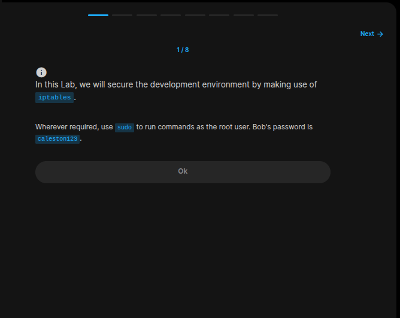
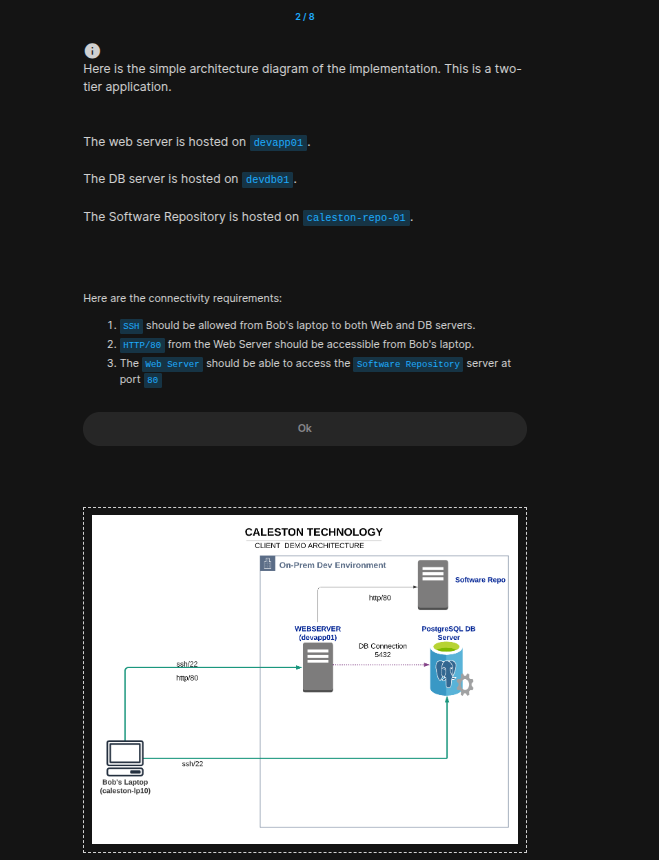
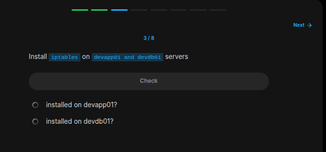
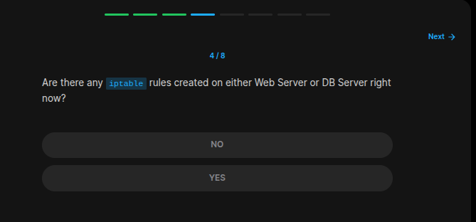
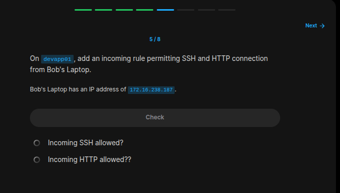
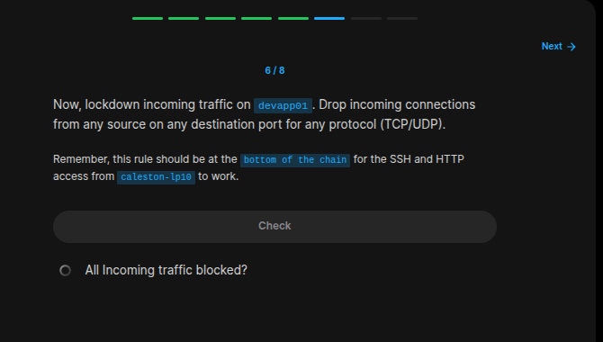
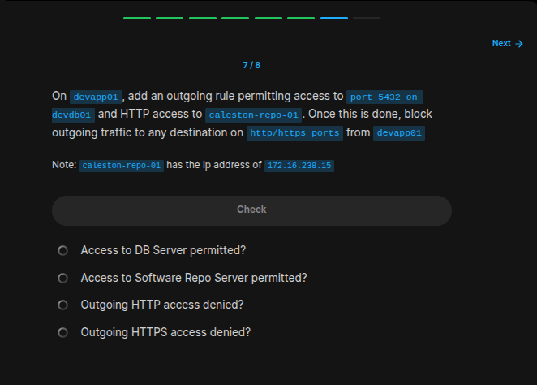
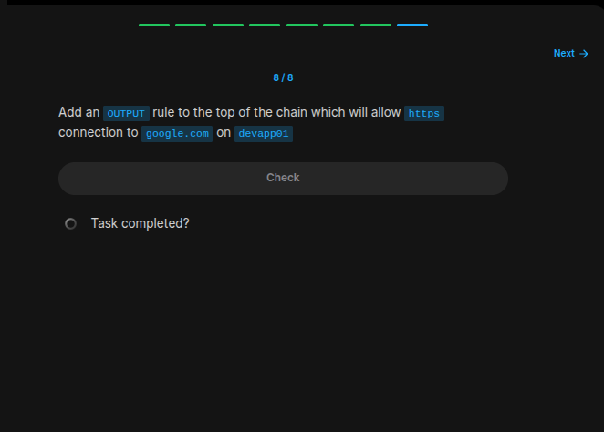

## Table of Contents

- [Introduction](#introduction)
- [Exercise 1/8](#exercise-18)
- [Exercise 2/8](#exercise-28)
- [Exercise 3/8](#exercise-38)
- [Exercise 4/8](#exercise-48)
- [Exercise 5/8](#exercise-58)
- [Exercise 6/8](#exercise-68)
- [Exercise 7/8](#exercise-78)
- [Exercise 8/8](#exercise-88)


##  Introduction

Understanding linux services.

### Exercise 1/8

```bash
# We are told that the Bob's password is this. Lets rememer that!
caleston123
```
### Exercise 2/8


```bash
# If we look at the hosts file for more information, we can see that ips are already settled:
# COMMAND
cat /etc/hosts

# OUTPUT
# 127.0.0.1       localhost
# ::1     localhost ip6-localhost ip6-loopback
# fe00::0 ip6-localnet
# ff00::0 ip6-mcastprefix
# ff02::1 ip6-allnodes
# ff02::2 ip6-allrouters
# 172.16.238.10   devapp01
# 172.16.238.11   devdb01
# 172.16.238.187  caleston-lp10
# 172.17.0.4      caleston-lp10

# This section is just giving us information, so lets move on with the exercise.
```
### Exercise 3/8

```bash
# First lets get into the devapp01 server like this:
ssh bob@devapp01

# And then enter the password of bob.

# After getting insde the devapp01 server, we can install iptables like this:
sudo apt-get install iptables -y

# and then exit:
exit

# Now lets get into the devdb01 server:
ssh bob@devdb01

# Enter the bob's password and we are in.

# Install the iptables:
sudo apt-get install iptables -y
```
### Exercise 4/8

```bash
# For this task, i found out this link:
# https://unix.stackexchange.com/questions/205867/viewing-all-iptables-rules

# Lets use that:
sudo iptables -L

# And this is the output from devdb01:
# OUTPUT

# bob@devdb01:~$ sudo iptables -L
# Chain INPUT (policy ACCEPT)
# target     prot opt source               destination         

# Chain FORWARD (policy ACCEPT)
# target     prot opt source               destination         

# Chain OUTPUT (policy ACCEPT)
# target     prot opt source               destination 

# Lets also check inside iptable of the devapp01 server:
ssh bob@devapp01

sudo iptables -L

# And we get the same output.

# So the answer is: 
NO
```
### Exercise 5/8

```bash
# First connect to the devapp01:
ssh bob@devapp01

# Now to solve this problem we can look at this link:
# https://www.webhi.com/how-to/how-to-use-iptables-firewall-rules-on-linux/#:~:text=Adding%20Rules,the%20end%20of%20a%20chain.&text=The%20%2DI%20option%20is%20used,specified%20position%20in%20a%20chain.&text=The%20%2Dp%20option%20is%20used,for%20specifying%20the%20destination%20port.

# So in order to add a new rule on our iptables, lets do this:
sudo iptables -A INPUT -s 172.16.238.187 -p tcp --dport 80 -j ACCEPT
sudo iptables -A INPUT -s 172.16.238.187 -p tcp --dport 22 -j ACCEPT
```
### Exercise 6/8

```bash
# Get into the devapp01:
ssh bob@devapp01

# Now lets run this code in order to block any traffic coming from other than caleston-lp10
# I came up with this lines but lab didn't take these as a solution. 
sudo iptables -I INPUT 3 -s 0.0.0.0/0 -p tcp -j DROP
sudo iptables -I INPUT 4 -s 0.0.0.0/0 -p udp -j DROP

# So this is the actual way of doing this:
sudo iptables -A INPUT -j DROP
```

### Exercise 7/8

```bash
# Lets first get into the devapp01:
ssh bob@devapp01

# And then create the rules for comunicating with the outside ports 80 and 5432
sudo iptables -A OUTPUT -s 172.16.238.15  -p tcp --dport 80 -j ACCEPT
sudo iptables -A OUTPUT -s 172.16.238.11  -p tcp --dport 5432 -j ACCEPT

# And lets drop all the package that is gooing via port 80 and 443 
sudo iptables -A OUTPUT -s 0.0.0.0/0 -p tcp --dport 80 -j DROP
sudo iptables -A OUTPUT -s 0.0.0.0/0 -p tcp --dport 443 -j DROP

```
### Exercise 8/8

```bash
# To achieve what is wanted from us, we can easily create this command that uses port 443 which is https for the google.com dns(a.k.a. google's ip).
sudo iptables -I OUTPUT 1 -s google.com -p tcp --dport 443 -j ACCEPT
```