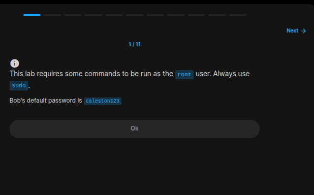
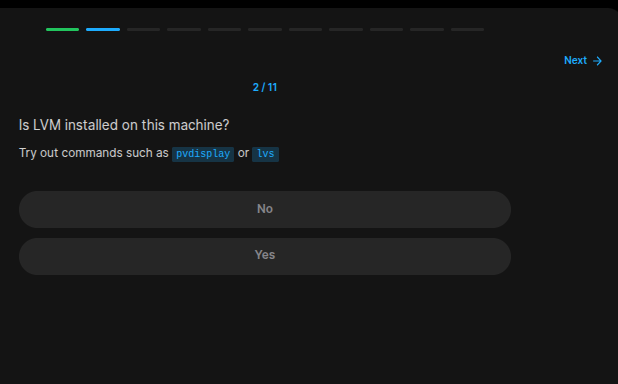
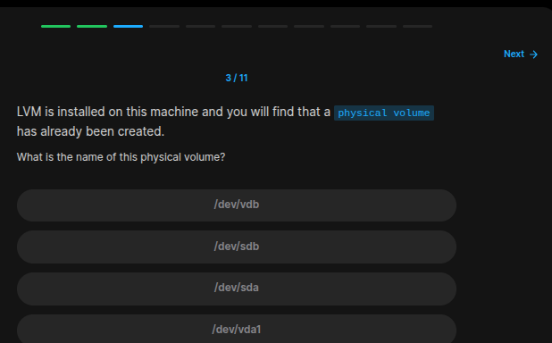
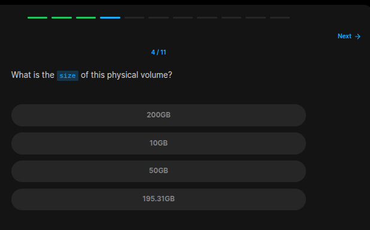
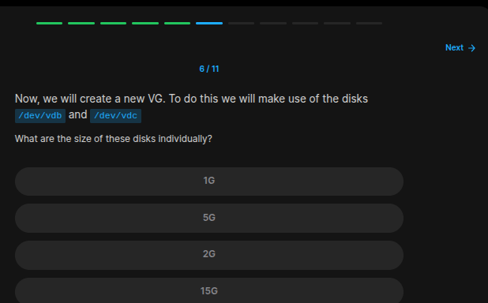
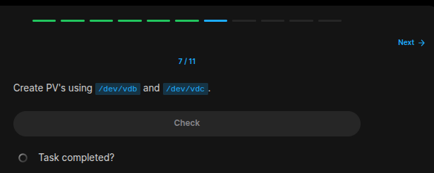
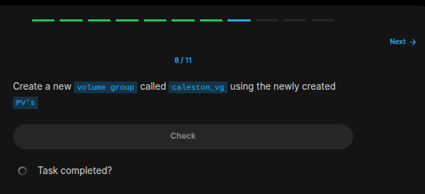
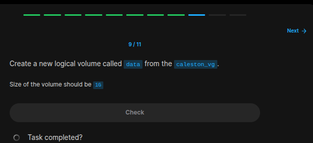
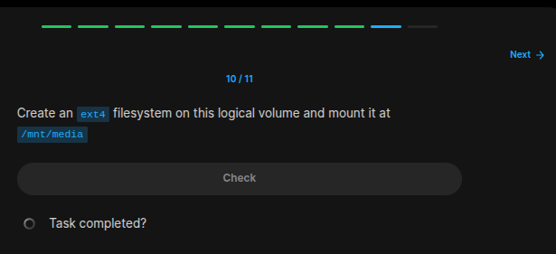
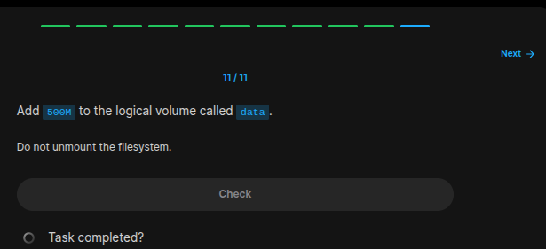

## Table of Contents

- [Introduction](#introduction)
- [Exercise 1/11](#exercise-111)
- [Exercise 2/11](#exercise-211)
- [Exercise 3/11](#exercise-311)
- [Exercise 4/11](#exercise-411)
- [Exercise 5/11](#exercise-511)
- [Exercise 6/11](#exercise-611)
- [Exercise 7/11](#exercise-711)
- [Exercise 8/11](#exercise-811)
- [Exercise 9/11](#exercise-911)
- [Exercise 10/11](#exercise-1011)
- [Exercise 11/11](#exercise-1111)

##  Introduction

Understanding linux services.

### Exercise 1/11

```
OK
```
### Exercise 2/11

```bash
sudo lvs # works
```
### Exercise 3/11

```bash
blkid

# its '/dev/vda1'
```
### Exercise 4/11

```bash
lsblk

# its 10GB
```
### Exercise 5/11

```bash
# We can also see this with:
lsblk
```
### Exercise 6/11

```
1GB each
```
### Exercise 7/11

```bash
# https://www.redhat.com/en/blog/create-physical-volume

# This is how we can create pv:
sudo pvcreate /dev/vdb
sudo pvcreate /dev/vdc
```
### Exercise 8/11

```bash
# https://www.redhat.com/en/blog/create-volume-group

sudo vgcreate caleston_vg /dev/vdb /dev/vdc
```
### Exercise 9/11

```bash
# https://www.redhat.com/en/blog/creating-logical-volumes

sudo lvcreate -L 1G -n data caleston_vg
```
### Exercise 10/11

```bash
sudo mkdir /mnt/media
sudo mkfs.ext4 /dev/mapper/caleston_vg-data
sudo mount /dev/mapper/caleston_vg-data /mnt/media/
```
### Exercise 11/11

```bash
# https://www.veeble.com/kb/how-to-extend-a-logical-volume-in-linux/

# From this link, we can create a command something like this:
# sudo lvextend -L+500M /dev/caleston_vg/data

# but no, this wasn't the right way. This is the hint section:
sudo lvresize -L +500M -n  /dev/mapper/caleston_vg-data
sudo resize2fs  /dev/mapper/caleston_vg-data
```