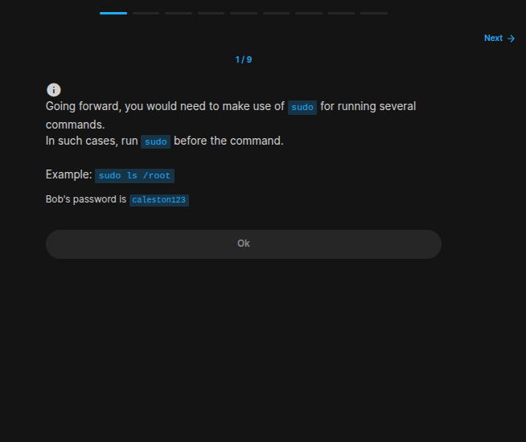
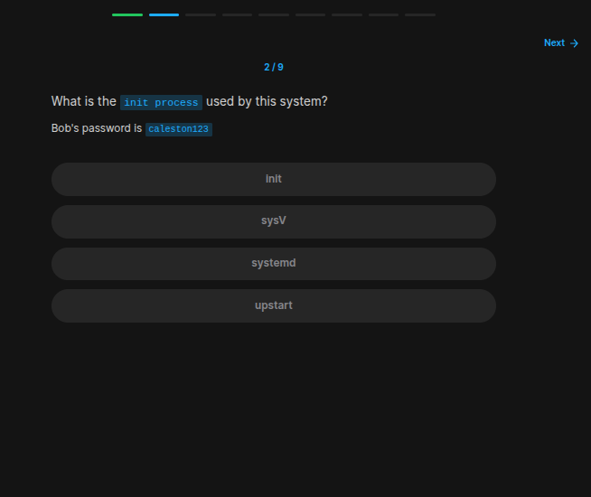
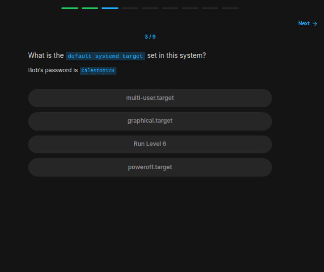
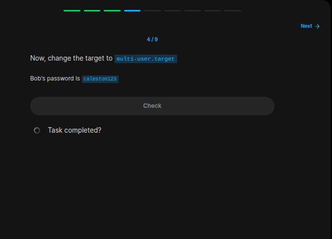
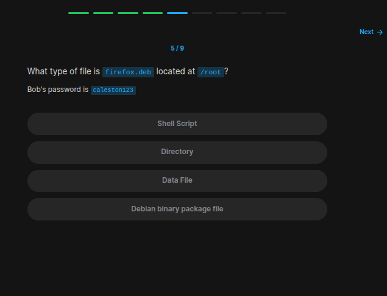
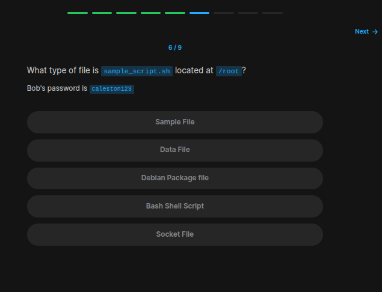
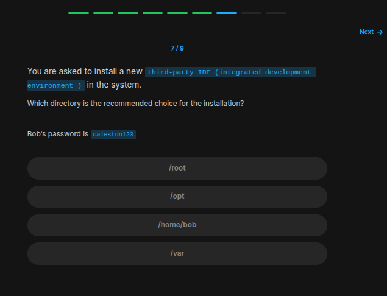
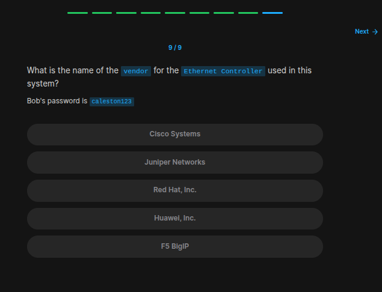

## Table of Contents

- [Introduction](#introduction)
- [Exercise 1/9](#exercise-19)
- [Exercise 2/9](#exercise-29)
- [Exercise 3/9](#exercise-39)
- [Exercise 4/9](#exercise-49)
- [Exercise 5/9](#exercise-59)
- [Exercise 6/9](#exercise-69)
- [Exercise 7/9](#exercise-79)
- [Exercise 8/9](#exercise-89)
- [Exercise 9/9](#exercise-99)


##  Introduction

Understanding linux services.

### Exercise 1/9

```bash
OK :')
```
### Exercise 2/9

```bash
# I was kinda lucky for finding this in the first try:
systemctl -l | init

# and there was the output:
systemd
```
### Exercise 3/9

```bash
# https://documentation.suse.com/smart/systems-management/html/systemd-management/index.html#:~:text=You%20can%20use%20the%20systemctl%20command%20to%20manage%20systemd%20targets.&text=To%20get%20the%20available%20targets,target%20STATE%20VENDOR%20PRESET%20basic.

sudo systemctl get-default
```
### Exercise 4/9

```bash
# Again in the same link, we can find this approach:
sudo systemctl set-default multi-user.target
```
### Exercise 5/9

```bash
# https://askubuntu.com/questions/1028506/how-do-i-display-filetype-with-ls

sudo file /root/firefox.deb
```
### Exercise 6/9

```bash
sudo file /root/sample_script.sh
```
### Exercise 7/9

```bash
# Turns out its
/opt
```
### Exercise 8/9
We are asked where the "lsblk" command stored in linux.
```bash
# I checked every shown file paths but other then 'dev/' they didn't exist.
```
### Exercise 9/9

```bash
# https://www.cyberciti.biz/faq/linux-list-network-cards-command/

lspci | grep -E -i --color 'network|ethernet'
```