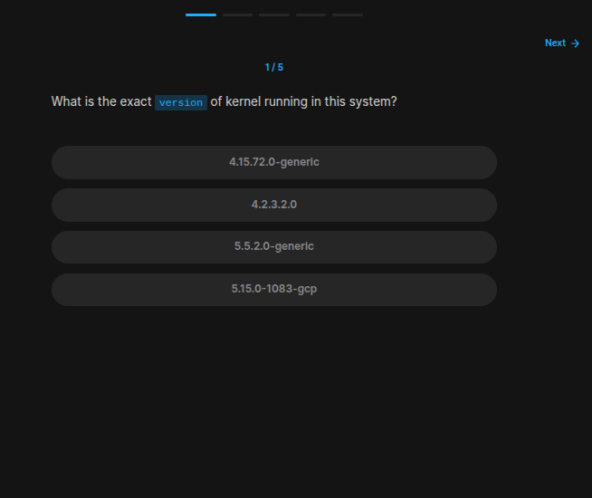
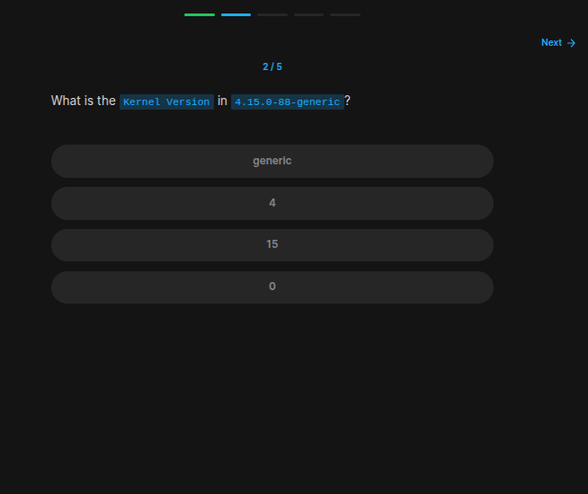
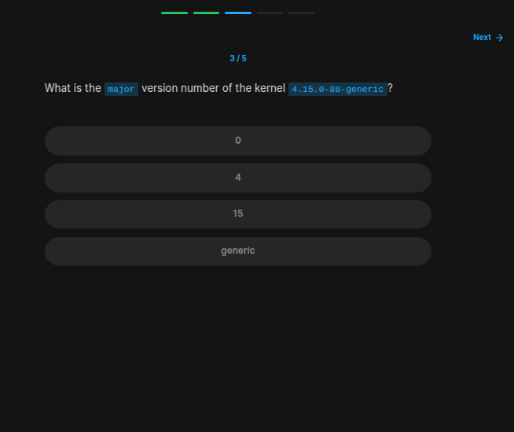

## Table of Contents

- [Introduction](#introduction)
- [Exercise 1/5](#exercise-15)
- [Exercise 2/5](#exercise-25)
- [Exercise 3/5](#exercise-35)
- [Exercise 4/5](#exercise-45)
- [Exercise 5/5](#exercise-55)


##  Introduction

Understanding linux services.

### Exercise 1/5

```bash
# https://askubuntu.com/questions/359574/how-do-i-find-out-the-kernel-version-i-am-running
uname -r
```
### Exercise 2/5

```bash
# Turns out its the first number in the version so its 4
```
### Exercise 3/5

```bash
# For this:
# https://askubuntu.com/questions/843197/what-are-kernel-version-number-components-w-x-yy-zzz-called

# So its
15
```
### Exercise 4/5

```bash
# https://serverfault.com/questions/305311/how-to-view-linux-kernel-logs-live
```
### Exercise 5/5
Last question was: How many disks are in this host right now.
```bash
# To solve this:
# https://ioflood.com/blog/lsblk-linux-command/#:~:text=The%20'lsblk'%20command%20in%20Linux%20is%20used%20to%20display%20information,%5Boption%5D%20%5Bdevice%5D%20.

# Therefor
5
```