## Table of Contents

- [Introduction](#introduction)
- [Exercise 1/11](#exercise-111)
- [Exercise 2/11](#exercise-211)
- [Exercise 3/11](#exercise-311)
- [Exercise 4/11](#exercise-411)
- [Exercise 5/11](#exercise-511)
- [Exercise 6/11](#exercise-611)
- [Exercise 7/11](#exercise-711)
- [Exercise 8/11](#exercise-811)
- [Exercise 9/11](#exercise-911)
- [Exercise 10/11](#exercise-1011)
- [Exercise 11/11](#exercise-1111)


##  Introduction

Understanding linux services.

### Exercise 1/11
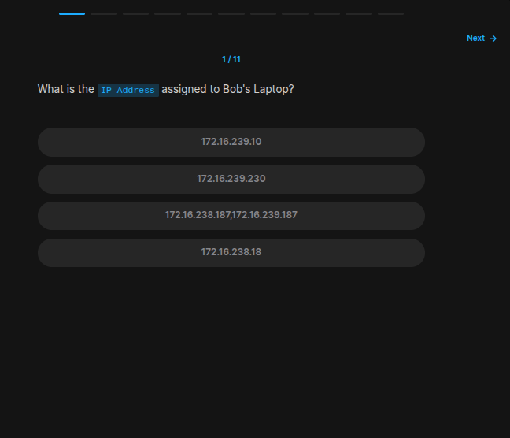
```bash
# We can see our pc's IP with this command:
ip a
```
### Exercise 2/11
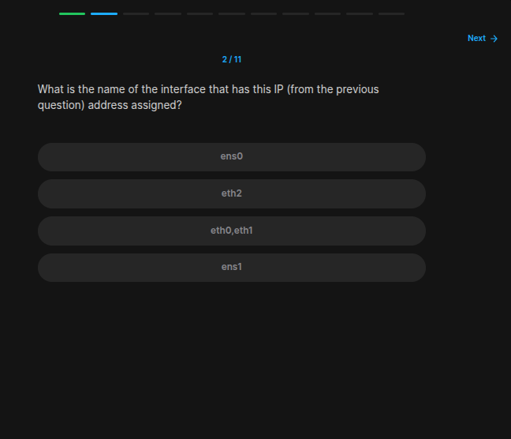
```
Its `eth0` and `eth1`
```
### Exercise 3/11
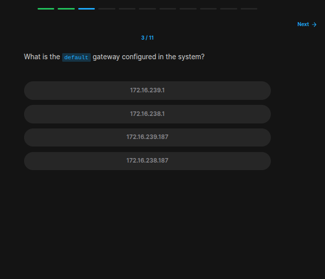
```bash
# https://serverfault.com/questions/31170/how-to-find-the-gateway-ip-address-in-linux
# We have to run this script:

route -n | grep 'UG[ \t]' | awk '{print $2}'
```
### Exercise 4/11
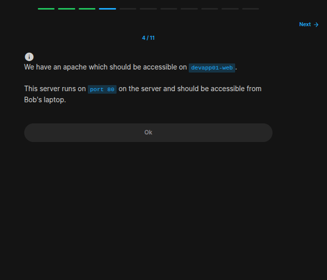
```
OK
```
### Exercise 5/11
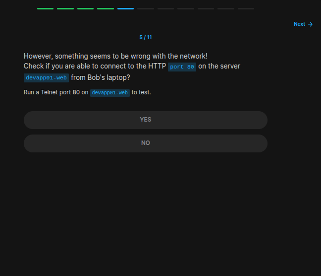
```bash
# https://www.digitalocean.com/community/tutorials/telnet-command-linux-unix

# telnet [hostname/IP] [port]

telnet devapp01-web 80

# After running this, this is the output i am getting:

# bob@caleston-lp10:~$ telnet devapp01-web 80 
# # Trying 172.16.238.10...
# telnet: Unable to connect to remote host: No route to host
```
### Exercise 6/11
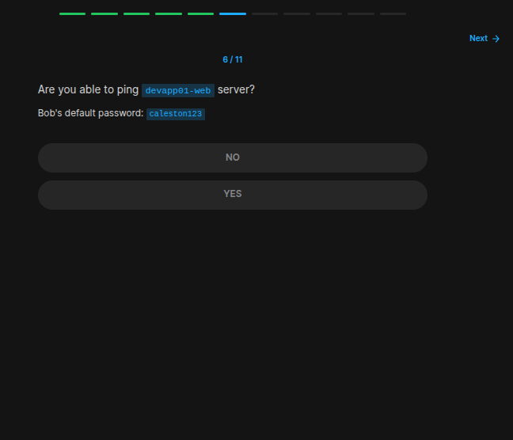
```bash
# lets ping it:
ping devapp01-web

# but this isn't also working
```
### Exercise 7/11
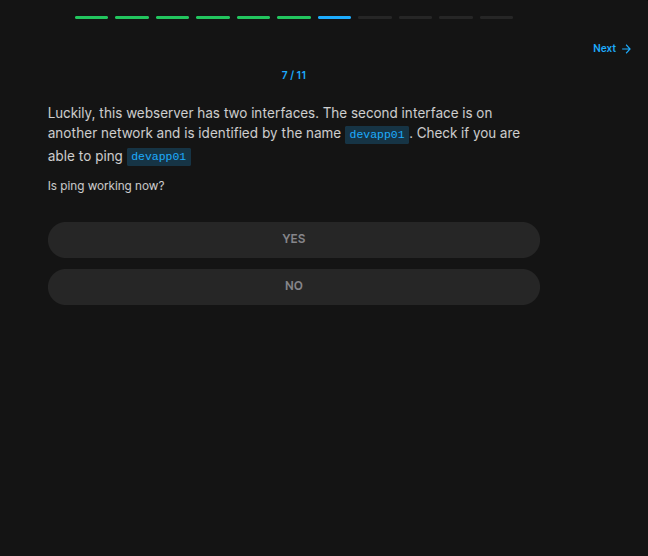
```bash
ping devapp01

# Yes! We can ping this host
```
### Exercise 8/11
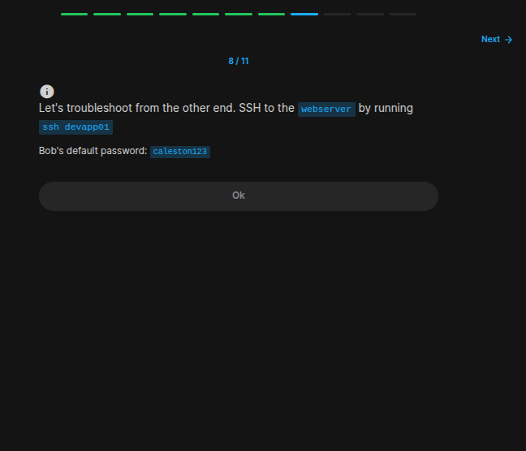
```bash
ssh devapp01

# and enter the password
```
### Exercise 9/11
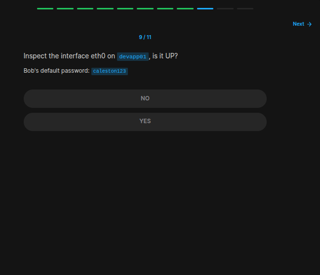
```bash
# With `ip a` we can see that its down.
ip a
```
### Exercise 10/11
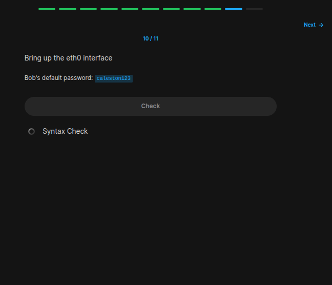
```bash
# https://www.iitk.ac.in/LDP/HOWTO/Linux+IPv6-HOWTO/ch05s02.html

sudo ip link set dev eth0 up
```
### Exercise 11/11
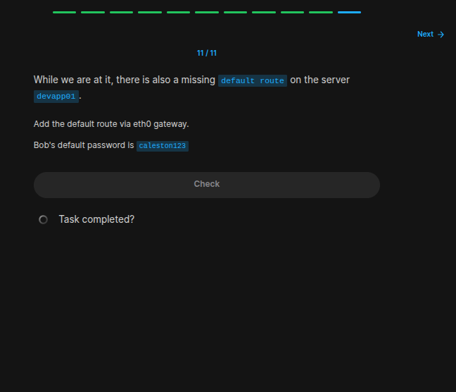
```bash
# https://www.cyberciti.biz/faq/linux-setup-default-gateway-with-route-command/

# According to this link, we have to make something like this:
sudo route add default gw 172.16.238.1 eth0

# You may ask why did we used the ip ending with `.1`. The thing is that .1 is the deafult gateway of the network interface. Therefor our destionation.
```