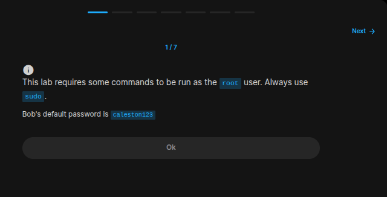
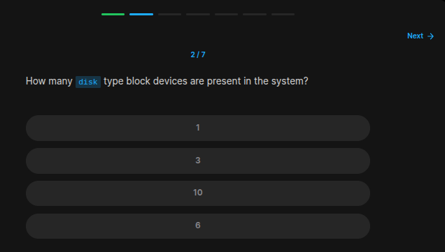
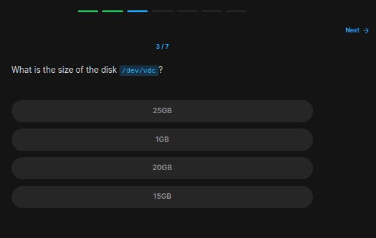
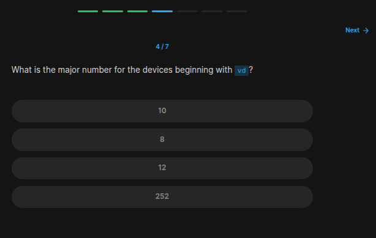
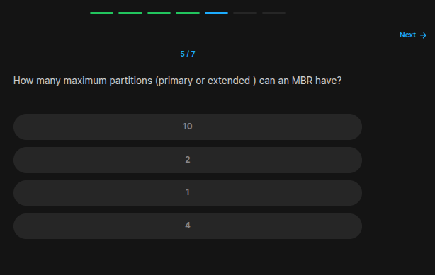
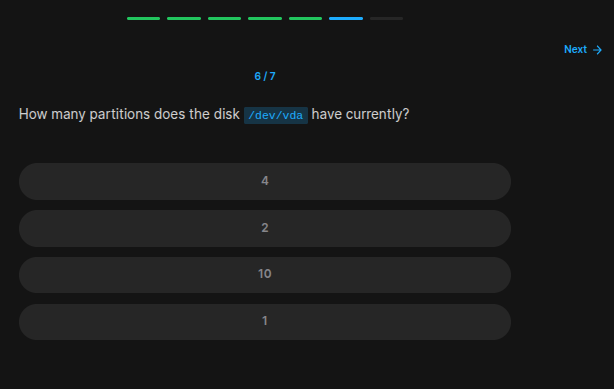
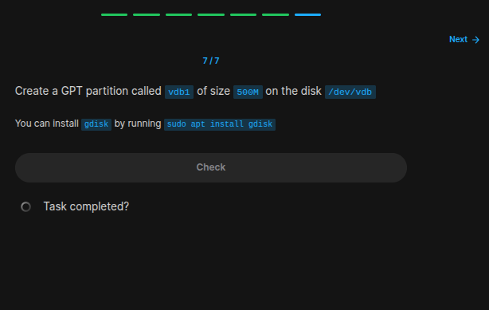

## Table of Contents

- [Introduction](#introduction)
- [Exercise 1/7](#exercise-17)
- [Exercise 2/7](#exercise-27)
- [Exercise 3/7](#exercise-37)
- [Exercise 4/7](#exercise-47)
- [Exercise 5/7](#exercise-57)
- [Exercise 6/7](#exercise-67)
- [Exercise 7/7](#exercise-77)


##  Introduction

Understanding linux services.

### Exercise 1/7

```
OK
```
### Exercise 2/7

```bash
# https://cyberpanel.net/blog/linux-list-disks#:~:text=Commonly%20used%20commands%20to%20list%20disks%20in%20Linux%20are%20lsblk,%2Dl%2C%20df%20%2Dh.

lsblk
```
### Exercise 3/7

```bash
# We can see in this command:
lsblk
```
### Exercise 4/7

```
252
```
### Exercise 5/7

```bash
# https://www.spiceworks.com/tech/hardware/articles/mbr-vs-gpt-the-best-choice-for-your-computer/
4 
```
### Exercise 6/7

```
1
```
### Exercise 7/7

```bash
# First install gdisk.
sudo apt install gdisk

sudo gdisk /dev/vdb

# then create a partition following instruction in this link:
# https://www.funtoo.org/Partitioning_using_gdisk
```