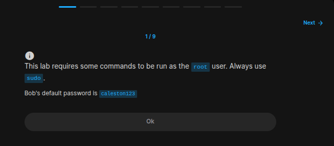
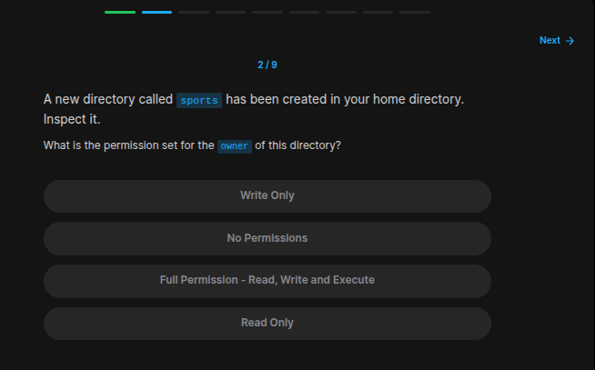
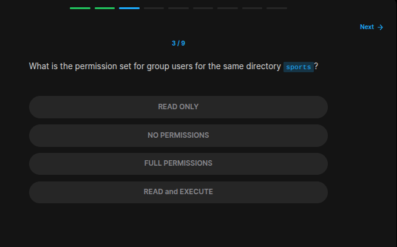
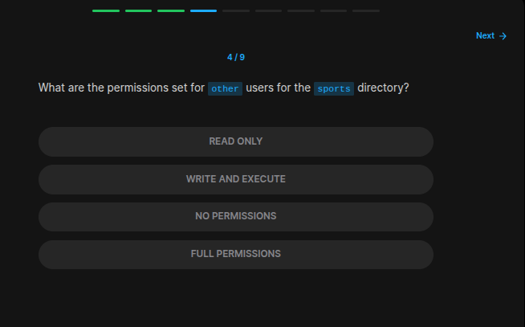
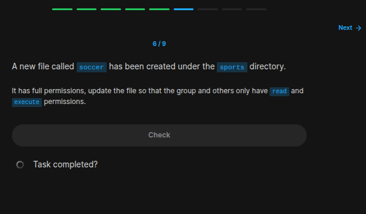
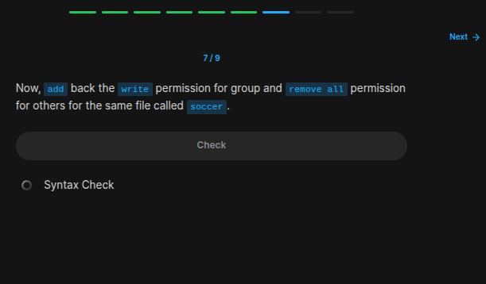
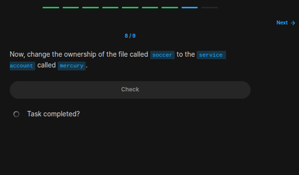
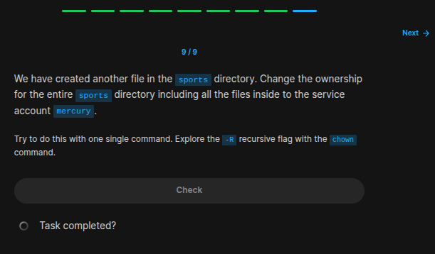

## Table of Contents

- [Introduction](#introduction)
- [Exercise 1/9](#exercise-19)
- [Exercise 2/9](#exercise-29)
- [Exercise 3/9](#exercise-39)
- [Exercise 4/9](#exercise-49)
- [Exercise 5/9](#exercise-59)
- [Exercise 6/9](#exercise-69)
- [Exercise 7/9](#exercise-79)
- [Exercise 8/9](#exercise-89)
- [Exercise 9/9](#exercise-99)

##  Introduction

Understanding linux services.

### Exercise 1/9

```
OK
```
### Exercise 2/9

```bash
ls -la
```
### Exercise 3/9

```bash
ls -la 
# and we can see that "READ and EXECUTE"
```
### Exercise 4/9

```
NO PERMISSIONS
```
### Exercise 5/9

```
bob owns it
```
### Exercise 6/9

```bash
# https://www.pluralsight.com/resources/blog/tech-operations/linux-file-permissions

# If we follow this instructions:

chmod go-w soccer
```
### Exercise 7/9

```bash
chmod g+w soccer
chmod o-wrx soccer
```
### Exercise 8/9

```bash
# https://linuxize.com/post/linux-chown-command/

sudo chown mercury soccer 
```
### Exercise 9/9

```bash
sudo chown mercury -R sports/
```

