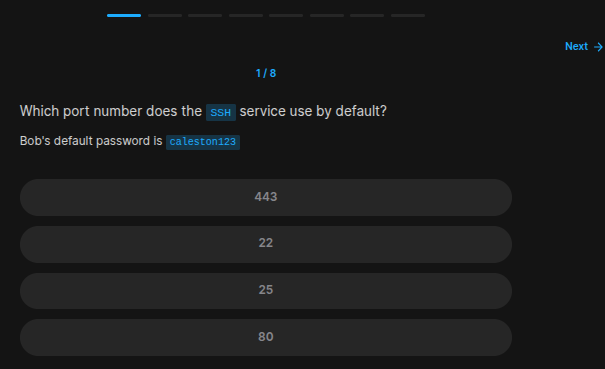
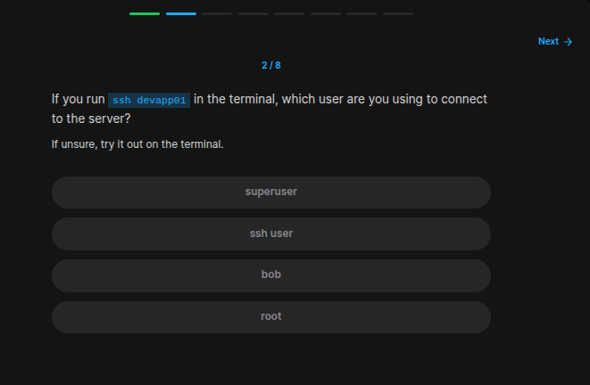
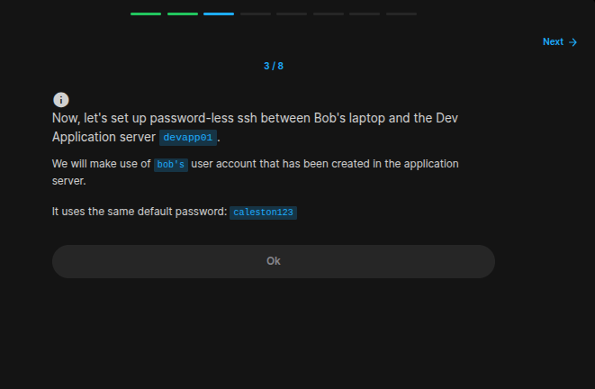
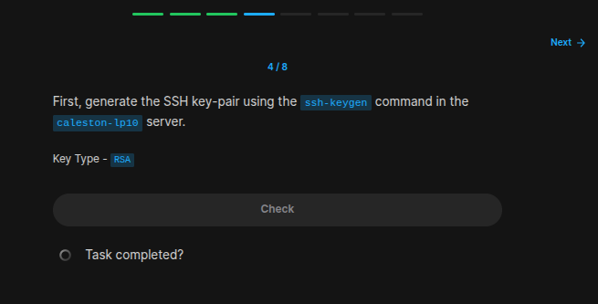
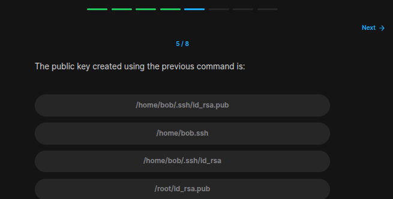
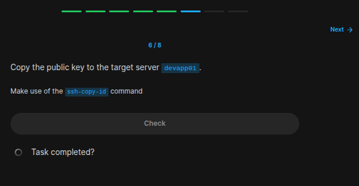
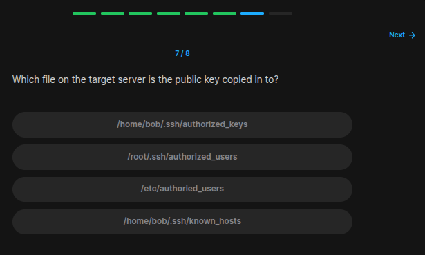
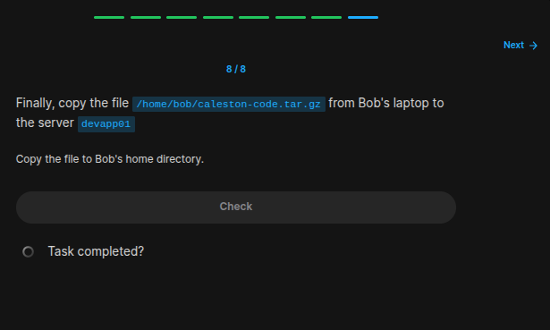

## Table of Contents

- [Introduction](#introduction)
- [Exercise 1/8](#exercise-18)
- [Exercise 2/8](#exercise-28)
- [Exercise 3/8](#exercise-38)
- [Exercise 4/8](#exercise-48)
- [Exercise 5/8](#exercise-58)
- [Exercise 6/8](#exercise-68)
- [Exercise 7/8](#exercise-78)
- [Exercise 8/8](#exercise-88)
- [Exercise 9/8](#exercise-98)
- [Exercise 10/8](#exercise-108)
- [Exercise 11/8](#exercise-118)
- [Exercise 8/8](#exercise-8)


##  Introduction

Understanding linux services.

### Exercise 1/8

```
22
```
### Exercise 2/8

```
bob
```
### Exercise 3/8

```
OK
```
### Exercise 4/8

```bash
ssh-keygen
```
### Exercise 5/8

```
/home/bob/.ssh/id_rsa.pub.
```
### Exercise 6/8

```bash
# https://www.ssh.com/academy/ssh/copy-id

ssh-copy-id -i ~/.ssh/id_rsa bob@devapp01

# After copying the key, we can use this command for ssh connection:
ssh devapp01
```
### Exercise 7/8

```
/home/bob/.ssh/authorized_keys
```
### Exercise 8/8

```bash
# https://www.geeksforgeeks.org/scp-command-in-linux-with-examples/

scp /home/bob/caleston-code.tar.gz bob@devapp01:/home/bob/
```