## Table of Contents

- [Introduction](#introduction)
- [Exercise 1/11](#exercise-111)
- [Exercise 2/11](#exercise-211)
- [Exercise 3/11](#exercise-311)
- [Exercise 4/11](#exercise-411)
- [Exercise 5/11](#exercise-511)
- [Exercise 6/11](#exercise-611)
- [Exercise 7/11](#exercise-711)
- [Exercise 8/11](#exercise-811)
- [Exercise 9/11](#exercise-911)
- [Exercise 10/11](#exercise-1011)
- [Exercise 11/11](#exercise-1111)


##  Introduction

Understanding linux services.

### Exercise 1/11
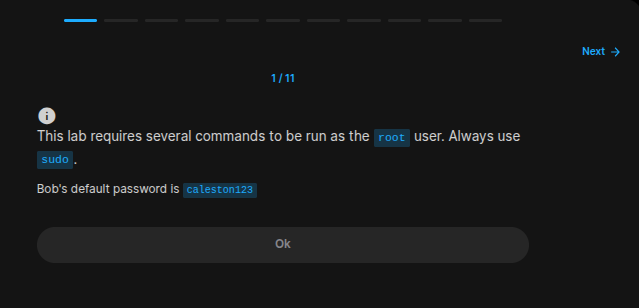
```
OK
```
### Exercise 2/11
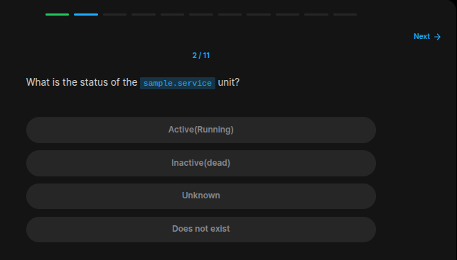
```bash
systemctl status sample.service
```
### Exercise 3/11
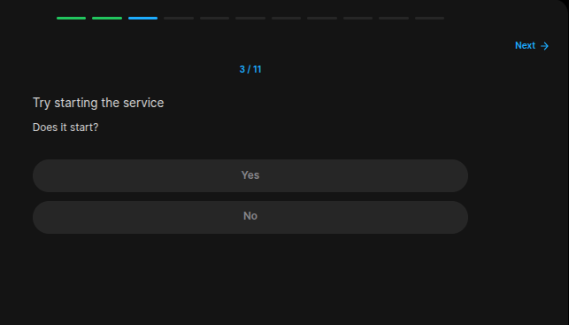
```bash
# First find the command itself:
systemctl --help | grep restart

# And then run it:
sudo systemctl restart sample.service

# But its not restarting!
```
### Exercise 4/11
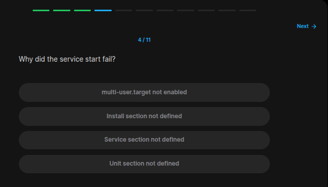
```bash
# We can see the output for the answer
sudo systemctl restart sample.service
```
### Exercise 5/11
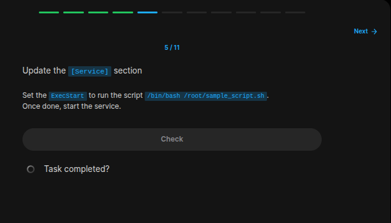
```bash
# https://gcore.com/learning/how-to-edit-service-file-linux-nano

systemctl show -p FragmentPath sample.service

sudo vi /etc/systemd/system/sample.service

# Then in the `ExecStart` section, enter this;
bin/bash /root/sample_script.sh

# And then start the service like this:
sudo systemctl start sample.service
```
### Exercise 6/11
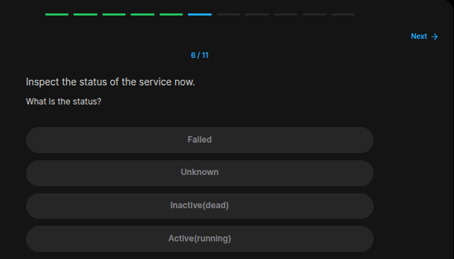
```bash
systemctl status sample.service
```
### Exercise 7/11
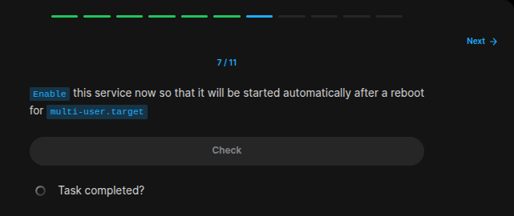
```bash
sudo systemctl enable sample.service
```
### Exercise 8/11
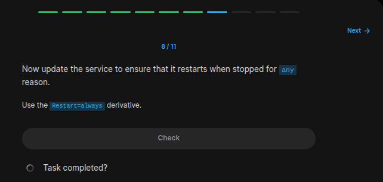
```bash
# Lets write this command in order to edit the service file:
sudo vi /etc/systemd/system/sample.service

# Add this line:
# Restart=always
```
### Exercise 9/11
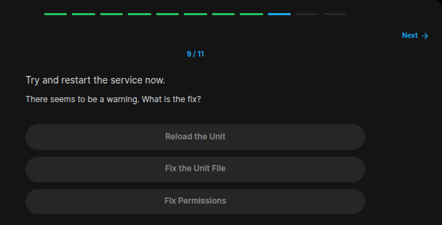
```bash
# Wben this code is runned: 
sudo systemctl restart sample.service

# This is the output;

# Warning: The unit file, source configuration file or drop-ins of sample.service changed on disk. Run 'systemctl daemon-reload' to  reload units.
```
### Exercise 10/11
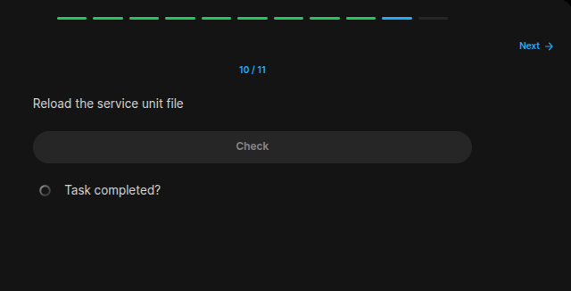
```bash
sudo systemctl daemon-reload
```
### Exercise 11/11
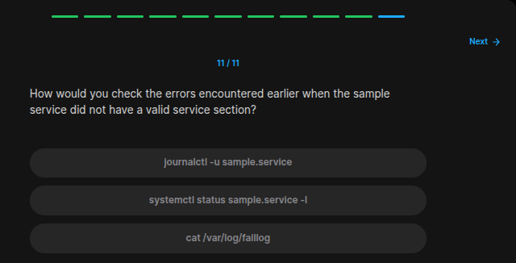
```bash
# https://last9.io/blog/systemctl-logs/

sudo journalctl -u sample.service
```