## Table of Contents

- [Introduction](#introduction)
- [Exercise 1/12](#exercise-112)
- [Exercise 2/12](#exercise-212)
- [Exercise 3/12](#exercise-312)
- [Exercise 4/12](#exercise-412)
- [Exercise 5/12](#exercise-512)
- [Exercise 6/12](#exercise-612)
- [Exercise 7/12](#exercise-712)
- [Exercise 8/12](#exercise-812)
- [Exercise 9/12](#exercise-912)
- [Exercise 10/12](#exercise-1012)
- [Exercise 11/12](#exercise-1112)
- [Exercise 12/12](#exercise-1212)


##  Introduction

Understanding linux services.

### Exercise 1/12
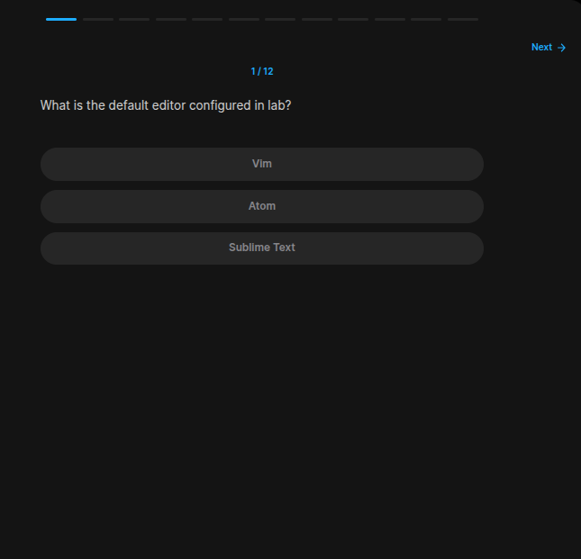
```bash
# In this link, people tried some ways:
# https://askubuntu.com/questions/709029/how-do-i-find-out-what-my-default-terminal-text-editor-is

# And this command is kinda what i need i suppose:
update-alternatives --display editor
# This says vim has a 30 priority.
```
### Exercise 2/12
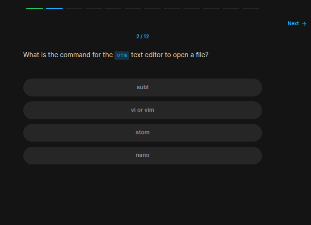
```bash
vi or vim
```
### Exercise 3/12

```bash
All are correct
```
### Exercise 4/12
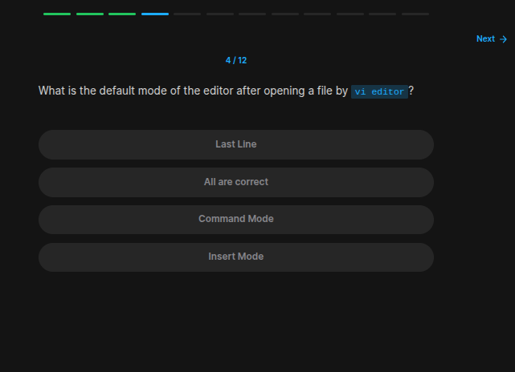
```bash
Command mode
```
### Exercise 5/12
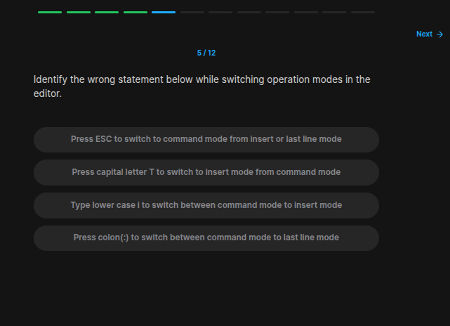
```bash
Uppercase T is the wrong one
```
### Exercise 6/12
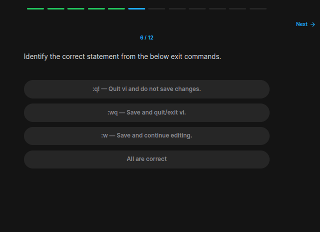
```bash
All are correct
```
### Exercise 7/12
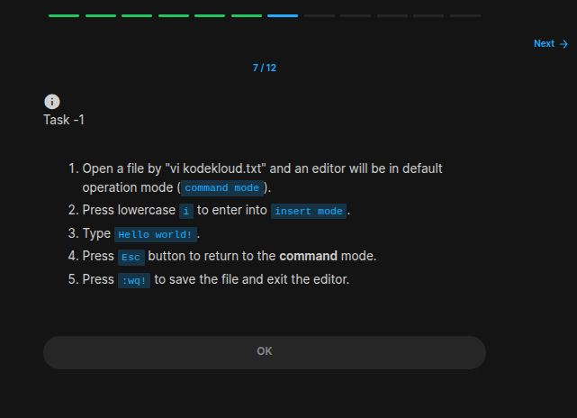
```bash
vi kodekloud.txt

# Enter Hello world!

# Then exit with ESC + :wq!
```
### Exercise 8/12
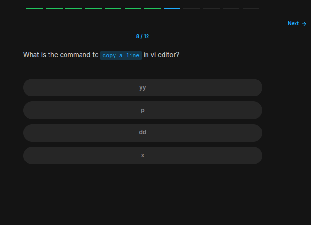
```bash
# https://www.redhat.com/en/blog/introduction-vi-editor#:~:text=The%20Vi%20editor%20has%20two,enter%20Insert%20mode%2C%20press%20i%20.

yy
```
### Exercise 9/12
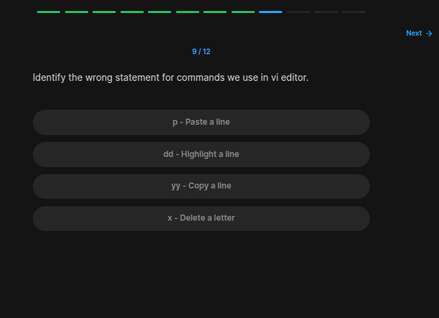
```bash
# https://www.redhat.com/en/blog/introduction-vi-editor#:~:text=The%20Vi%20editor%20has%20two,enter%20Insert%20mode%2C%20press%20i%20.
```
### Exercise 10/12
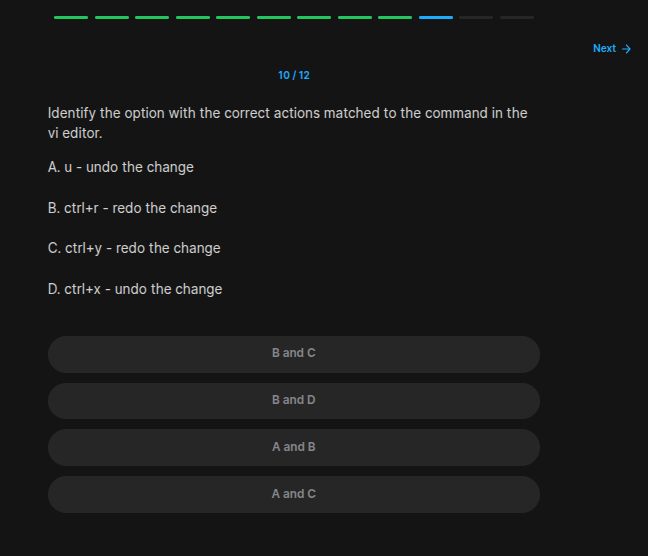
```bash
# Its
# A and B
```
### Exercise 11/12
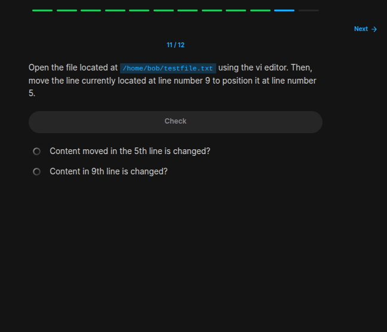
```bash
vi /home/bob/testfile.txt

# https://www.redhat.com/en/blog/introduction-vi-editor

# And then do needed operations with yy and p.
```
### Exercise 12/12
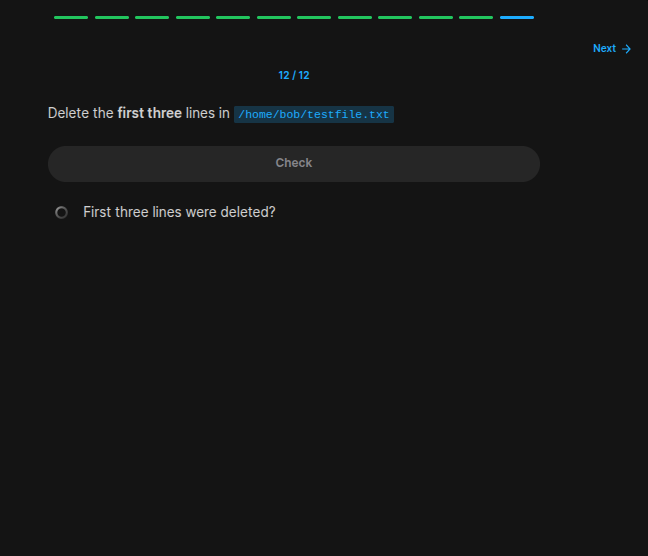
```bash
# https://www.redhat.com/en/blog/introduction-vi-editor
# Do needed operations using dd.
```