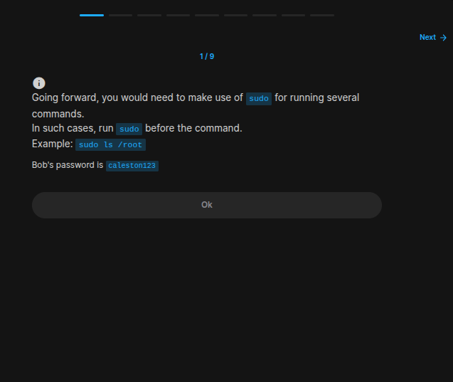
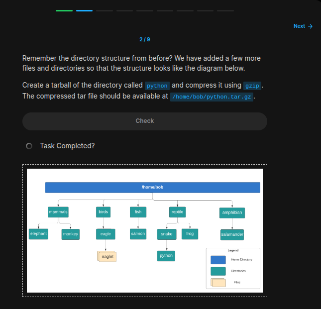
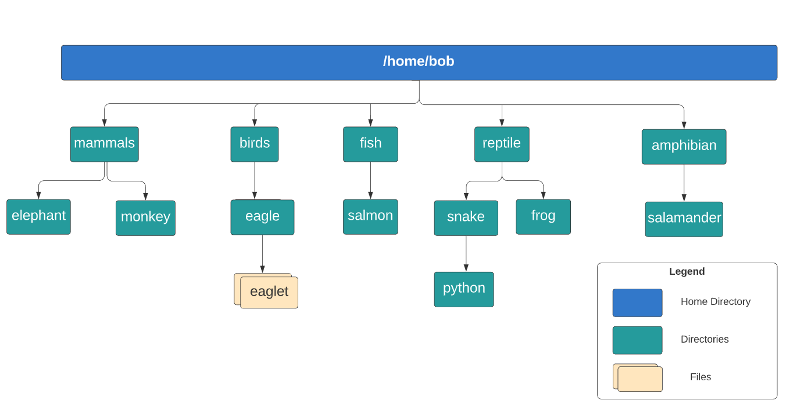
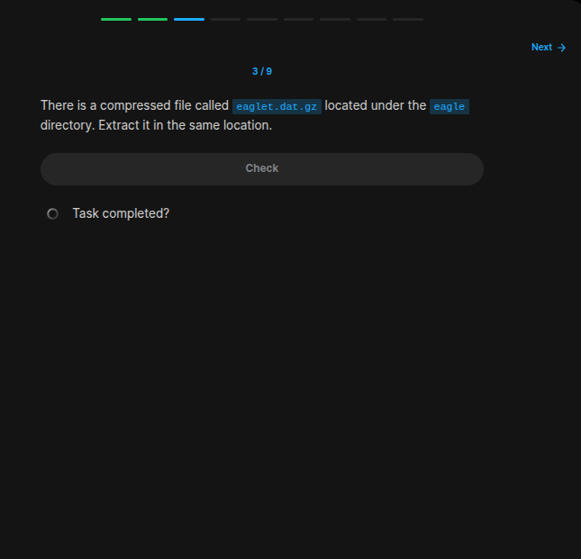
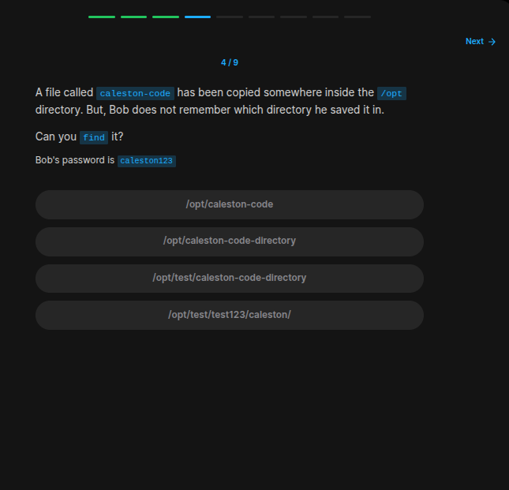
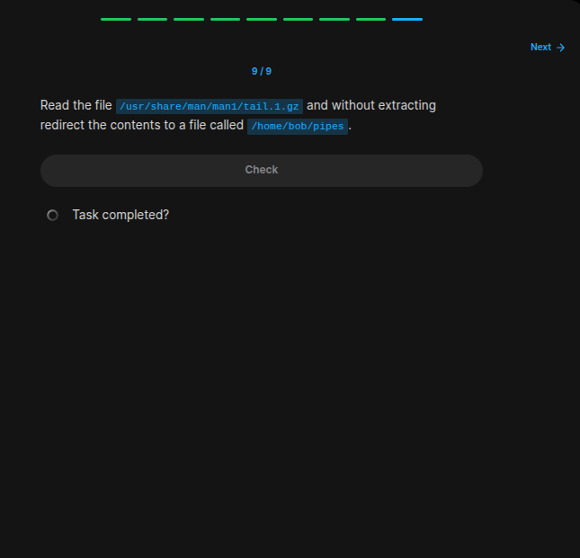

## Table of Contents

- [Introduction](#introduction)
- [Exercise 1/9](#exercise-19)
- [Exercise 2/9](#exercise-29)
- [Exercise 3/9](#exercise-39)
- [Exercise 4/9](#exercise-49)
- [Exercise 5/9](#exercise-59)
- [Exercise 6/9](#exercise-69)
- [Exercise 7/9](#exercise-79)
- [Exercise 8/9](#exercise-89)
- [Exercise 9/9](#exercise-99)


##  Introduction

Understanding linux services.

### Exercise 1/9

```bash
OK
```
### Exercise 2/9


```bash
# First step:
# https://www.cs.swarthmore.edu/~newhall/unixhelp/howto_tar.html

tar cvf python.tar reptile/snake/python/

# And then this:
# https://www.geeksforgeeks.org/gzip-command-linux/

gzip python.tar
```
### Exercise 3/9

```bash
gzip -d eaglet.dat.gz 
```
### Exercise 4/9

```bash
# https://opensource.com/article/18/4/how-use-find-linux

cd opt/
find -name 'caleston-code'
```
### Exercise 5/9

```bash
sudo find /etc -name dummy.service
echo /etc/systemd/system/dummy.service > /home/bob/dummy-service
```
### Exercise 6/9

```bash
# This is the command from the hint section, i couldn't find it.
sudo grep -ir 172.16.238.197 /etc/ > /home/bob/ip
```
### Exercise 7/9

```bash
echo "a file in my home directory" > /home/bob/file_with_data.txt   
```
### Exercise 8/9

```bash
# https://eitca.org/cybersecurity/eitc-is-lsa-linux-system-administration/linux-shell-features/pipes-and-redirection/examination-review-pipes-and-redirection/how-can-you-redirect-the-standard-error-output-of-a-command-to-a-file-in-linux-shell/#:~:text=To%20redirect%20the%20standard%20error,both%20to%20the%20same%20file.

# We need to use "2>" command in order to save the error output.
python3 /home/bob/my_python_test.py 2> /home/bob/py_error.txt
```
### Exercise 9/9

```bash
# https://community.unix.com/t/how-to-view-the-contents-of-gz-file-without-extracting-the-file/181605/3
gzip -cd  /usr/share/man/man1/tail.1.gz > /home/bob/pipes
```