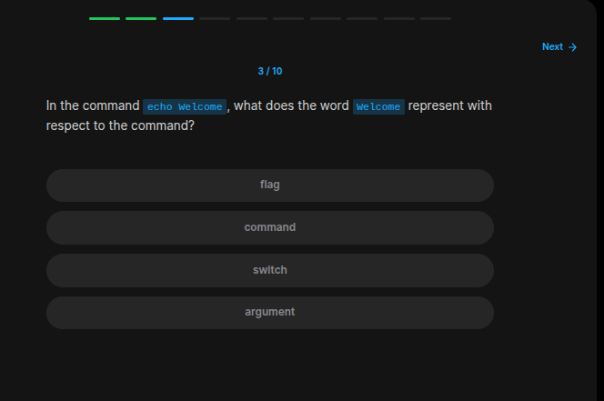
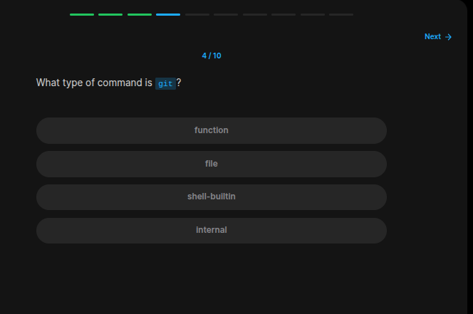
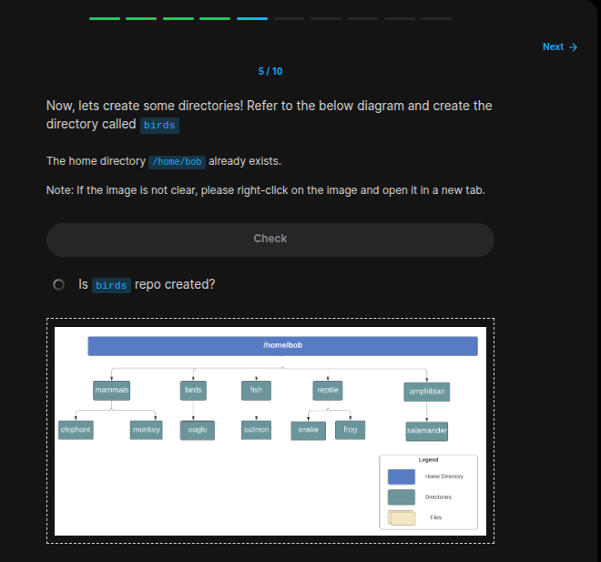
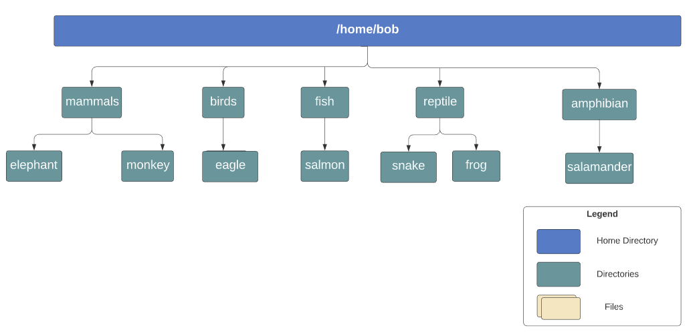
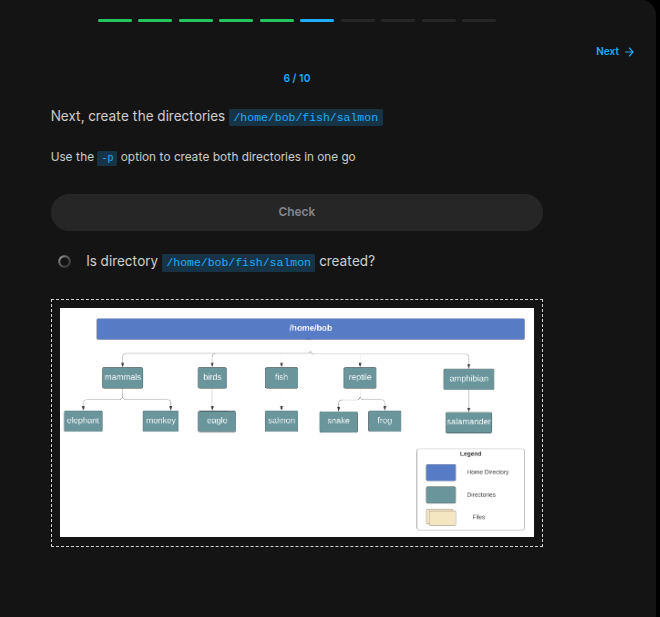
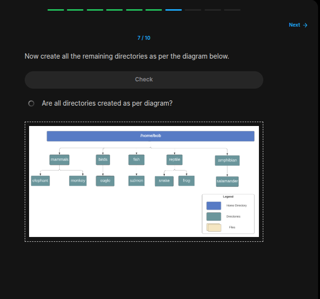
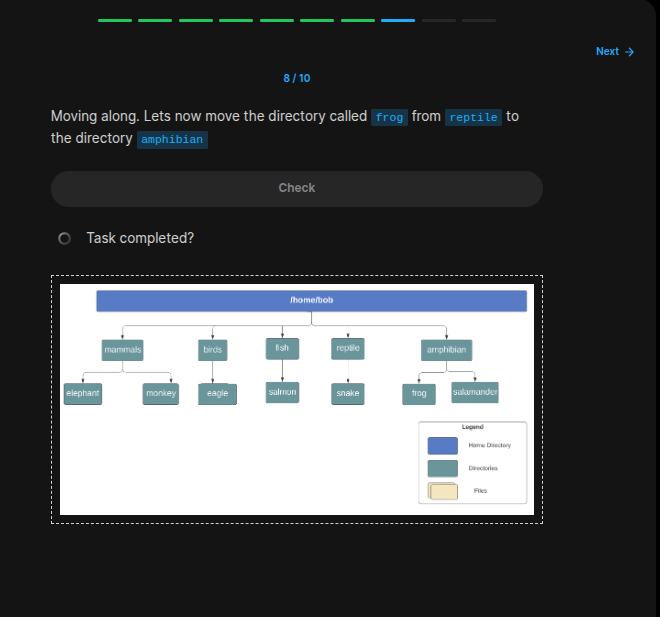
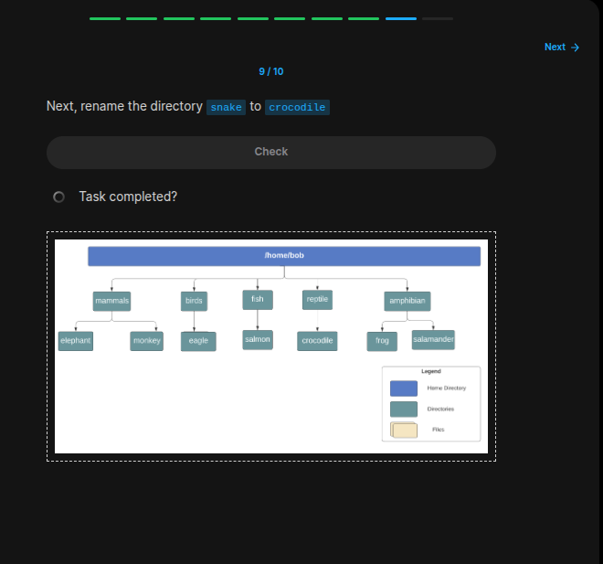
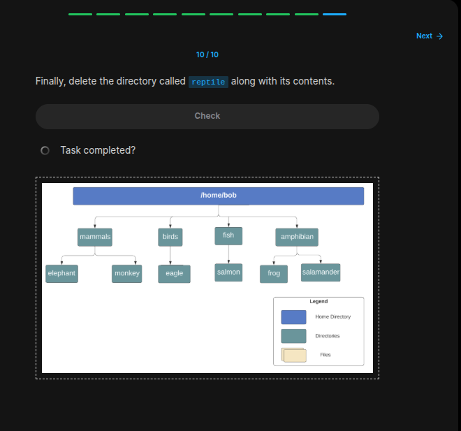

## Table of Contents

- [Introduction](#introduction)
- [Exercise 1/10](#exercise-110)
- [Exercise 2/10](#exercise-210)
- [Exercise 3/10](#exercise-310)
- [Exercise 4/10](#exercise-410)
- [Exercise 5/10](#exercise-510)
- [Exercise 6/10](#exercise-610)
- [Exercise 7/10](#exercise-710)
- [Exercise 8/10](#exercise-810)
- [Exercise 9/10](#exercise-910)
- [Exercise 10/10](#exercise-1010)


##  Introduction

Understanding linux services.

### Exercise 1/10

```bash
/home/bob
```
### Exercise 2/10

```bash
echo $HOME
```
### Exercise 3/10

```bash
argument
```
### Exercise 4/10

```bash
file
```
### Exercise 5/10


```bash
mkdir -p birds/eagle
mkdir -p mammals/elephant
mkdir -p mammals/monkey
mkdir -p fish/salmon
mkdir -p reptile/frog
mkdir -p reptile/snake
mkdir -p amphibian/salamander
```
### Exercise 6/10

```bash
# Already created before.
```
### Exercise 7/10

```bash
# Already created before.
```
### Exercise 8/10

```bash
mv /reptile/frog amphibian/
```
### Exercise 9/10

```bash
mv reptile/snake reptile/crocodile
```
### Exercise 10/10

```bash
rm -rf reptile/
```