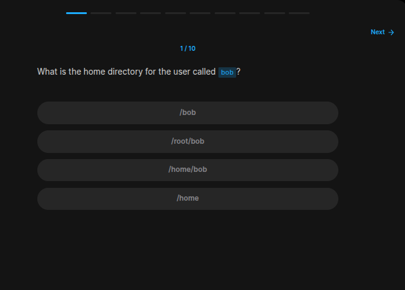

## Table of Contents

- [Introduction](#introduction)
- [Exercise 1/12](#exercise-112)
- [Exercise 2/12](#exercise-212)
- [Exercise 3/12](#exercise-312)
- [Exercise 4/12](#exercise-412)
- [Exercise 5/12](#exercise-512)
- [Exercise 6/12](#exercise-612)
- [Exercise 7/12](#exercise-712)
- [Exercise 8/12](#exercise-812)
- [Exercise 9/12](#exercise-912)
- [Exercise 10/12](#exercise-1012)
- [Exercise 11/12](#exercise-1112)
- [Exercise 12/12](#exercise-1212)


##  Introduction

Understanding linux services.

### Exercise 1/12



```bash

```
### Exercise 2/12

```bash

```
### Exercise 3/12

```bash

```
### Exercise 4/12

```bash

```
### Exercise 5/12

```bash

```
### Exercise 6/12

```bash

```
### Exercise 7/12

```bash

```
### Exercise 8/12

```bash

```
### Exercise 9/12


```bash

```
### Exercise 10/12


```bash

```
### Exercise 11/12


```bash

```
### Exercise 12/12


```bash

```