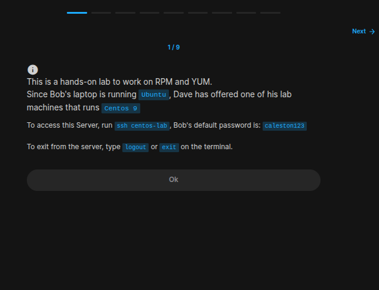
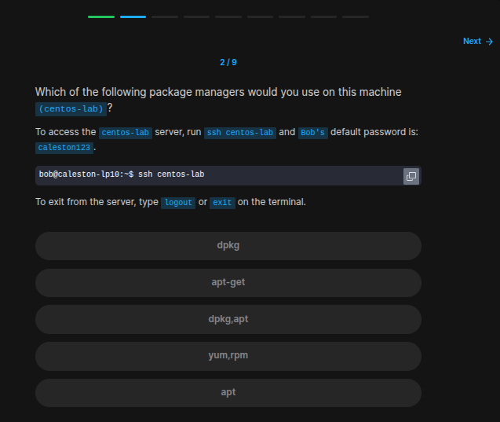
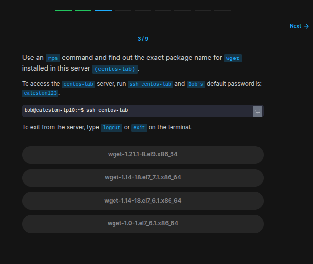
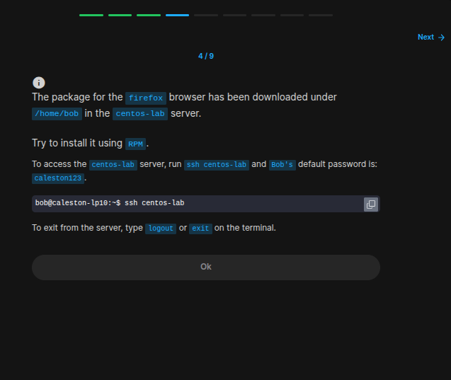
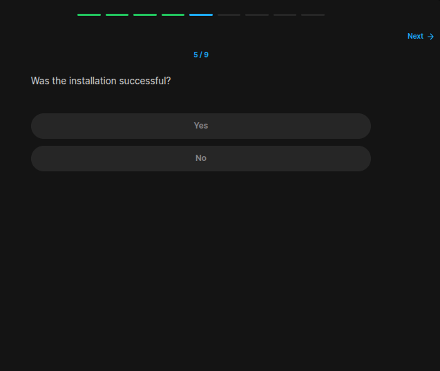
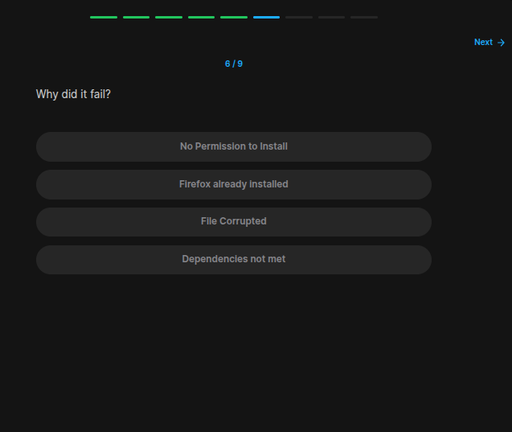
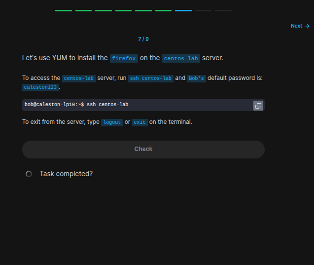
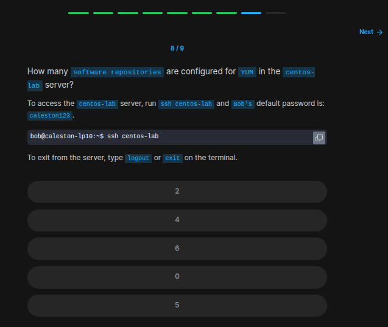
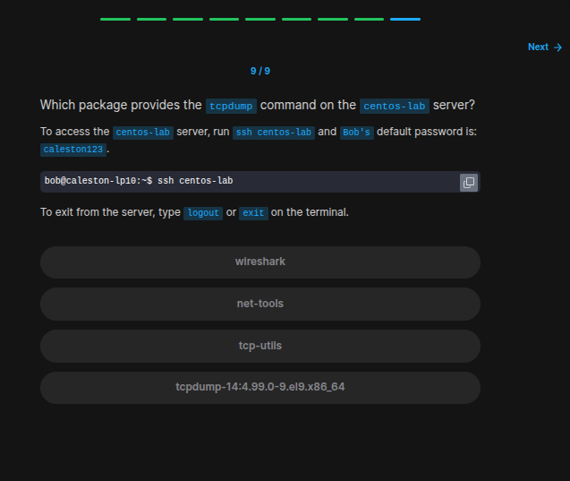

## Table of Contents

- [Introduction](#introduction)
- [Exercise 1/9](#exercise-19)
- [Exercise 2/9](#exercise-29)
- [Exercise 3/9](#exercise-39)
- [Exercise 4/9](#exercise-49)
- [Exercise 5/9](#exercise-59)
- [Exercise 6/9](#exercise-69)
- [Exercise 7/9](#exercise-79)
- [Exercise 8/9](#exercise-89)
- [Exercise 9/9](#exercise-99)

##  Introduction

Understanding linux services.

### Exercise 1/9

```bash
# OK :')

ssh centos-lab
# pass:
caleston123
```
### Exercise 2/9

```bash
# Only yum and rpm works
```
### Exercise 3/9

```bash
# https://www.cyberciti.biz/faq/howto-list-installed-rpm-package/

rpm -qa | grep wget
```
### Exercise 4/9

```bash
Ok
```
### Exercise 5/9

```bash
NO
# Because i got an error saying this:

# OUTPUT
# [bob@centos-lab ~]$ sudo rpm -i firefox-128.6.0-1.el9.x86_64.rpm 
# error: Failed dependencies:
#         mozilla-filesystem is needed by firefox-128.6.0-1.el9.x86_64
#         pciutils-libs is needed by firefox-128.6.0-1.el9.x86_64
#         redhat-indexhtml is needed by firefox-128.6.0-1.el9.x86_64
```
### Exercise 6/9

```bash
Dependencies not met
```
### Exercise 7/9

```bash
sudo yum install firefox-128.6.0-1.el9.x86_64.rpm -y
```
### Exercise 8/9

```bash
# https://superuser.com/questions/488890/list-of-installed-repositories-yum

yum repolist
```
### Exercise 9/9

```bash
sudo yum install tcpdump -y

# After installing, we can see the package name.
```